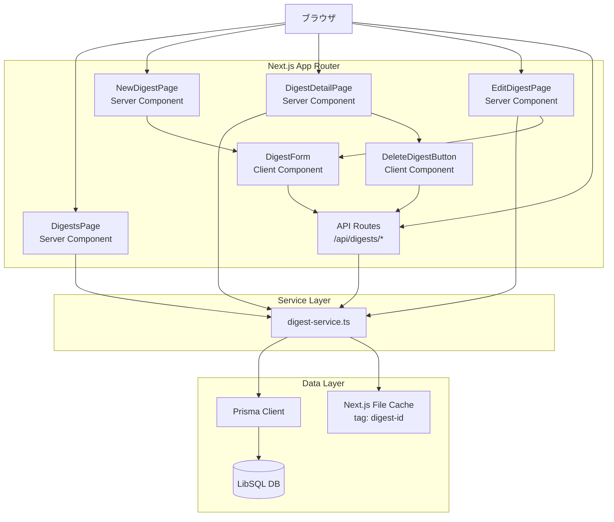

# Design Document: digests

---
**Purpose**: ダイジェスト管理機能（作成・一覧・詳細・編集・削除）の技術設計。実装済みコードを正確に文書化し、責任境界・インターフェース・データモデルを明確にする。

---

## Overview

ダイジェスト機能は、RSSリーダー上でMarkdown形式の要約文書を管理する独立した文書機能である。ユーザーは `/digests/*` のルート群を通じてダイジェストのCRUD操作を行い、GFMに準拠したMarkdownをrehype-sanitizeでサニタイズした状態で閲覧できる。

**Purpose**: Markdown形式の要約文書を安全に保存・閲覧できる文書管理機能を提供する。  
**Users**: アプリケーションのログインユーザーがダイジェストを作成・閲覧・編集・削除する。  
**Impact**: 既存のフィード閲覧機能とは独立した文書リポジトリとして機能し、RSSエントリへの直接リンクは持たない。

### Goals

- Markdown（GFM）コンテンツを安全にレンダリングし、XSSを防止する
- ダイジェストのCRUD操作をシンプルかつ一貫したUIで提供する
- サービス層とUI層を明確に分離し、テスト容易性を確保する

### Non-Goals

- AIによる自動ダイジェスト生成ロジック
- RSSエントリとのリレーション
- ページネーション（UI一覧は50件固定、API側はページネーション対応）
- 検索・フィルタリング機能

## Boundary Commitments

### This Spec Owns

- `DigestService`（`/src/lib/digest-service.ts`）のすべてのDB操作とキャッシュ制御
- `/src/app/digests/*` 配下のすべてのページコンポーネント
- `/src/app/api/digests/*` 配下のすべてのAPIルートハンドラー
- `DigestForm` / `DeleteDigestButton` クライアントコンポーネント
- `/src/types/digest.ts` の型定義

### Out of Boundary

- AIスコアリング・要約生成（外部システム）
- フィードエントリとの関連付け（`Entry` モデルへの変更なし）
- 認証・認可制御（better-auth が担当）
- Prisma クライアントの生成・マイグレーション管理

### Allowed Dependencies

- Prisma クライアント（`@/lib/db`）— DB アクセス
- `AppError` クラス（`@/lib/errors`）— エラーハンドリング
- shadcn/ui コンポーネント（`@/components/ui/*`）— UI プリミティブ
- `next/cache`（`unstable_cache`, `revalidateTag`）— タグベースキャッシュ
- `react-markdown` + `remark-gfm` + `rehype-raw` + `rehype-sanitize` — Markdownレンダリング

### Revalidation Triggers

- `DigestService` のインターフェースシグネチャが変更された場合、APIルートハンドラーの再確認が必要
- `Digest` Prismaモデルのスキーマ変更は型定義と全サービス関数の更新が必要
- `rehype-sanitize` の設定変更はセキュリティレビューが必要

## Architecture

### Architecture Pattern & Boundary Map



**Architecture Integration**:
- **Selected pattern**: Server Components + REST API + Client Components（フォーム・削除操作のみ）
- **Domain boundaries**: サービス層がDB操作を完全に隠蔽。ページコンポーネントはサービスを直接呼び出し、クライアントコンポーネントはAPIルート経由でアクセス
- **Existing patterns preserved**: feed-management と同一のレイヤー分離パターンを踏襲
- **Dependency direction**: Types → DB → Service → API Routes / Pages → Client Components

### Technology Stack

| Layer | Choice / Version | Role in Feature | Notes |
|-------|------------------|-----------------|-------|
| Frontend | Next.js 16 / React 19 | Server/Client Components、ルーティング | App Router のみ使用 |
| Markdown | react-markdown + remark-gfm + rehype-sanitize | GFM対応Markdownレンダリングとサニタイズ | rehype-rawも使用 |
| Backend | Next.js API Routes | REST エンドポイント /api/digests/* | |
| Data | Prisma 7 + LibSQL | Digest モデルのCRUD | unstable_cache でキャッシュ |
| Styling | Tailwind CSS 4 + shadcn/ui | UI コンポーネント | |

## File Structure Plan

### Directory Structure

```
src/
├── types/
│   └── digest.ts                    # Digest, DigestListItem, API Response型定義
├── lib/
│   └── digest-service.ts            # DB操作・キャッシュ制御（サービス層）
├── app/
│   ├── api/
│   │   └── digests/
│   │       ├── route.ts             # GET（一覧）/ POST（作成）
│   │       └── [id]/
│   │           └── route.ts         # GET / PATCH / DELETE（個別操作）
│   └── digests/
│       ├── page.tsx                 # ダイジェスト一覧ページ（Server Component）
│       ├── new/
│       │   └── page.tsx             # 新規作成ページ（Server Component）
│       └── [id]/
│           ├── page.tsx             # 詳細ページ（Server Component）
│           └── edit/
│               └── page.tsx         # 編集ページ（Server Component）
└── components/
    ├── digest-form.tsx              # 作成・編集フォーム（Client Component）
    └── delete-digest-button.tsx     # 削除ボタン（Client Component）
```

### Modified Files

- `prisma/schema.prisma` — `Digest` モデル定義を含む（既存）
- `src/types/feed.ts` — `ErrorCode` に `DIGEST_NOT_FOUND` を含む（既存）

## Requirements Traceability

| Requirement | Summary | Components | Interfaces |
|-------------|---------|------------|------------|
| 1.1–1.5 | ダイジェスト一覧表示 | DigestsPage, DigestService | getDigests() |
| 2.1–2.5 | ダイジェスト作成 | NewDigestPage, DigestForm, API POST /api/digests | createDigest() |
| 3.1–3.6 | 詳細閲覧・Markdownレンダリング | DigestDetailPage, DigestService | getCachedDigestById() |
| 4.1–4.5 | ダイジェスト編集 | EditDigestPage, DigestForm, API PATCH /api/digests/:id | updateDigest() |
| 5.1–5.4 | ダイジェスト削除 | DeleteDigestButton, API DELETE /api/digests/:id | deleteDigest() |
| 6.1–6.7 | REST API | API Routes /api/digests/*, /api/digests/:id | 全サービス関数 |

## Components and Interfaces

### Summary

| Component | Domain/Layer | Intent | Req Coverage | Key Dependencies | Contracts |
|-----------|--------------|--------|--------------|------------------|-----------|
| DigestService | Service | DB操作・キャッシュ | 1–6 | Prisma, next/cache | Service |
| API Routes | API | REST エンドポイント | 6.1–6.7 | DigestService | API |
| DigestsPage | UI/Page | 一覧表示 | 1.1–1.5 | DigestService | — |
| DigestDetailPage | UI/Page | 詳細・Markdownレンダリング | 3.1–3.6 | DigestService | — |
| NewDigestPage | UI/Page | 作成フォーム表示 | 2.1–2.5 | DigestForm | — |
| EditDigestPage | UI/Page | 編集フォーム表示 | 4.1–4.5 | DigestService, DigestForm | — |
| DigestForm | UI/Client | 作成・編集フォーム | 2.1–2.5, 4.1–4.5 | API Routes | State |
| DeleteDigestButton | UI/Client | 削除確認・実行 | 5.1–5.4 | API Routes | State |

---

### Service Layer

#### DigestService

| Field | Detail |
|-------|--------|
| Intent | Digestエンティティに関するすべてのDB操作とNext.jsキャッシュ制御を担う |
| Requirements | 1.1–1.5, 2.1–2.5, 3.1–3.6, 4.1–4.5, 5.1–5.4, 6.1–6.7 |

**Responsibilities & Constraints**
- Prisma クライアントを通じた Digest テーブルへのCRUD操作
- `unstable_cache` を使用したタグベースキャッシュ（タグ: `digest-${id}`）
- 存在しないIDへのアクセスは `AppError('DIGEST_NOT_FOUND', ..., 404)` をスローする
- 更新・削除操作の前に対象レコードの存在確認を行う

**Dependencies**
- Outbound: Prisma Client — DB操作 (P0)
- Outbound: `next/cache` — `unstable_cache` / `revalidateTag` (P1)
- Inbound: API Routes — すべてのCRUD操作呼び出し (P0)
- Inbound: Server Components (DigestsPage, DigestDetailPage, EditDigestPage) — 読み取り操作呼び出し (P0)

**Contracts**: Service [x] / API [ ] / Event [ ] / Batch [ ] / State [ ]

##### Service Interface

```typescript
// src/lib/digest-service.ts

export async function createDigest(data: {
  content: string
  title?: string
}): Promise<Digest>

export async function getDigests(
  page?: number,    // default: 1
  limit?: number    // default: 20
): Promise<{ data: DigestListItem[]; total: number }>

export async function getDigestById(id: string): Promise<Digest>
// throws AppError('DIGEST_NOT_FOUND', 'Digest not found', 404) when not found

export function getCachedDigestById(id: string): Promise<Digest>
// Next.js unstable_cache wrapper for getDigestById
// cache tags: [`digest-${id}`]

export async function updateDigest(
  id: string,
  data: { content?: string; title?: string | null }
): Promise<Digest>
// throws AppError('DIGEST_NOT_FOUND', ..., 404) when not found

export async function deleteDigest(id: string): Promise<void>
// throws AppError('DIGEST_NOT_FOUND', ..., 404) when not found
```

- Preconditions: `content` は非空文字列。`id` は有効なUUID文字列
- Postconditions: 作成・更新は永続化されたDigestを返す。削除はvoidを返す
- Invariants: 存在しないIDへの参照は必ず `AppError(404)` をスロー

**Implementation Notes**
- Integration: `unstable_cache` は関数単位でラップし、タグ配列 `[digest-${id}]` を指定することで `revalidateTag` での選択的無効化を実現
- Validation: 入力バリデーションはAPIルートハンドラー層で行い、サービス層はバリデーション済みデータのみを受け取る

---

### API Layer

#### API Routes: /api/digests

| Field | Detail |
|-------|--------|
| Intent | Digestリソースのコレクション操作（一覧取得・作成）を提供するREST API |
| Requirements | 6.1, 6.2, 6.6 |

**Contracts**: Service [ ] / API [x] / Event [ ] / Batch [ ] / State [ ]

##### API Contract

| Method | Endpoint | Request | Response | Errors |
|--------|----------|---------|----------|--------|
| GET | /api/digests | `?page&limit` (query) | `{ success, data: DigestListItem[], pagination }` | 500 |
| POST | /api/digests | `{ content: string, title?: string }` | `{ success, data: Digest }` (201) | 400, 500 |

**Request/Response schemas**:
```typescript
// POST request body
{ content: string; title?: string | null }

// GET response
{
  success: true
  data: DigestListItem[]
  pagination: { page: number; limit: number; total: number; hasNext: boolean; hasPrev: boolean }
}

// POST response (201)
{ success: true; data: Digest }

// Error response
{ success: false; error: { code: ErrorCode; message: string } }
```

**Implementation Notes**
- Validation: `content` が文字列かつ非空であることをチェック。`title` が存在する場合は文字列型チェック
- `limit` は最大100、最小1にクランプ

---

#### API Routes: /api/digests/[id]

| Field | Detail |
|-------|--------|
| Intent | Digestリソースの個別操作（取得・更新・削除）を提供するREST API |
| Requirements | 6.3, 6.4, 6.5, 6.6, 6.7 |

**Contracts**: Service [ ] / API [x] / Event [ ] / Batch [ ] / State [ ]

##### API Contract

| Method | Endpoint | Request | Response | Errors |
|--------|----------|---------|----------|--------|
| GET | /api/digests/:id | — | `{ success, data: Digest }` | 404, 500 |
| PATCH | /api/digests/:id | `{ content?: string, title?: string\|null }` | `{ success, data: Digest }` | 400, 404, 500 |
| DELETE | /api/digests/:id | — | `{ success: true }` | 404, 500 |

**Implementation Notes**
- PATCH成功後に `revalidateTag(`digest-${id}`, 'max')` を呼び出してキャッシュを無効化
- DELETE成功後に `revalidateTag(`digest-${id}`, 'max')` を呼び出してキャッシュを無効化

---

### UI Layer

#### DigestsPage (Server Component)

| Field | Detail |
|-------|--------|
| Intent | ダイジェストの一覧を表示するページ（サーバーサイドレンダリング） |
| Requirements | 1.1–1.5 |

**Responsibilities & Constraints**
- `force-dynamic` でキャッシュを無効化し、常に最新データを取得
- `getDigests(1, 50)` を呼び出して最大50件を取得・表示
- 日時は `ja-JP` ロケールでフォーマット（`toLocaleDateString`）

**Implementation Notes**（Summary-only: プレゼンテーションコンポーネント）
- タイトルあり: タイトルを主表示、作成日時をサブテキスト
- タイトルなし: 作成日時を主表示
- 件数0件時: 空状態UI（BookOpenアイコン + メッセージ）

---

#### DigestDetailPage (Server Component)

| Field | Detail |
|-------|--------|
| Intent | ダイジェストの詳細を表示し、Markdownをレンダリングするページ |
| Requirements | 3.1–3.6 |

**Responsibilities & Constraints**
- `getCachedDigestById(id)` でタグキャッシュされたデータを取得
- `AppError(404)` をキャッチして `notFound()` を呼び出す
- `ReactMarkdown` に `remarkGfm`, `rehypeRaw`, `rehypeSanitize` プラグインを適用する

**Implementation Notes**（Summary-only: プレゼンテーション主体）
- Markdownレンダリング: `prose prose-sm prose-neutral dark:prose-invert` クラス適用
- ヘッダー: 一覧リンク・編集リンク・`DeleteDigestButton` を配置

---

#### DigestForm (Client Component)

| Field | Detail |
|-------|--------|
| Intent | ダイジェストの作成・編集を行うフォームコンポーネント（クライアントサイド） |
| Requirements | 2.1–2.5, 4.1–4.5 |

**Responsibilities & Constraints**
- `mode: 'create' | 'edit'` プロップで動作を切り替える
- `content` の空文字チェックをクライアントサイドで行い、エラーメッセージを表示
- API呼び出し: 作成時 `POST /api/digests`、編集時 `PATCH /api/digests/:id`
- 成功後に `router.push(`/digests/${data.data.id}`)` + `router.refresh()` でリダイレクト

**Contracts**: Service [ ] / API [ ] / Event [ ] / Batch [ ] / State [x]

##### State Management

```typescript
// コンポーネント内ローカル状態
const [title, setTitle] = useState<string>('')
const [content, setContent] = useState<string>('')
const [isSubmitting, setIsSubmitting] = useState<boolean>(false)
const [error, setError] = useState<string | null>(null)
```

##### Props Interface

```typescript
interface DigestFormProps {
  mode: 'create' | 'edit'
  digestId?: string          // edit モード時必須
  defaultValues?: {
    title?: string | null
    content?: string
  }
}
```

**Implementation Notes**
- Validation: `content.trim()` が空の場合は `error` 状態にメッセージをセットして送信を阻止
- title が空文字の場合は `null` として送信（任意フィールド）

---

#### DeleteDigestButton (Client Component)

| Field | Detail |
|-------|--------|
| Intent | ダイジェストの削除確認と実行を行うクライアントコンポーネント |
| Requirements | 5.1–5.4 |

**Responsibilities & Constraints**
- `window.confirm` で削除確認ダイアログを表示
- `DELETE /api/digests/:id` を呼び出し、成功時に `/digests` へリダイレクト

**Contracts**: Service [ ] / API [ ] / Event [ ] / Batch [ ] / State [x]

##### State Management

```typescript
const [isDeleting, setIsDeleting] = useState<boolean>(false)
```

---

## Data Models

### Domain Model

Digestは独立したアグリゲートルートであり、他のエンティティ（Feed, Entry）への依存を持たない。

- **Digest**: タイトル（任意）とMarkdownコンテンツ（必須）を持つ文書エンティティ
- **Invariants**: `content` は非空文字列。`id` はUUID。`createdAt` はDB生成

### Logical Data Model

```
Digest {
  id        : UUID (PK, auto-generated)
  title     : String? (nullable)
  content   : String (required, non-empty Markdown text)
  createdAt : DateTime (auto-set on create, immutable)
}
```

- 一覧取得では `content` を除外した `DigestListItem` を返してペイロードを削減
- `createdAt` は降順インデックスで高速ソートを実現

### Physical Data Model

**Prisma Schema (digests table)**:

```prisma
model Digest {
  id        String   @id @default(uuid())
  title     String?
  content   String
  createdAt DateTime @default(now())

  @@index([createdAt(sort: Desc)])
  @@map("digests")
}
```

**インデックス戦略**: `createdAt DESC` インデックスにより、一覧取得のORDER BYパフォーマンスを最適化。

### Data Contracts & Integration

**API Data Transfer**:

```typescript
// Digest (完全エンティティ)
interface Digest {
  id: string
  title: string | null
  content: string
  createdAt: Date
}

// DigestListItem (一覧用、content省略)
interface DigestListItem {
  id: string
  title: string | null
  createdAt: Date
}
```

## Error Handling

### Error Strategy

- **サービス層**: 存在しないリソースへのアクセスは `AppError(404)` をスロー。その他のDB例外は上位に伝播させる
- **APIルート**: `AppError` はステータスコードをそのままHTTPレスポンスに変換。予期しないエラーは500を返す
- **ページ層**: `AppError(404)` を `notFound()` に変換してNext.jsの404ページを表示
- **クライアントコンポーネント**: APIエラーはエラーメッセージをUI内に表示

### Error Categories and Responses

**User Errors (4xx)**:
- `content` が空/未指定 → `400 VALIDATION_ERROR`
- 存在しないIDへのアクセス → `404 DIGEST_NOT_FOUND`

**System Errors (5xx)**:
- DB接続失敗・予期しない例外 → `500 INTERNAL_SERVER_ERROR`

## Testing Strategy

### Unit Tests

- `digest-service.ts`: `createDigest`, `getDigests`, `getDigestById`, `updateDigest`, `deleteDigest` の各関数
  - 正常ケース（データ作成・取得・更新・削除）
  - `getDigestById` で存在しないID → `AppError(404)` をスローすること
  - `updateDigest` / `deleteDigest` で存在しないID → `AppError(404)` をスローすること

### Integration Tests

- `POST /api/digests`: 正常作成 → 201レスポンスと作成データを返す
- `POST /api/digests`: `content` 未指定 → 400レスポンスを返す
- `PATCH /api/digests/:id`: 正常更新 → 200レスポンスと更新データを返す
- `DELETE /api/digests/:id`: 存在しないID → 404レスポンスを返す

### E2E/UI Tests

- ダイジェスト作成フロー: フォーム送信 → 詳細ページへリダイレクト
- ダイジェスト編集フロー: 編集フォームに既存値がセットされている → 更新後に詳細へ遷移
- 削除確認ダイアログ: キャンセル時は削除されない

### Security Considerations

- **Markdownサニタイズ**: `rehype-sanitize` を必ず `rehype-raw` の後に適用し、XSSを防止する
- **APIバリデーション**: `content` の型・空文字チェックをAPIルートで実施。Prismaのスキーマ制約も保護層として機能
