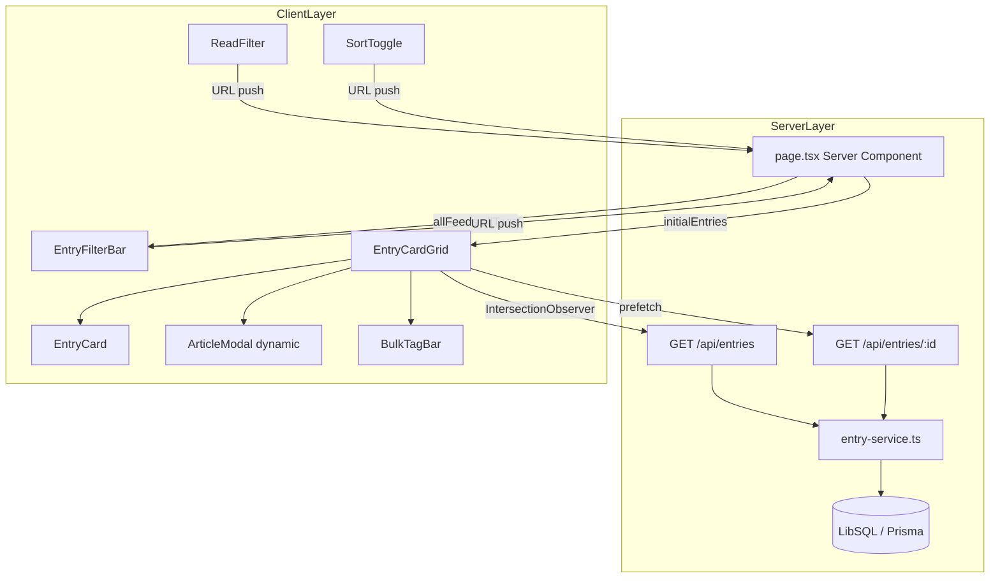
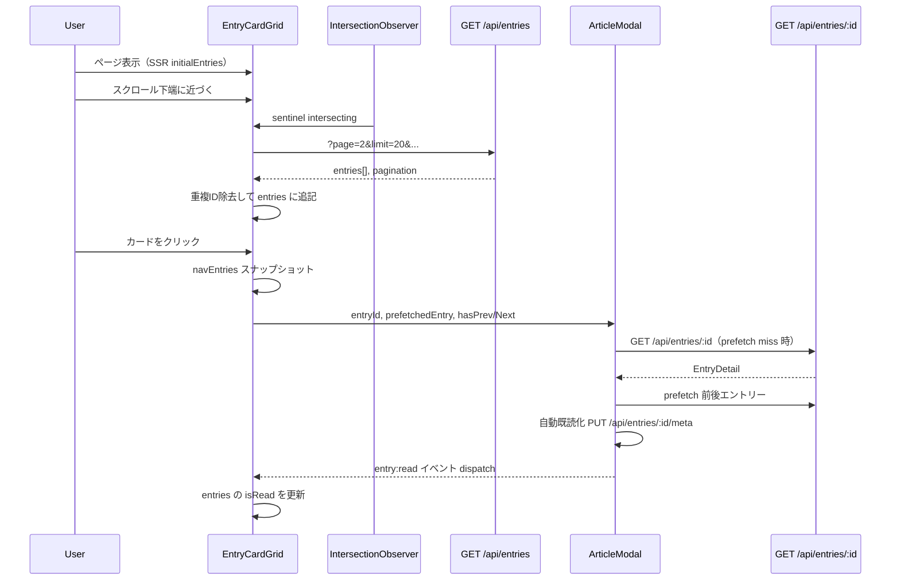
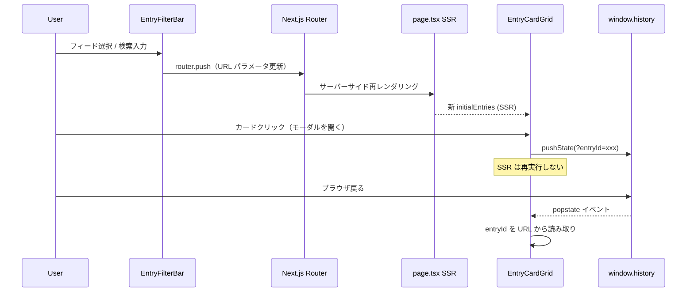

# Design Document: entry-viewing

## Overview

エントリー閲覧機能は、feed-management が収集した RSS エントリーをユーザーが効率よく閲覧・操作するためのコア UI を提供する。ホーム画面でのフィルタリング・無限スクロール・記事モーダルの全文表示・キーボード/スワイプナビゲーションを一体として実装している。

**Purpose**: 複数フィードのエントリーを一元的にブラウジングし、記事モーダルで全文閲覧できる読書体験を提供する。  
**Users**: セルフホスト型 RSS リーダーの利用者が、ホーム画面でエントリーをフィルタリング・検索し、記事モーダルを通じて前後ナビゲーションを行う。  
**Impact**: 本フィーチャーの EntryCardGrid・ArticleModal コンポーネントは、read-status・tag-management・preference-recommendations のエントリー表示基盤として機能する。

### Goals

- カーソルベースページネーション + IntersectionObserver による安定した無限スクロール
- `history.pushState` による URL 状態管理（Next.js ルーターを使わないモーダル表示）
- navEntries スナップショットによる、ナビゲーション中の安定した前後移動
- 隣接エントリーのプリフェッチによる体感速度向上
- URLデデュプリケーション（feedId 未指定時に `distinct: ['link']`）

### Non-Goals

- `isRead` / `isReadLater` フラグのビジネスロジック（read-status が担当）
- タグの作成・削除・一覧管理（tag-management が担当）
- 嗜好スコア計算（preference-recommendations が担当）
- フィード CRUD（feed-management が担当）

---

## Boundary Commitments

### This Spec Owns

- `GET /api/entries` — フィルタリング・ページネーション・URLデデュプリケーション
- `GET /api/entries/:id` — 単一エントリー詳細取得
- `EntryCardGrid` — 無限スクロール・navスナップショット・プリフェッチキャッシュ
- `EntryCard` — カード表示・既読トグル・バッチ選択
- `ArticleModal` — 全文表示・スワイプ・キーボードショートカット・自動既読化
- `EntryFilterBar` — タイトル検索・フィード/タグフィルタ・デバウンス
- `ReadFilter` / `SortToggle` — 既読フィルタ・ソート順トグル
- `EntryService.findManyEntries` / `findManyEntriesDedup` — クエリ・ページネーション
- `EntryService.getEntryById` — 詳細取得
- ホームページ（`/src/app/page.tsx`）の初期サーバーサイドデータフェッチ

### Out of Boundary

- `PUT /api/entries/:id/meta` の isRead/isReadLater 保存ロジック（read-status が担当、本フィーチャーは呼び出しのみ）
- タグの付与・削除・一覧 API（tag-management が担当）
- `POST /api/tags/batch` の実装（tag-management が担当、EntryCardGrid は呼び出しのみ）
- 嗜好スコアリング・`EntryPreferenceScore` の更新
- フィード登録・削除・更新
- `BulkTagBar` コンポーネント（tag-management との統合、EntryCardGrid は呼び出しのみ）

### Allowed Dependencies

- feed-management: `Feed` モデル、`Entry` モデル（読み取りのみ）
- Prisma / LibSQL: Entry・EntryMeta・EntryTag テーブルへの読み取りアクセス
- Next.js App Router: Server Components（初期データ取得）+ Client Components（インタラクション）
- `next/dynamic`: ArticleModal の動的インポート（SSR無効）
- shadcn/ui・Tailwind CSS 4: UI コンポーネント
- `useHotkeyConfig` hook: キーボードショートカット設定の読み取り

### Revalidation Triggers

- `Entry` / `EntryMeta` モデルのスキーマ変更
- `/api/entries` レスポンス形式の変更（`data` / `pagination` 構造）
- `findManyEntries` / `findManyEntriesDedup` インターフェース変更
- `navEntries` スナップショット戦略の変更（read-status・tag-management に影響）

---

## Architecture

### Existing Architecture Analysis

本フィーチャーは Next.js App Router の既存パターンに完全適合している。

- **Server Component（初期データ取得）**: `/src/app/page.tsx` が `findManyEntries` を直接呼び出してSSRで初期エントリーをレンダリングする
- **Client Component（インタラクション）**: `EntryCardGrid`・`EntryFilterBar`・`ReadFilter`・`SortToggle` は `'use client'` で宣言される
- **動的インポート**: `ArticleModal` は `next/dynamic({ ssr: false })` で遅延ロードされ、SSR ページサイズを削減する
- **Service Layer パターン**: `entry-service.ts` がすべての DB クエリを担い、API Route は薄いハンドラーとして機能する
- **URL 状態管理**: フィルタ変更は `router.push`（server re-render）を使い、モーダル開閉は `history.pushState`（client-only）を使う

### Architecture Pattern & Boundary Map



### Technology Stack

| Layer | Choice / Version | Role in Feature | Notes |
|-------|-----------------|-----------------|-------|
| Frontend | Next.js 16 + React 19 | Server Component 初期フェッチ + Client Component インタラクション | App Router のみ使用 |
| UI | Tailwind CSS 4 + shadcn/ui | カードグリッド・フィルタバー・モーダル UI | `cn()` ユーティリティで条件付きクラス |
| State | React `useState` / `useRef` / `useEffect` | CardGrid の entries・navEntries・prefetch キャッシュ | Redux/Zustand 不使用 |
| Routing | `history.pushState` (modal) + `useRouter` (filter) | モーダル表示中のURL管理 | SSR再実行を防ぐため分離 |
| Data | Prisma 7 + LibSQL | Entry・EntryMeta クエリ | `distinct: ['link']` でURL重複排除 |
| Dynamic Import | `next/dynamic({ ssr: false })` | ArticleModal の遅延ロード | 初期ページサイズ削減 |

---

## File Structure Plan

### Directory Structure

```
src/
├── app/
│   ├── page.tsx                        # Home: Server Component、初期エントリー取得・フィルタ状態読み取り
│   └── api/
│       └── entries/
│           ├── route.ts                # GET /api/entries — クエリパラメータ → findManyEntries
│           └── [id]/
│               └── route.ts            # GET /api/entries/:id — getEntryById
├── components/
│   ├── entry-card-grid.tsx             # EntryCardGrid: 無限スクロール・navスナップショット・prefetch・モーダル制御
│   ├── entry-card.tsx                  # EntryCard: カード表示・読了トグル・バッチ選択
│   ├── article-modal.tsx               # ArticleModal: 全文表示・スワイプ・キーボードショートカット
│   ├── entry-filter-bar.tsx            # EntryFilterBar: テキスト検索・フィード/タグフィルタ
│   ├── read-filter.tsx                 # ReadFilter: 既読/未読トグル
│   └── sort-toggle.tsx                 # SortToggle: 新しい順/古い順
├── lib/
│   ├── entry-service.ts                # findManyEntries・findManyEntriesDedup・getEntryById・updateEntryMeta
│   └── hotkey-config.ts                # ホットキー設定のロード・保存・デフォルト値
├── hooks/
│   └── use-hotkey-config.ts            # useHotkeyConfig: ホットキー設定 React hook
└── types/
    └── entry.ts                        # EntryListItem・EntryDetail・GetEntriesQuery 他
```

### Modified Files

- `src/app/page.tsx` — `searchParams` を読み取り、`findManyEntries` を呼び出して初期データを Server Component で取得する
- `src/lib/entry-service.ts` — `findManyEntries` / `findManyEntriesDedup` / `getEntryById` を実装（既存ファイルを拡張）

---

## System Flows

### 無限スクロール + navスナップショット + プリフェッチ



### URL 状態管理フロー



---

## Requirements Traceability

| Requirement | Summary | Components | Interfaces |
|-------------|---------|------------|------------|
| 1.1 | カードグリッド表示 | EntryCard, EntryCardGrid | EntryListItem |
| 1.2 | 空状態表示 | EntryCardGrid | — |
| 1.3 | 既読/未読視覚区別 | EntryCard | EntryMeta.isRead |
| 1.4 | 件数表示 | page.tsx | pagination.total |
| 2.1–2.5 | 無限スクロール | EntryCardGrid | GET /api/entries, Pagination |
| 3.1–3.4 | テキスト検索 | EntryFilterBar | URL search param |
| 4.1–4.7 | フィルタリング | EntryFilterBar, ReadFilter, Entry API | GetEntriesQuery |
| 5.1–5.9 | ArticleModal 全文表示 | ArticleModal, EntryCardGrid | EntryDetail |
| 6.1–6.8 | モーダルナビゲーション | EntryCardGrid, ArticleModal | navEntries snapshot |
| 7.1–7.3 | 自動既読化 | ArticleModal, EntryCardGrid | PUT /api/entries/:id/meta |
| 8.1–8.3 | URL デデュプリケーション | EntryService | findManyEntriesDedup |
| 9.1–9.4 | 隣接プリフェッチ | EntryCardGrid | prefetchCacheRef |
| 10.1–10.5 | Entry API | API Routes | GetEntriesQuery, GetEntriesResponse |
| 11.1–11.3 | 一括タグ付け | EntryCardGrid, BulkTagBar | POST /api/tags/batch |

---

## Components and Interfaces

### コンポーネント概要

| Component | Layer | Intent | Req Coverage | Key Dependencies | Contracts |
|-----------|-------|--------|-------------|-----------------|-----------|
| page.tsx | Server | SSR 初期データフェッチ | 1.4, 4.3, 4.4 | EntryService, TagService, FeedService | — |
| EntryCardGrid | Client | 無限スクロール・nav・prefetch | 1–3, 5.1, 6, 9, 11 | ArticleModal, EntryCard, BulkTagBar | State |
| EntryCard | Client | エントリーカード表示・操作 | 1.1, 1.3, 7.2, 7.3 | PUT /api/entries/:id/meta | — |
| ArticleModal | Client | 全文表示・ナビゲーション | 5.2–5.9, 6.6–6.8, 7.1 | GET /api/entries/:id, PUT meta | — |
| EntryFilterBar | Client | フィルタリング・検索 | 3, 4.1, 4.2, 4.5 | useRouter | — |
| ReadFilter | Client | 既読フィルタトグル | 4.3 | useRouter | — |
| SortToggle | Client | ソート順トグル | 4.4 | useRouter | — |
| EntryService | Service | DB クエリ・重複排除 | 8, 10 | Prisma | Service |
| Entry API Routes | API | HTTP ハンドラー | 10 | EntryService | API |

---

### Service Layer

#### EntryService

| Field | Detail |
|-------|--------|
| Intent | エントリーの一覧取得（フィルタ・ページネーション）と単一エントリー詳細取得 |
| Requirements | 2.1, 4.6, 4.7, 8.1, 8.2, 8.3, 10.1–10.5 |

**Responsibilities & Constraints**
- `findManyEntries(query: GetEntriesQuery)` — フィルタ・カーソル・ページ番号によるエントリー一覧取得
- `feedId` 未指定かつカーソルなしの場合、`findManyEntriesDedup` に委譲して `distinct: ['link']` で重複排除
- カーソルベースページネーション: `afterId` / `beforeId` を pivot として `publishedAt` 比較でフィルタ
- `getEntryById(id: string)` — feed・meta・tags を join した詳細取得

**Dependencies**
- Inbound: GET /api/entries, GET /api/entries/:id (P0)
- Outbound: Prisma / LibSQL — Entry, EntryMeta, Feed, EntryTag テーブル (P0)

**Contracts**: Service [x] / API [ ] / Event [ ] / Batch [ ] / State [ ]

##### Service Interface

```typescript
interface EntryServiceInterface {
  findManyEntries(query: GetEntriesQuery): Promise<{
    entries: EntryListItem[]
    pagination: Pagination
  }>

  getEntryById(id: string): Promise<EntryDetail | null>

  updateEntryMeta(entryId: string, data: UpdateEntryMetaInput): Promise<EntryMeta | null>
}

interface GetEntriesQuery {
  feedId?: string
  tagId?: string
  search?: string
  page?: number           // default: 1
  limit?: number          // default: 20
  afterId?: string        // cursor: fetch entries after this ID
  beforeId?: string       // cursor: fetch entries before this ID
  isReadLater?: boolean
  isUnread?: boolean
  userPreferenceId?: string
  isAnyPreferred?: boolean
  sortOrder?: 'asc' | 'desc'  // default: 'desc'
  scoreThreshold?: number     // default: 0.5
}

interface Pagination {
  page: number
  limit: number
  total: number
  hasNext: boolean
  hasPrev: boolean
}
```

**Implementation Notes**
- `findManyEntriesDedup` は `prisma.entry.findMany({ distinct: ['link'], orderBy: { effectedDate: sortOrder } })` で実装。カーソルパラメータとの組み合わせは非対応（feedId 未指定・初期ロード専用）
- カーソルナビ時は `publishedAt` の比較で前後フィルタを構築し、`beforeId` の場合は昇順取得後 `.reverse()`
- 同一 link の既読連動（8.3）は `saveEntries` の副作用として実装済み

---

### API Layer

#### GET /api/entries

| Field | Detail |
|-------|--------|
| Intent | クエリパラメータを `GetEntriesQuery` にパースし `findManyEntries` に委譲 |
| Requirements | 10.1, 10.2, 10.5 |

**Contracts**: Service [ ] / API [x] / Event [ ] / Batch [ ] / State [ ]

##### API Contract

| Method | Endpoint | Request | Response | Errors |
|--------|----------|---------|----------|--------|
| GET | /api/entries | Query params (GetEntriesQuery) | `{ success: true, data: EntryListItem[], pagination: Pagination }` | 400 (VALIDATION_ERROR), 500 |

**Implementation Notes**
- `page` パラメータが `isNaN` または `< 1` の場合に 400 を返す
- 他パラメータはすべてオプション; 未指定はデフォルト値を service 側で適用

#### GET /api/entries/:id

| Field | Detail |
|-------|--------|
| Intent | 単一エントリー詳細を返す |
| Requirements | 10.3, 10.4 |

**Contracts**: Service [ ] / API [x] / Event [ ] / Batch [ ] / State [ ]

##### API Contract

| Method | Endpoint | Request | Response | Errors |
|--------|----------|---------|----------|--------|
| GET | /api/entries/:id | — | `{ success: true, data: EntryDetail }` | 404 (ENTRY_NOT_FOUND), 500 |

---

### Client Layer

#### EntryCardGrid

| Field | Detail |
|-------|--------|
| Intent | 無限スクロール・モーダル制御・navスナップショット・プリフェッチキャッシュを一体管理するメイン Client Component |
| Requirements | 2.1–2.5, 5.1, 5.7, 5.8, 6.1–6.5, 7.2, 7.3, 9.1–9.4, 11.1–11.3 |

**Responsibilities & Constraints**
- `entries` と `navEntries` を別の state で管理。`entries` は read/unread イベントで更新、`navEntries` はモーダル開封時のスナップショットで固定
- `loadMore`（無限スクロール）と `loadNavMore`（モーダルナビ先読み）は独立した page カウンタを持つ
- `prefetchCacheRef: Map<string, EntryDetail>` でプリフェッチ結果を管理
- モーダル表示は `history.pushState(?entryId=...)` で URL 管理（Next.js router.push を使わない）
- `popstate` イベントでブラウザ戻る/進むを検知して `selectedEntryId` を同期

**Contracts**: Service [ ] / API [ ] / Event [ ] / Batch [ ] / State [x]

##### State Management

```typescript
// エントリーリスト状態
const [entries, setEntries] = useState<EntryListItem[]>(initialEntries)
const [page, setPage] = useState(1)
const [hasMore, setHasMore] = useState(initialPagination.hasNext)

// navスナップショット（モーダルナビ専用、read状態変化の影響を受けない）
const [navEntries, setNavEntries] = useState<EntryListItem[]>([])
const [navPage, setNavPage] = useState(1)
const [navHasMore, setNavHasMore] = useState(false)

// プリフェッチキャッシュ（副作用なし参照用）
const prefetchCacheRef = useRef<Map<string, EntryDetail>>(new Map())

// モーダル表示エントリー（URL から読み取り）
const [selectedEntryId, setSelectedEntryId] = useState<string | null>(null)
```

- `entry:read` / `entry:unread` カスタムイベントで `entries` の isRead を更新（`navEntries` は更新しない）
- `entry:updated` カスタムイベントで `entries` の isReadLater を更新し、あとで読むページでは対象エントリーを除去
- `entry:tags-updated` カスタムイベントでプリフェッチキャッシュの該当エントリーを無効化

#### EntryCard

| Field | Detail |
|-------|--------|
| Intent | 個別エントリーをカード形式で表示し、既読トグルとバッチ選択をサポートする |
| Requirements | 1.1, 1.3, 7.2, 7.3, 11.1 |

**Implementation Notes**
- `memo()` でラップして不要な再レンダリングを防止
- 既読トグルは `PUT /api/entries/:id/meta` を呼び出し、成功後に `entry:read` / `entry:unread` イベントを dispatch
- 発行日は `useEffect` 内でクライアントサイドフォーマット（SSR/CSR の hydration mismatch を回避）
- バッチ選択モード時は onClick で `onToggleSelect` を呼ぶ（モーダルを開かない）

#### ArticleModal

| Field | Detail |
|-------|--------|
| Intent | エントリー全文をモーダルで表示し、スワイプ・キーボードショートカット・自動既読化を処理する |
| Requirements | 5.2–5.9, 6.6–6.8, 7.1 |

**Responsibilities & Constraints**
- `next/dynamic({ ssr: false })` で遅延ロードされる
- `prefetchedEntry` prop が渡された場合はフェッチをスキップしキャッシュデータを即座に表示
- 自動既読化: `entry.meta?.isRead` が false の場合のみ `PUT /api/entries/:id/meta { isRead: true }` を実行
- スワイプ: `SWIPE_THRESHOLD = 60px` でジェスチャーを判定。ポインターが button/a/input/textarea に起因する場合はスワイプを無効化
- 読了プログレスバー: `scrollTop / (scrollHeight - clientHeight) * 100`
- キーボードショートカット: `useHotkeyConfig()` で設定を読み取り、6種類のアクションを処理

**Contracts**: Service [ ] / API [ ] / Event [ ] / Batch [ ] / State [x]

#### EntryFilterBar

| Field | Detail |
|-------|--------|
| Intent | タイトル検索・フィード/タグフィルタを提供し、URL クエリパラメータを更新する |
| Requirements | 3.1–3.4, 4.1, 4.2, 4.5 |

**Implementation Notes**
- 検索デバウンス: `useRef<ReturnType<typeof setTimeout>>` で 300ms タイマーを管理
- IME composition guard: `isComposingRef` で compositionstart/end を追跡し、composition 中はデバウンスをスキップ
- `searchParams` の変化を `useEffect` で監視し、外部からの URL 変化（ブラウザ戻る/進む）に対応

---

## Data Models

### Domain Model

```
Entry (aggregate root)
  ├── id: string (UUID)
  ├── feedId: string → Feed
  ├── guid: string (RSS item guid)
  ├── title: string
  ├── link: string (URL)
  ├── description: string? (RSS summary)
  ├── content: string? (full HTML/text)
  ├── imageUrl: string?
  ├── publishedAt: DateTime?
  ├── effectedDate: DateTime (sort key for dedup mode)
  ├── meta: EntryMeta? (read状態)
  └── tags: EntryTag[] (タグ関連)

EntryMeta (value object、別テーブルで遅延作成)
  ├── entryId: string @unique
  ├── isRead: boolean
  └── isReadLater: boolean
```

**Invariants**
- `feedId + guid` で一意（重複エントリーは upsert で更新）
- `link` が重複する場合、feedId 未指定全記事ビューでは `distinct` により1件に集約
- EntryMeta は entryId に対して 0 または 1 のみ存在（`@unique`）

### Physical Data Model

```sql
-- インデックス（閲覧機能で使用）
@@index([publishedAt(sort: Desc)])    -- ソート
@@index([effectedDate(sort: Desc)])   -- dedup モードソート
@@index([feedId])                     -- フィードフィルタ
@@index([feedId, publishedAt(sort: Desc)])  -- フィード別ソート
@@index([link])                       -- dedup / 既読連動
```

### Data Contracts & Integration

#### エントリー一覧レスポンス

```typescript
// GET /api/entries response
{
  success: true,
  data: EntryListItem[],   // id, title, link, imageUrl, publishedAt, createdAt, feed, meta
  pagination: {
    page: number,
    limit: number,
    total: number,
    hasNext: boolean,
    hasPrev: boolean
  }
}
```

#### エントリー詳細レスポンス

```typescript
// GET /api/entries/:id response
{
  success: true,
  data: EntryDetail  // Entry の全フィールド + feed + meta + tags[]
}
```

---

## Error Handling

### Error Strategy

- API バリデーションエラーは 400 + `VALIDATION_ERROR` コードで返す
- 存在しないリソースは 404 + `ENTRY_NOT_FOUND` で返す
- サーバー内部エラーは 500 + `INTERNAL_SERVER_ERROR` で返す
- フロントエンド fetch 失敗時は無視（ローディング状態を解除するのみ）、ユーザーに追加ページがないと見せる

### Error Categories and Responses

- **User Errors (4xx)**: `page < 1` → 400 VALIDATION_ERROR; entryId 不存在 → 404 ENTRY_NOT_FOUND
- **System Errors (5xx)**: DB 接続障害 → 500、ログ出力のみ（グレースフルデグラデーション）
- **UI フォールバック**: `loadMore` / `loadNavMore` は fetch 失敗時に `finally` でローディングフラグをクリアするのみ

---

## Testing Strategy

### Unit Tests

- `findManyEntries`: feedId 指定・未指定・カーソルパラメータ・scoreThreshold フィルタの境界値
- `findManyEntriesDedup`: `distinct: ['link']` で重複が正しく除去されること
- `getEntryById`: 存在・不存在の両ケース
- `formatDate`（EntryCard 内）: 分・時・日・週のフォーマット分岐

### Integration Tests

- `GET /api/entries`: 各クエリパラメータの組み合わせとページネーション応答
- `GET /api/entries/:id`: 正常レスポンス・404 応答
- `page < 1` バリデーション → 400 応答

### E2E / UI Tests

- EntryCard クリックで ArticleModal が開き、entryId が URL に追加されること
- ArticleModal でスワイプ操作（右スワイプで前、左スワイプで次）が正しく動作すること
- EntryFilterBar の検索入力が 300ms 後に URL `search` パラメータを更新すること
- IntersectionObserver による loadMore トリガー（モック使用）

### Performance

- エントリー一覧初期表示: 20 件フェッチが 200ms 以内（LibSQL ローカル）
- プリフェッチ: モーダル開封時に前後エントリーの詳細が非同期で取得されること（ブロッキングなし）

---

## Security Considerations

- EntryDetail の `content` / `description` は現状 `whitespace-pre-wrap` でプレーンテキストとして表示しており、`dangerouslySetInnerHTML` は使用しない
- 外部リンクはすべて `target="_blank" rel="noopener noreferrer"` で開く
- iOS PWA standalone モードでは `window.open()` にフォールバックして意図しないアプリ内遷移を防ぐ
