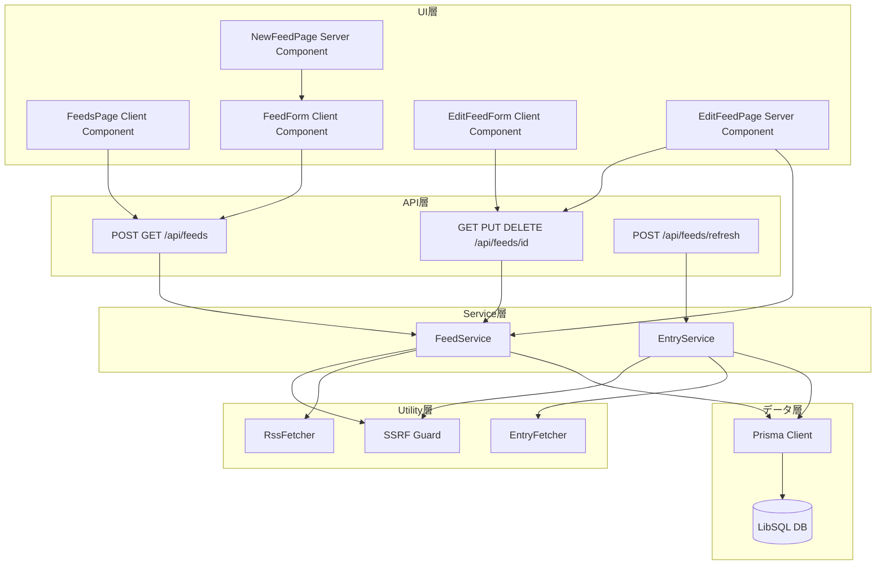
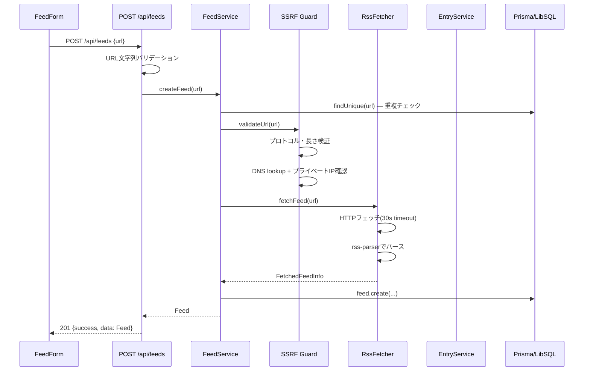
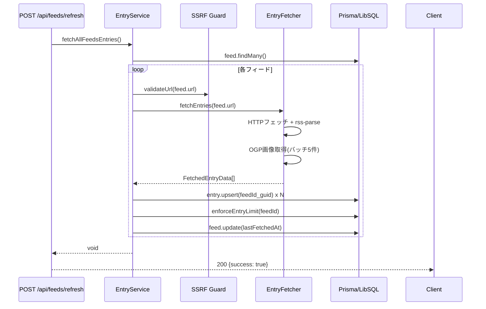
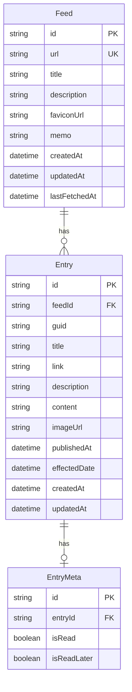

# Design Document: feed-management

## Overview

フィード管理機能は、RSSリーダーアプリケーションのコアとなる機能で、ユーザーがRSS/AtomフィードのURLを登録・編集・削除し、エントリーを自動取得する仕組みを提供する。SSRF保護を必須とし、フィードあたり最大500件のエントリーを保持する。

**Purpose**: ユーザーが複数のRSS/AtomフィードをURLで一元管理し、エントリーを自動収集できるようにする。  
**Users**: セルフホスト型RSSリーダーの利用者。フィードの登録・更新・削除・手動リフレッシュを行う。  
**Impact**: 本フィーチャーが確立するFeedおよびEntryデータモデルは、entry-viewing・read-status・tag-management・preference-recommendationsの下流フィーチャーが共有する基盤となる。

### Goals

- フィードURL登録時のSSRF保護・メタデータ自動取得・エントリー初期ロードをシームレスに実行する
- フィードあたり500件の上限管理と重複排除を一貫して維持する
- フィード一覧・詳細・編集・削除の標準RESTインターフェースを提供する
- 手動リフレッシュにより全フィードのエントリーを即時更新できるようにする

### Non-Goals

- 定期自動更新スケジューラー（node-cronによる別フィーチャー）
- エントリー閲覧・フィルタリングUI（entry-viewingが担当）
- 認証・認可（better-authが担当）
- 嗜好スコアリング・レコメンデーション

---

## Boundary Commitments

### This Spec Owns

- `Feed` エンティティのCRUD操作（作成・読取・更新・削除）
- フィード登録時のSSRFバリデーション・メタデータ取得・エントリー初期ロード
- 手動リフレッシュ（全フィードのエントリー再取得）
- エントリー保存・重複排除・500件上限管理
- エントリー画像URL抽出（RSS属性優先、フォールバックとしてOGP取得）
- フィード管理UI（一覧・追加フォーム・編集フォーム）
- API Routes: `GET/POST /api/feeds`, `GET/PUT/DELETE /api/feeds/[id]`, `POST /api/feeds/refresh`
- SSRF Guardロジック（`ssrf-guard.ts`）

### Out of Boundary

- エントリーの閲覧・フィルタリング・ページネーション（entry-viewingが担当）
- 読了状態管理（read-statusが担当）
- タグ管理（tag-managementが担当）
- 嗜好スコア計算（preference-recommendationsが担当）
- 認証・セッション管理（better-authが担当）
- 定期スケジューリング（node-cronによる別フィーチャー）
- `EntryMeta`の読了状態連動は本フィーチャーで実装済み（エントリー保存時の副作用）

### Allowed Dependencies

- Prisma / LibSQL: Feed・Entryモデルへの読み書き
- `rss-parser`: フィードコンテンツのパース
- Next.js App Router: APIルートおよびページコンポーネント
- shadcn/ui・Tailwind CSS: UIコンポーネント
- better-auth: 認証状態への参照（ただし認証処理自体は担当しない）

### Revalidation Triggers

- `Feed` モデルのスキーマ変更（フィールド追加・削除）
- APIレスポンス形式の変更（`data`, `error` 構造）
- SSRFバリデーションロジックの変更（下流フィーチャーが同ガードを使用する場合）
- `enforceEntryLimit`の上限値変更（entry-viewingの表示件数に影響）

---

## Architecture

### Existing Architecture Analysis

本フィーチャーは既存のNext.js App Router構成に完全に適合している。

- **Service Layerパターン**: ビジネスロジックは`/src/lib/`に集約。ルートハンドラーはサービス関数に即座に委譲する薄いハンドラー
- **Thin Route Handlers**: `/src/app/api/`のルートハンドラーはバリデーションとエラーハンドリングのみを担う
- **Client Components**: `/src/app/feeds/page.tsx`はClient Componentとして実装され、CSRでAPIを呼び出す
- **Server Components**: 編集ページ（`/src/app/feeds/[id]/edit/page.tsx`）はServer Componentでフィードデータを取得しClient Componentに渡す

### Architecture Pattern & Boundary Map



**依存方向**: UI層 → API層 → Service層 → Utility層 → データ層。各層は自層より下位の層のみを参照する。

### Technology Stack

| Layer | Choice / Version | Role in Feature | Notes |
|-------|------------------|-----------------|-------|
| Frontend | Next.js 16 + React 19 | Client/Server Components、フォームUI | App Router |
| Backend | Next.js API Routes | REST エンドポイント | 薄いハンドラー |
| ORM | Prisma 7 | Feed・Entry・EntryMeta CRUD | LibSQL adapter |
| Database | LibSQL (SQLite互換) | データ永続化 | Turso互換 |
| RSS Parse | rss-parser | フィードコンテンツパース | カスタムフィールド対応 |
| Styling | Tailwind CSS 4 + shadcn/ui | UIコンポーネント | |
| Language | TypeScript strict | 型安全 | no any |

---

## File Structure Plan

### Directory Structure

```
src/
├── app/
│   ├── api/
│   │   └── feeds/
│   │       ├── route.ts              # GET /api/feeds, POST /api/feeds
│   │       ├── [id]/
│   │       │   └── route.ts          # GET/PUT/DELETE /api/feeds/[id]
│   │       └── refresh/
│   │           └── route.ts          # POST /api/feeds/refresh
│   └── feeds/
│       ├── page.tsx                  # フィード一覧 (Client Component)
│       ├── new/
│       │   └── page.tsx              # フィード追加ページ (Server Component)
│       └── [id]/
│           └── edit/
│               └── page.tsx          # フィード編集ページ (Server Component)
├── components/
│   ├── feed-form.tsx                 # フィード追加フォーム (Client Component)
│   └── edit-feed-form.tsx            # フィード編集フォーム (Client Component)
├── lib/
│   ├── feed-service.ts               # Feed CRUD + getAllFeeds (React cache)
│   ├── entry-service.ts              # エントリー保存・上限管理・全フィードリフレッシュ
│   ├── rss-fetcher.ts                # フィードメタデータ取得・パース
│   ├── entry-fetcher.ts              # エントリー取得・OGP画像抽出
│   ├── ssrf-guard.ts                 # URLバリデーション・SSRF保護
│   ├── errors.ts                     # AppError・各エラークラス
│   └── db.ts                         # Prisma clientシングルトン
├── types/
│   └── feed.ts                       # Feed・FeedListItem・APIリクエスト/レスポンス型
└── generated/
    └── prisma/                       # Prisma自動生成クライアント（変更不可）
```

### Modified Files

- `prisma/schema.prisma` — FeedモデルおよびEntryモデルの定義（本フィーチャーで確立）

---

## System Flows

### フィード登録フロー



### 手動リフレッシュフロー



---

## Requirements Traceability

| Requirement | Summary | Components | Interfaces |
|-------------|---------|------------|------------|
| 1.1–1.7 | フィードURL登録・バリデーション | FeedService, SSRF Guard, RssFetcher | POST /api/feeds |
| 2.1–2.4 | メタデータ取得 | RssFetcher | fetchFeed() |
| 3.1–3.7 | エントリー取得・保存・上限管理 | EntryService, EntryFetcher | fetchAllFeedsEntries(), saveEntries(), enforceEntryLimit() |
| 4.1–4.4 | フィード一覧 | FeedService | GET /api/feeds, getAllFeeds() |
| 5.1–5.2 | フィード詳細 | FeedService | GET /api/feeds/[id], getFeedById() |
| 6.1–6.4 | フィード編集 | FeedService | PUT /api/feeds/[id], updateFeed() |
| 7.1–7.3 | フィード削除 | FeedService | DELETE /api/feeds/[id], deleteFeed() |
| 8.1–8.3 | 手動リフレッシュ | EntryService | POST /api/feeds/refresh |
| 9.1–9.5 | SSRF保護 | SSRF Guard | validateUrl() |
| 10.1–10.6 | フィード管理UI | FeedsPage, FeedForm, EditFeedForm | - |

---

## Components and Interfaces

### Component Summary

| Component | Domain/Layer | Intent | Req Coverage | Key Dependencies | Contracts |
|-----------|--------------|--------|--------------|-----------------|-----------|
| FeedService | Service | Feed CRUD + unreadCount集計 | 1, 4, 5, 6, 7 | Prisma, SSRF Guard, RssFetcher (P0) | Service |
| EntryService | Service | エントリー保存・上限管理・全フィードリフレッシュ | 3, 8 | Prisma, SSRF Guard, EntryFetcher (P0) | Service |
| RssFetcher | Utility | フィードメタデータ取得・パース | 2 | rss-parser, fetch (P0) | Service |
| EntryFetcher | Utility | エントリー取得・OGP画像抽出 | 3 | rss-parser, fetch (P0) | Service |
| SSRF Guard | Utility | URLバリデーション・プライベートIP拒否 | 9 | dns/promises (P0) | Service |
| Feed API Routes | API | RESTエンドポイント | 1, 4, 5, 6, 7, 8 | FeedService, EntryService (P0) | API |
| FeedsPage | UI | フィード一覧 + 削除操作 | 10 | /api/feeds (P1) | State |
| FeedForm | UI | フィード追加フォーム | 1, 10 | /api/feeds (P1) | State |
| EditFeedForm | UI | フィード編集フォーム | 6, 10 | /api/feeds/[id] (P1) | State |

---

### Service層

#### FeedService

| Field | Detail |
|-------|--------|
| Intent | FeedエンティティのCRUD操作と一覧取得（未読数・最新投稿日時含む） |
| Requirements | 1.1, 1.2, 1.3, 1.4, 4.1, 4.2, 4.3, 4.4, 5.1, 5.2, 6.1, 6.2, 6.3, 6.4, 7.1, 7.2, 7.3 |

**Responsibilities & Constraints**
- フィード登録: 重複チェック → SSRFバリデーション → メタデータ取得 → DB保存のシーケンスを保証する
- `getAllFeeds`はReact `cache()`でラップし同一リクエスト内での重複クエリを防ぐ
- `getFeedById`は存在確認を兼ね、update/deleteの前提として呼び出される
- フィードURL自体は更新対象から除外する（URLは不変）

**Dependencies**
- Inbound: Feed API Routes — CRUD呼び出し (P0)
- Outbound: Prisma Client — Feed CRUD (P0)
- Outbound: SSRF Guard — URL登録時バリデーション (P0)
- Outbound: RssFetcher — フィードメタデータ取得 (P0)

**Contracts**: Service [x]

##### Service Interface

```typescript
export async function createFeed(url: string): Promise<Feed>
export const getAllFeeds: () => Promise<FeedListItem[]>  // React cache wrapped
export async function getFeedById(id: string): Promise<Feed>
export async function updateFeed(id: string, data: UpdateFeedInput): Promise<Feed>
export async function deleteFeed(id: string): Promise<void>
```

- `createFeed`: 重複時 `ConflictError`、SSRF違反時 `SSRFError`、フェッチ失敗時 `FeedFetchError`、フォーマット不正時 `InvalidFeedFormatError`
- `getFeedById` / `updateFeed` / `deleteFeed`: 存在しない場合 `NotFoundError`

---

#### EntryService

| Field | Detail |
|-------|--------|
| Intent | エントリーの保存・重複排除・上限管理（500件）・全フィードリフレッシュ |
| Requirements | 3.1, 3.2, 3.3, 3.4, 3.5, 3.6, 3.7, 8.1, 8.2, 8.3 |

**Responsibilities & Constraints**
- `saveEntries`: guidを一意キーとしてupsert。同一linkの既読エントリーがあれば新規エントリーを自動既読にする
- `enforceEntryLimit`: 500件超過時にpublishedAt昇順（古い順）で超過分を削除
- `fetchAllFeedsEntries`: 各フィードに対してSSRFバリデーション → エントリー取得 → 保存 → 上限管理 → lastFetchedAt更新。個別エラーは catch してスキップし処理継続

**Dependencies**
- Inbound: Refresh API Route — `fetchAllFeedsEntries` (P0)
- Outbound: Prisma Client — Entry/EntryMeta CRUD (P0)
- Outbound: SSRF Guard — リフレッシュ時URLバリデーション (P0)
- Outbound: EntryFetcher — エントリーコンテンツ取得 (P0)

**Contracts**: Service [x]

##### Service Interface

```typescript
export async function saveEntries(feedId: string, entries: FetchedEntryData[]): Promise<void>
export async function enforceEntryLimit(feedId: string): Promise<void>
export async function fetchAllFeedsEntries(): Promise<void>
```

---

### Utility層

#### RssFetcher

| Field | Detail |
|-------|--------|
| Intent | フィードURLへのHTTPフェッチとrss-parserによるメタデータ抽出 |
| Requirements | 2.1, 2.2, 2.3, 2.4, 1.6, 1.7 |

**Responsibilities & Constraints**
- 30秒タイムアウト（AbortController）
- タイトル不在時はURLをフォールバックとして使用
- ファビコン: RSS 2.0 `image.url` → Atom `icon` の優先順位
- フェッチ失敗: `FeedFetchError`、パース失敗: `InvalidFeedFormatError`

**Contracts**: Service [x]

##### Service Interface

```typescript
export async function fetchFeed(url: string): Promise<FetchedFeedInfo>
// FetchedFeedInfo: { title: string; description: string | null; faviconUrl: string | null; lastFetchedAt: Date }
```

---

#### EntryFetcher

| Field | Detail |
|-------|--------|
| Intent | フィードURLからエントリー一覧を取得し、画像URLを多段抽出する |
| Requirements | 3.1, 3.2, 3.3 |

**Responsibilities & Constraints**
- 画像URL抽出優先順位: RSS enclosure → media:content → media:thumbnail → itunes:image → コンテンツ内imgタグ
- 画像なしエントリーに対してOGP画像をバッチ5件単位で並列取得（5秒タイムアウト）
- OGP取得は `og:image` → `og:image:url` → `twitter:image` → `twitter:image:src` の順で試行
- OGP取得失敗時はnullとして扱い処理継続

**Contracts**: Service [x]

##### Service Interface

```typescript
export async function fetchEntries(feedUrl: string): Promise<FetchedEntryData[]>
// FetchedEntryData: { guid, title, link, description, content, imageUrl, publishedAt }
```

---

#### SSRF Guard

| Field | Detail |
|-------|--------|
| Intent | フィードURLへのHTTPリクエスト前にSSRF攻撃を防止するバリデーション |
| Requirements | 9.1, 9.2, 9.3, 9.4, 9.5, 1.3, 1.5 |

**Responsibilities & Constraints**
- プロトコル: `http:` または `https:` のみ許可
- 長さ: 2048文字以内
- DNSルックアップ: `dns.lookup(hostname, { all: true })` で全アドレス解決
- 拒否対象: IPv4（127.x / 10.x / 172.16-31.x / 192.168.x / 169.254.x / CGNAT）、IPv6（::1 / fe80: / fc00: / fd）
- DNS解決失敗時も `SSRFError` を投げる（ホスト解決不能＝許可しない）

**Contracts**: Service [x]

##### Service Interface

```typescript
export async function validateUrl(url: string): Promise<void>
export function isPrivateIP(ip: string): boolean
// throws SSRFError on violation
```

---

### API層

#### Feed API Routes

| Field | Detail |
|-------|--------|
| Intent | フィード管理のRESTfulエンドポイント。薄いハンドラーとしてサービス層に委譲する |
| Requirements | 1.1–1.7, 4.1–4.4, 5.1–5.2, 6.1–6.4, 7.1–7.3, 8.1–8.3 |

**Contracts**: API [x]

##### API Contract

| Method | Endpoint | Request Body | Response | Error Codes |
|--------|----------|-------------|----------|-------------|
| GET | /api/feeds | — | `{success: true, data: FeedListItem[]}` | 500 |
| POST | /api/feeds | `{url: string}` | `{success: true, data: Feed}` (201) | 400, 409, 422, 500 |
| GET | /api/feeds/[id] | — | `{success: true, data: Feed}` | 404, 500 |
| PUT | /api/feeds/[id] | `{title?, description?, memo?}` | `{success: true, data: Feed}` | 400, 404, 500 |
| DELETE | /api/feeds/[id] | — | `{success: true}` | 404, 500 |
| POST | /api/feeds/refresh | — | `{success: true}` | 500 |

**エラーレスポンス形式**:
```typescript
{ success: false, error: { code: ErrorCode, message: string } }
```

**エラーコードマッピング**:
- `FEED_ALREADY_EXISTS` → 409
- `FEED_NOT_FOUND` → 404
- `URL_NOT_ALLOWED` → 400
- `FEED_FETCH_FAILED` → 422
- `INVALID_FEED_FORMAT` → 422
- `VALIDATION_ERROR` → 400
- `INTERNAL_SERVER_ERROR` → 500

---

### UI層

#### FeedsPage

| Field | Detail |
|-------|--------|
| Intent | フィード一覧をCSRで表示し、削除操作を提供するClient Component |
| Requirements | 10.1, 10.2, 10.3, 10.4 |

**Implementation Note**
- `useEffect` + `useCallback` でマウント時に `GET /api/feeds` を呼び出す
- ロード中はスケルトンUI（4件のパルスアニメーション）を表示
- フィードなし時は空状態UIとフィード追加リンクを表示
- 削除時は `confirm()` でユーザー確認後 `DELETE /api/feeds/[id]` を呼び出し、成功時にローカルstateからフィルタリング

#### FeedForm

| Field | Detail |
|-------|--------|
| Intent | フィードURL入力フォーム。登録APIを呼び出し成功時にリダイレクト |
| Requirements | 1.1, 1.3, 10.5 |

**Implementation Note**
- クライアントサイドでURLプレフィックス（http/https）を事前バリデーション
- 送信中は `Loader2` アイコン付きローディング状態を表示
- APIエラー時はerrorメッセージをUIに表示（`role="alert"`）
- `redirectTo` プロップ経由でリダイレクト先を指定可能

#### EditFeedForm

| Field | Detail |
|-------|--------|
| Intent | フィード編集フォーム。タイトル・説明・メモを編集しAPIを呼び出す |
| Requirements | 6.1, 6.2, 6.3, 10.6 |

**Implementation Note**
- `feed` プロップで初期値を受け取り（Server Componentが取得）
- URLは読み取り専用で表示（編集不可）
- description・memoは最大1000文字、文字数カウンター表示
- 保存成功時に `/feeds` へリダイレクト

---

## Data Models

### Domain Model



**Invariants**:
- `Feed.url` はシステム全体でユニーク
- `Entry(feedId, guid)` はフィード内でユニーク（upsertのキー）
- フィードあたりのEntry数は500件以内（`enforceEntryLimit`による）
- Feedを削除するとEntryはカスケード削除される

### Logical Data Model

**Feed**:
- `id`: UUID、主キー
- `url`: String、ユニーク制約。フィード登録後は変更不可
- `title`: String、必須。フィードタイトル（不在時はURLをフォールバック）
- `description`: String?、任意
- `faviconUrl`: String?、任意
- `memo`: String?、ユーザーが任意に追記するメモ
- `lastFetchedAt`: DateTime?、最後にエントリーをフェッチした日時

**Entry**:
- `(feedId, guid)`: 複合ユニーク制約。重複upsertのキー
- `effectedDate`: 仮想的な「有効日」。publishedAtが存在する場合はpublishedAtと同値、なければcreatedAt（デフォルト）。entry-viewingの重複排除ソートキーとして使用
- `imageUrl`: RSSまたはOGPから抽出した画像URL

### Data Contracts & Integration

**API Request/Response Types** (`/src/types/feed.ts`):
```typescript
interface Feed {
  id: string; url: string; title: string; description: string | null;
  faviconUrl: string | null; memo: string | null;
  createdAt: Date; updatedAt: Date; lastFetchedAt: Date | null;
}
interface FeedListItem {
  id: string; title: string; url: string; faviconUrl: string | null;
  unreadCount: number; createdAt: Date; updatedAt: Date; lastPublishedAt: Date | null;
}
type UpdateFeedInput = Partial<Pick<Feed, 'title' | 'description' | 'memo' | 'lastFetchedAt'>>
```

---

## Error Handling

### Error Strategy

`AppError`基底クラスを継承したドメイン固有エラーを使用。ルートハンドラーが`AppError`をキャッチしてHTTPステータスコードにマッピングする。予期しないエラーは500として返す。

### Error Categories and Responses

**User Errors (4xx)**:
- `SSRFError` (URL_NOT_ALLOWED, 400): URLプロトコル不正・プライベートIP検出
- `ConflictError` (FEED_ALREADY_EXISTS, 409): 同一URL重複登録
- `NotFoundError` (FEED_NOT_FOUND, 404): 存在しないフィードID指定
- `VALIDATION_ERROR` (400): 空URLや空タイトル

**Business Logic Errors (422)**:
- `FeedFetchError` (FEED_FETCH_FAILED, 422): HTTPフェッチ失敗・タイムアウト
- `InvalidFeedFormatError` (INVALID_FEED_FORMAT, 422): RSS/Atomパース失敗

**System Errors (5xx)**:
- 予期しない例外 → `INTERNAL_SERVER_ERROR` (500)
- `fetchAllFeedsEntries` では個別フィードエラーをcatchしてログ出力後にスキップ（サービス継続性）

### Monitoring

- 各ルートハンドラーで `console.error('Unexpected error:', error)` によるログ出力
- `fetchAllFeedsEntries` では `console.error('[EntryService] Failed to fetch entries for feed...')` でフィード単位のエラーを記録

---

## Testing Strategy

### Unit Tests

- **SSRF Guard**: プライベートIPレンジの各パターン（IPv4/IPv6全種）を網羅したユニットテスト。`isPrivateIP` 関数の境界値テスト
- **RssFetcher**: 正常なRSSレスポンス・Atomレスポンス・タイトル不在・パースエラーのモックテスト
- **EntryFetcher**: 画像URL抽出の優先順位テスト（enclosure・media:content等各ソース）、OGP取得のモックテスト
- **FeedService**: createFeed・getAllFeeds・updateFeed・deleteFeedの各ケース（重複・NotFound・正常）

### Integration Tests

- **POST /api/feeds**: 正常登録・重複URL・SSRF違反・フェッチ失敗の各シナリオ（Prismaテスト用DBリセット）
- **PUT /api/feeds/[id]**: 空タイトルバリデーション・NotFound・正常更新
- **DELETE /api/feeds/[id]**: カスケード削除確認・NotFound
- **POST /api/feeds/refresh**: 全フィード処理・個別エラースキップ確認

### E2E / UI Tests

- フィード一覧ページ: ロード中スケルトン → フィード表示 → 削除確認フロー
- フィード追加ページ: URL入力 → 送信 → エラー表示 → 成功リダイレクト
- フィード編集ページ: 初期値表示 → 変更 → 保存 → フィード一覧へリダイレクト

---

## Security Considerations

- **SSRF保護**: 全フィードURL操作で `validateUrl()` を必須実行。DNS解決後のIPアドレス検証により、DNS rebinding攻撃も防止
- **コンテンツサニタイゼーション**: エントリーのdescription/contentはHTML stripして保存。表示側でrehype-sanitizeを使用（entry-viewingが担当）
- **OGP取得**: User-Agentを設定し、5秒タイムアウトとエラー無視で外部リソース取得のリスクを限定
