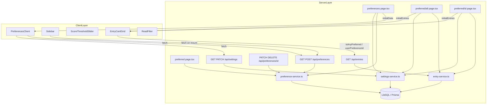
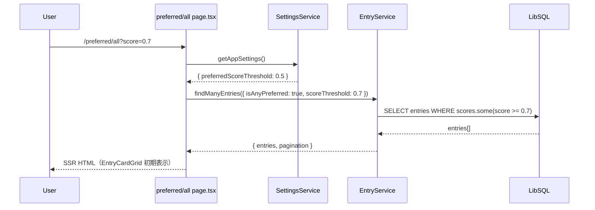
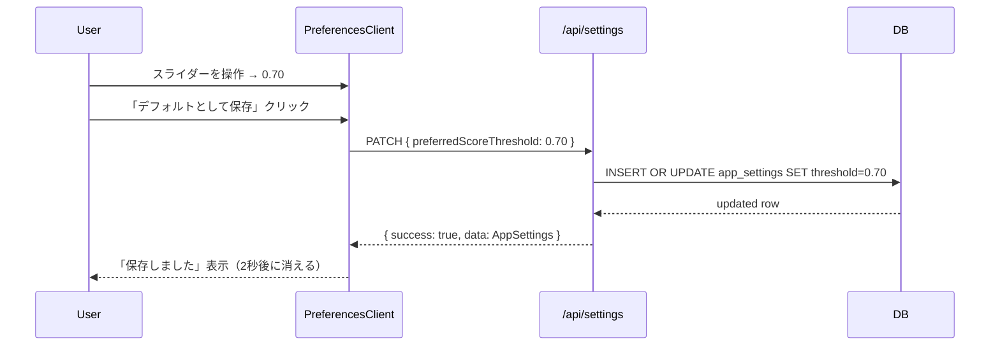

# Design Document: preference-recommendations

## Overview

嗜好ベースレコメンデーション機能は、ユーザーが関心トピックを自由テキストで登録・管理し、外部スコアリングエンジンが書き込んだ `EntryPreferenceScore` を参照してスコアしきい値以上の記事を「好みの記事」として提示する。

**Purpose**: 登録した嗜好テキストに合致する記事をフィルタリングし、ユーザーが関心のある記事に効率よくアクセスできる体験を提供する。  
**Users**: セルフホスト RSS リーダーの利用者が、好みの記事ページから単一嗜好・全嗜好条件でエントリーを閲覧する。  
**Impact**: entry-viewing の `EntryCardGrid` を再利用しつつ、`GET /api/entries` に `userPreferenceId` / `isAnyPreferred` / `scoreThreshold` パラメータを追加することで、既存フィルタリング基盤を拡張する。

### Goals

- 嗜好テキストの CRUD を REST API と UI で完結させる
- AppSettings シングルトンパターンで `preferredScoreThreshold` を永続化する
- `/preferred/all` と `/preferred/[id]` ページで嗜好フィルター付きエントリー閲覧を提供する
- サイドバーに「お好みの記事」セクションを組み込み、各嗜好へのナビゲーションを提供する

### Non-Goals

- エントリースコアリングロジック（外部スコアリングエンジンが `EntryPreferenceScore` を書き込む前提）
- エントリー閲覧モーダル（ArticleModal）の実装（entry-viewing が担当）
- キーボードショートカット設定（settings が担当）

---

## Boundary Commitments

### This Spec Owns

- `UserPreference` テーブルの CRUD（`preference-service.ts`）
- `AppSettings.preferredScoreThreshold` の読み取り・更新（`settings-service.ts`）
- `GET /POST /api/preferences`、`PATCH /DELETE /api/preferences/[id]`、`GET /PATCH /api/settings`
- `/preferences` ページ（嗜好管理 UI + スコアしきい値スライダー）
- `/preferred` ページ（嗜好一覧インデックス）
- `/preferred/all` ページ（全嗜好 OR フィルター）
- `/preferred/[id]` ページ（単一嗜好フィルター）
- サイドバーの「お好みの記事」セクション（`Sidebar` コンポーネント内の preference リスト）
- `GET /api/entries` への `userPreferenceId` / `isAnyPreferred` / `scoreThreshold` パラメータ追加
- `EntryService.findManyEntries` / `findManyEntriesDedup` への嗜好フィルタークエリの組み込み
- `ScoreThresholdSlider` コンポーネント

### Out of Boundary

- `EntryPreferenceScore` の作成・更新（外部スコアリングエンジンが担当）
- `ArticleModal`・`EntryCard`・`EntryCardGrid` のコア実装（entry-viewing が担当）
- キーボードショートカット設定 UI（settings が担当）
- `AppSettings` テーブルの他フィールド（このフィーチャーは `preferredScoreThreshold` のみを管理）

### Allowed Dependencies

- entry-viewing: `EntryCardGrid`・`ReadFilter` コンポーネントの再利用
- Prisma / LibSQL: `UserPreference`・`AppSettings`・`EntryPreferenceScore`・`Entry` テーブルへのアクセス
- Next.js App Router: Server Components + Client Components
- shadcn/ui・Tailwind CSS 4: UI コンポーネント

### Revalidation Triggers

- `UserPreference` / `AppSettings` / `EntryPreferenceScore` モデルのスキーマ変更
- `GET /api/preferences` レスポンス形式の変更（Sidebar が依存）
- `findManyEntries` の `userPreferenceId` / `isAnyPreferred` / `scoreThreshold` インターフェース変更
- `AppSettings.preferredScoreThreshold` のデフォルト値変更

---

## Architecture

### Existing Architecture Analysis

本フィーチャーは Next.js App Router の既存パターンに完全適合している。

- **Service Layer**: `preference-service.ts` と `settings-service.ts` が DB 操作を担い、API Route は薄いハンドラー
- **AppSettings シングルトン**: `id = 'singleton'` で `upsert` する SQLite ネイティブ `INSERT ... ON CONFLICT` パターン（Prisma の `upsert` ではなく raw query で実装済み）
- **エントリーフィルター統合**: `entry-service.ts` の `findManyEntries` / `findManyEntriesDedup` に `userPreferenceId` / `isAnyPreferred` / `scoreThreshold` クエリを追加して実装済み

### Architecture Pattern & Boundary Map



### Technology Stack

| Layer | Choice / Version | Role in Feature | Notes |
|-------|-----------------|-----------------|-------|
| Frontend | Next.js 16 + React 19 | Server Component 初期フェッチ + Client Component インタラクション | App Router のみ |
| UI | Tailwind CSS 4 + shadcn/ui | 嗜好管理フォーム・スライダー・サイドバー | shadcn Button / Textarea / Separator |
| State | React `useState` / `useRef` | PreferencesClient のローカル状態 | Redux/Zustand 不使用 |
| Routing | `useRouter` + URLSearchParams | ScoreThresholdSlider の score パラメータ更新 | Server re-render |
| Data | Prisma 7 + LibSQL | UserPreference・AppSettings・EntryPreferenceScore クエリ | raw query で AppSettings upsert |

---

## File Structure Plan

### Directory Structure

```
src/
├── app/
│   ├── preferences/
│   │   ├── page.tsx              # Server Component: initialPreferences + initialScoreThreshold を取得して PreferencesClient に渡す
│   │   └── preferences-client.tsx # Client Component: 嗜好 CRUD フォーム + スコアしきい値スライダー
│   ├── preferred/
│   │   ├── page.tsx              # Server Component: 嗜好一覧インデックス（各嗜好ページへのリンク）
│   │   ├── all/
│   │   │   └── page.tsx          # Server Component: isAnyPreferred=true フィルターエントリー一覧
│   │   └── [id]/
│   │       └── page.tsx          # Server Component: userPreferenceId フィルターエントリー一覧（実装済みか確認要）
│   └── api/
│       ├── preferences/
│       │   ├── route.ts          # GET（全嗜好取得）/ POST（嗜好作成）
│       │   └── [id]/
│       │       └── route.ts      # PATCH（嗜好更新）/ DELETE（嗜好削除）
│       ├── settings/
│       │   └── route.ts          # GET（設定取得）/ PATCH（スコアしきい値更新）
│       └── entries/
│           └── route.ts          # 既存ファイルを拡張: userPreferenceId / isAnyPreferred / scoreThreshold パラメータ追加
├── components/
│   ├── sidebar.tsx               # 既存ファイルを拡張: preferredOpen セクション + preferences API fetch
│   └── score-threshold-slider.tsx # Client Component: range slider + URL score パラメータ更新
└── lib/
    ├── preference-service.ts     # getAllPreferences / createPreference / updatePreference / deletePreference
    ├── settings-service.ts       # getAppSettings / updatePreferredScoreThreshold（AppSettings singleton upsert）
    └── entry-service.ts          # 既存ファイルを拡張: userPreferenceId / isAnyPreferred / scoreThreshold フィルタ
```

### Modified Files

- `src/app/api/entries/route.ts` — `userPreferenceId`・`isAnyPreferred`・`scoreThreshold` クエリパラメータのパース追加
- `src/lib/entry-service.ts` — `findManyEntries` / `findManyEntriesDedup` への嗜好フィルタークエリ組み込み
- `src/components/sidebar.tsx` — 「お好みの記事」セクションおよび `/api/preferences` フェッチ追加

---

## System Flows

### 嗜好フィルターによるエントリー取得フロー



### スコアしきい値更新フロー



---

## Requirements Traceability

| Requirement | Summary | Components | Interfaces |
|-------------|---------|------------|------------|
| 1.1 | 嗜好作成 | Preference API POST | createPreference |
| 1.2 | 作成バリデーション | Preference API POST | VALIDATION_ERROR 400 |
| 1.3 | 嗜好一覧取得 | Preference API GET | getAllPreferences |
| 1.4 | 嗜好更新 | Preference API PATCH | updatePreference |
| 1.5 | 更新バリデーション | Preference API PATCH | VALIDATION_ERROR 400 |
| 1.6 | 嗜好削除 | Preference API DELETE | deletePreference |
| 2.1 | 設定取得 | Settings API GET | getAppSettings |
| 2.2 | しきい値更新 | Settings API PATCH | updatePreferredScoreThreshold |
| 2.3 | 設定バリデーション | Settings API PATCH | VALIDATION_ERROR 400 |
| 2.4 | デフォルト値 | SettingsService | DEFAULT_SCORE_THRESHOLD = 0.5 |
| 3.1 | isAnyPreferred フィルター | Entry API GET | isAnyPreferred query param |
| 3.2 | スコアパラメータ使用 | preferred/all page | scoreThreshold URL param |
| 3.3 | デフォルトしきい値 | preferred/all page | AppSettings fallback |
| 3.4 | スコアスライダー | ScoreThresholdSlider | score URL param |
| 3.5 | 既読フィルター（全嗜好） | ReadFilter | filter URL param |
| 4.1 | userPreferenceId フィルター | Entry API GET | userPreferenceId query param |
| 4.2 | 単一嗜好フィルター | preferred/[id] page | userPreferenceId param |
| 4.3 | スコアスライダー（単一） | ScoreThresholdSlider | score URL param |
| 4.4 | 既読フィルター（単一） | ReadFilter | filter URL param |
| 5.1 | userPreferenceId パラメータ | Entry API | GetEntriesQuery |
| 5.2 | isAnyPreferred パラメータ | Entry API | GetEntriesQuery |
| 5.3 | scoreThreshold パラメータ | Entry API | GetEntriesQuery |
| 5.4 | デフォルト scoreThreshold | EntryService | PREFERRED_SCORE_THRESHOLD = 0.5 |
| 6.1 | 嗜好管理ページ初期表示 | preferences page, PreferencesClient | getAllPreferences, getAppSettings |
| 6.2 | 嗜好作成フォーム | PreferencesClient | POST /api/preferences |
| 6.3 | 作成バリデーション UI | PreferencesClient | error state |
| 6.4 | インライン編集 | PreferencesClient | PATCH /api/preferences/[id] |
| 6.5 | 削除 | PreferencesClient | DELETE /api/preferences/[id] |
| 6.6 | しきい値スライダー保存 | PreferencesClient | PATCH /api/settings |
| 6.7 | ローディング状態 | PreferencesClient | isCreating, savingId, deletingId, isSavingThreshold |
| 6.8 | エラー表示 | PreferencesClient | error, thresholdError state |
| 7.1 | サイドバー「お好みの記事」リンク | Sidebar | /preferred |
| 7.2 | サイドバー嗜好サブリンク | Sidebar | /preferred/all, /preferred/[id] |
| 7.3 | 嗜好0件時サブリンク非表示 | Sidebar | preferences.length |
| 7.4 | サイドバー嗜好フェッチ | Sidebar | GET /api/preferences |
| 7.5 | アクティブナビゲーション | Sidebar | pathname 比較 |
| 8.1 | インデックスページ嗜好一覧 | preferred page | getAllPreferences |
| 8.2 | 嗜好0件時メッセージ | preferred page | preferences.length === 0 |
| 8.3 | 嗜好リンク一覧 | preferred page | /preferred/all, /preferred/[id] |

---

## Components and Interfaces

### コンポーネント概要

| Component | Layer | Intent | Req Coverage | Key Dependencies | Contracts |
|-----------|-------|--------|-------------|-----------------|-----------|
| PreferenceService | Service | 嗜好 CRUD DB 操作 | 1.1–1.6 | Prisma | Service |
| SettingsService | Service | AppSettings singleton 管理 | 2.1–2.4 | Prisma | Service |
| Preference API Routes | API | 嗜好 CRUD HTTP | 1.1–1.6 | PreferenceService | API |
| Settings API Route | API | スコアしきい値 HTTP | 2.1–2.3 | SettingsService | API |
| EntryService (拡張) | Service | 嗜好フィルタークエリ | 3.1, 4.1, 5.1–5.4 | Prisma | Service |
| Entry API (拡張) | API | 嗜好パラメータ追加 | 5.1–5.3 | EntryService | API |
| preferences page | Server | 初期データ SSR フェッチ | 6.1 | PreferenceService, SettingsService | — |
| PreferencesClient | Client | 嗜好 CRUD UI + しきい値スライダー | 6.2–6.8 | Preference API, Settings API | State |
| preferred page | Server | 嗜好一覧インデックス | 8.1–8.3 | PreferenceService | — |
| preferred/all page | Server | 全嗜好 OR フィルターページ | 3.1–3.5 | EntryService, SettingsService | — |
| preferred/[id] page | Server | 単一嗜好フィルターページ | 4.1–4.4 | EntryService, SettingsService | — |
| ScoreThresholdSlider | Client | スコアしきい値の URL パラメータ制御 | 3.4, 4.3 | useRouter | State |
| Sidebar (拡張) | Client | 「お好みの記事」セクション | 7.1–7.5 | Preference API | State |

---

### Service Layer

#### PreferenceService

| Field | Detail |
|-------|--------|
| Intent | UserPreference テーブルの CRUD を担う薄いデータアクセス層 |
| Requirements | 1.1, 1.3, 1.4, 1.6 |

**Responsibilities & Constraints**
- `getAllPreferences()`: 作成日時昇順で全嗜好を返す
- `createPreference(text)`: テキストをトリムして新規作成
- `updatePreference(id, text)`: ID 指定で更新
- `deletePreference(id)`: ID 指定で削除

**Dependencies**
- Inbound: Preference API Routes (P0)
- Outbound: Prisma / LibSQL — user_preferences テーブル (P0)

**Contracts**: Service [x] / API [ ] / Event [ ] / Batch [ ] / State [ ]

##### Service Interface

```typescript
interface PreferenceService {
  getAllPreferences(): Promise<UserPreference[]>
  createPreference(text: string): Promise<UserPreference>
  updatePreference(id: string, text: string): Promise<UserPreference>
  deletePreference(id: string): Promise<UserPreference>
}

interface UserPreference {
  id: string
  text: string
  createdAt: Date
  updatedAt: Date
}
```

**Implementation Notes**
- テキストのトリムは API Route 層で行い、Service は受け取った値をそのまま保存する
- `updatePreference` / `deletePreference` は Prisma の `RecordNotFoundError` をそのまま上位に伝播させる（404 ハンドリングは API 層の責務）

---

#### SettingsService

| Field | Detail |
|-------|--------|
| Intent | AppSettings シングルトンの読み取り・更新を担う |
| Requirements | 2.1, 2.2, 2.4 |

**Responsibilities & Constraints**
- `getAppSettings()`: id='singleton' の行を raw query で取得。存在しない場合はデフォルト値（threshold=0.5）を返す
- `updatePreferredScoreThreshold(threshold)`: `INSERT ... ON CONFLICT DO UPDATE` で upsert を実行し、更新後の設定を返す
- Prisma の `upsert` ではなく raw query を使う理由: LibSQL の `@default("singleton")` が Prisma upsert と相性が悪いため

**Dependencies**
- Inbound: Settings API Route, preferences page (P0)
- Outbound: Prisma.$queryRaw / Prisma.$executeRaw — app_settings テーブル (P0)

**Contracts**: Service [x] / API [ ] / Event [ ] / Batch [ ] / State [ ]

##### Service Interface

```typescript
interface SettingsService {
  getAppSettings(): Promise<AppSettingsResult>
  updatePreferredScoreThreshold(threshold: number): Promise<AppSettingsResult>
}

interface AppSettingsResult {
  id: string
  preferredScoreThreshold: number
}
```

**Implementation Notes**
- `getAppSettings` は `prisma.$queryRaw` で実装（型は `AppSettingsRow[]` で受け取り）
- `updatePreferredScoreThreshold` は `prisma.$executeRaw` で upsert 後に `getAppSettings()` を再度呼ぶ

---

### API Layer

#### Preference API Routes

**Contracts**: Service [ ] / API [x] / Event [ ] / Batch [ ] / State [ ]

##### API Contract

| Method | Endpoint | Request | Response | Errors |
|--------|----------|---------|----------|--------|
| GET | /api/preferences | — | `{ success: true, data: UserPreference[] }` | 500 |
| POST | /api/preferences | `{ text: string }` | `{ success: true, data: UserPreference }` (201) | 400 VALIDATION_ERROR, 500 |
| PATCH | /api/preferences/[id] | `{ text: string }` | `{ success: true, data: UserPreference }` | 400 VALIDATION_ERROR, 500 |
| DELETE | /api/preferences/[id] | — | `{ success: true }` | 500 |

**Implementation Notes**
- POST / PATCH は `text` が空文字・未指定の場合に `VALIDATION_ERROR` を返す
- `text.trim()` 後に Service に渡す
- エラーハンドリングは `AppError` を使った `handleError` 関数で統一

---

#### Settings API Route

**Contracts**: Service [ ] / API [x] / Event [ ] / Batch [ ] / State [ ]

##### API Contract

| Method | Endpoint | Request | Response | Errors |
|--------|----------|---------|----------|--------|
| GET | /api/settings | — | `{ success: true, data: AppSettingsResult }` | 500 |
| PATCH | /api/settings | `{ preferredScoreThreshold: number }` | `{ success: true, data: AppSettingsResult }` | 400 VALIDATION_ERROR, 500 |

**Implementation Notes**
- `preferredScoreThreshold` が数値でない、または `< 0` / `> 1` の場合に 400 を返す
- バリデーションは Route Handler 内で直接実装

---

#### Entry API 拡張（GET /api/entries）

| Field | Detail |
|-------|--------|
| Intent | 既存エントリー API に嗜好フィルターパラメータを追加する |
| Requirements | 5.1, 5.2, 5.3 |

**Contracts**: Service [ ] / API [x] / Event [ ] / Batch [ ] / State [ ]

追加パラメータ:

| パラメータ | 型 | 説明 |
|-----------|---|------|
| `userPreferenceId` | string | 指定嗜好 ID によるスコアフィルター |
| `isAnyPreferred` | boolean | いずれかの嗜好スコア >= threshold でフィルター |
| `scoreThreshold` | number (0.0–1.0) | スコアフィルターのしきい値（省略時 0.5） |

**Implementation Notes**
- `isAnyPreferred=true` は `where.scores = { some: { score: { gte: threshold } } }` で実装
- `userPreferenceId` は `where.scores = { some: { preferenceId: userPreferenceId, score: { gte: threshold } } }` で実装（dedup モード）

---

### Client Layer

#### PreferencesClient

| Field | Detail |
|-------|--------|
| Intent | 嗜好 CRUD とスコアしきい値スライダーを1画面で管理するインタラクティブクライアント |
| Requirements | 6.2–6.8 |

**Contracts**: Service [ ] / API [ ] / Event [ ] / Batch [ ] / State [x]

##### State Management

```typescript
// 嗜好リスト状態
const [preferences, setPreferences] = useState<Preference[]>(initialPreferences)
const [editingId, setEditingId] = useState<string | null>(null)
const [editingText, setEditingText] = useState('')
const [isAdding, setIsAdding] = useState(false)
const [newText, setNewText] = useState('')

// 各操作の非同期状態
const [savingId, setSavingId] = useState<string | null>(null)
const [deletingId, setDeletingId] = useState<string | null>(null)
const [isCreating, setIsCreating] = useState(false)

// エラー表示
const [error, setError] = useState<string | null>(null)

// スコアしきい値状態
const [scoreThreshold, setScoreThreshold] = useState(initialScoreThreshold)
const [isSavingThreshold, setIsSavingThreshold] = useState(false)
const [thresholdError, setThresholdError] = useState<string | null>(null)
const [thresholdSaved, setThresholdSaved] = useState(false)
```

**Implementation Notes**
- 作成・更新・削除はすべて楽観的 UI 更新（fetch 成功後に state を更新）
- Cmd/Ctrl+Enter でフォームを送信可能（`onKeyDown` ハンドラー）
- `thresholdSaved` は保存成功後 2 秒で自動クリア

---

#### ScoreThresholdSlider

| Field | Detail |
|-------|--------|
| Intent | スコアしきい値の range slider。値確定時（mouseup/touchend）に URL の `score` パラメータを更新する |
| Requirements | 3.4, 4.3 |

**Contracts**: Service [ ] / API [ ] / Event [ ] / Batch [ ] / State [x]

**Implementation Notes**
- `onChange` でローカル state を更新（UI の即時反映）
- `onMouseUp` / `onTouchEnd` で `router.push` を実行（Server re-render をトリガー）
- `startTransition` でナビゲーションを非同期化してレスポンシブな UI を維持

---

#### Sidebar（「お好みの記事」セクション）

| Field | Detail |
|-------|--------|
| Intent | 嗜好一覧を `/api/preferences` から取得し、サイドバーに展開可能なリストとして表示する |
| Requirements | 7.1–7.5 |

**Contracts**: Service [ ] / API [ ] / Event [ ] / Batch [ ] / State [x]

**Implementation Notes**
- 初期マウント時に `fetch('/api/preferences')` を呼び `preferences` state に保存
- `preferredOpen` state でサブリンクの展開/折りたたみを制御
- `pathname` との比較でアクティブスタイルを適用

---

## Data Models

### Domain Model

```
UserPreference (aggregate root)
  ├── id: string (UUID)
  ├── text: string（嗜好テキスト）
  ├── createdAt: DateTime
  ├── updatedAt: DateTime
  └── scores: EntryPreferenceScore[] (外部システムが書き込む)

AppSettings (singleton)
  ├── id: string = "singleton"
  ├── preferredScoreThreshold: Float (0.0–1.0, default: 0.5)
  └── updatedAt: DateTime

EntryPreferenceScore (外部システムが管理)
  ├── id: string (UUID)
  ├── entryId: string → Entry
  ├── preferenceId: string → UserPreference
  ├── score: Float (0.0–1.0)
  ├── createdAt: DateTime
  └── updatedAt: DateTime
```

**Invariants**
- `AppSettings` は常に id='singleton' の行が1行のみ存在する（upsert パターン）
- `EntryPreferenceScore` の `(entryId, preferenceId)` ペアは一意（`@@unique`）
- `preferredScoreThreshold` は 0.0〜1.0 の範囲内（API 層でバリデーション）

### Physical Data Model

```sql
-- user_preferences テーブル
CREATE TABLE user_preferences (
  id TEXT PRIMARY KEY,
  text TEXT NOT NULL,
  createdAt DATETIME DEFAULT CURRENT_TIMESTAMP,
  updatedAt DATETIME
);

-- app_settings テーブル
CREATE TABLE app_settings (
  id TEXT PRIMARY KEY DEFAULT 'singleton',
  preferredScoreThreshold REAL DEFAULT 0.5,
  updatedAt DATETIME
);

-- entry_preference_scores テーブル（外部システムが書き込む）
CREATE TABLE entry_preference_scores (
  id TEXT PRIMARY KEY,
  entryId TEXT REFERENCES entries(id) ON DELETE CASCADE,
  preferenceId TEXT REFERENCES user_preferences(id) ON DELETE CASCADE,
  score REAL NOT NULL,
  createdAt DATETIME,
  updatedAt DATETIME,
  UNIQUE(entryId, preferenceId)
);
CREATE INDEX idx_eps_entryId ON entry_preference_scores(entryId);
CREATE INDEX idx_eps_preferenceId ON entry_preference_scores(preferenceId);
```

---

## Error Handling

### Error Strategy

- API バリデーションエラーは 400 + `VALIDATION_ERROR` コードで返す
- 存在しないリソースへの操作は Prisma エラーを `AppError` に変換して 404 / 500 を返す
- サーバー内部エラーは 500 + `INTERNAL_SERVER_ERROR` で返す
- フロントエンドは fetch 失敗時に `error` / `thresholdError` state にエラーメッセージを設定して表示する

### Error Categories and Responses

- **User Errors (400)**: `text` 空・未指定 → `VALIDATION_ERROR`; `preferredScoreThreshold` 範囲外 → `VALIDATION_ERROR`
- **System Errors (500)**: DB 障害 → `INTERNAL_SERVER_ERROR`（ログ出力）
- **Business Logic (UI)**: 操作中はボタンを disabled にして二重送信を防止

---

## Testing Strategy

### Unit Tests

- `getAllPreferences`: 空リスト・複数件の順序検証
- `createPreference`: 正常作成・空テキスト拒否
- `getAppSettings`: 行あり・行なし（デフォルト値 0.5）のケース
- `updatePreferredScoreThreshold`: upsert（新規・更新）の両ケース
- `findManyEntries` への嗜好フィルター: `userPreferenceId` / `isAnyPreferred` + `scoreThreshold` 境界値

### Integration Tests

- `GET /api/preferences`: 嗜好一覧レスポンス検証
- `POST /api/preferences`: 正常作成・バリデーションエラー（400）
- `PATCH /api/preferences/[id]`: 正常更新・バリデーションエラー（400）
- `DELETE /api/preferences/[id]`: 正常削除
- `GET /api/settings`: 初期値・更新後値の検証
- `PATCH /api/settings`: 正常更新・境界値（0.0, 1.0）・範囲外（-0.1, 1.1）
- `GET /api/entries?isAnyPreferred=true&scoreThreshold=0.7`: フィルタリング結果検証
- `GET /api/entries?userPreferenceId=xxx&scoreThreshold=0.6`: 特定嗜好フィルター検証

### E2E / UI Tests

- `/preferences` ページで嗜好を作成・編集・削除できること
- `/preferences` ページでスコアしきい値スライダーを操作して保存できること
- `/preferred/all` ページでスコアスライダーを動かすと URL パラメータが更新されること
- Sidebar の「お好みの記事」セクションに登録済み嗜好のリンクが表示されること
