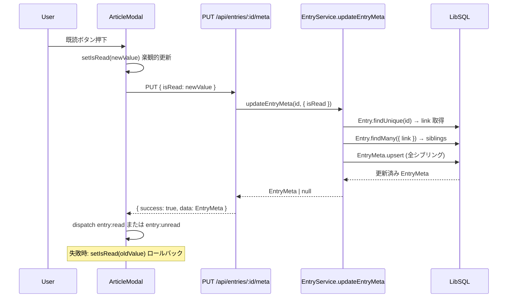
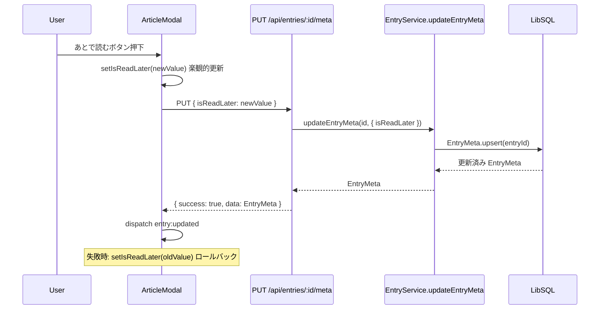

# Design Document: read-status

## Overview

read-status フィーチャーは、RSSエントリーの既読/未読フラグ（isRead）とあとで読むフラグ（isReadLater）を管理する。EntryMeta テーブルへの upsert によってフラグを永続化し、同一 link URL を持つ複数エントリー間で既読状態を自動同期（リンクベースシブリング同期）する。

**Purpose**: ユーザーが記事の既読/未読状態とあとで読むリストを管理できる機能を提供する。  
**Users**: セルフホスト型 RSS リーダーの利用者が、モーダルを開く操作・ツールバーボタン・キーボードショートカットで状態を変更し、サイドバーで未読数を把握する。  
**Impact**: entry-viewing の ArticleModal にボタンを追加し、Sidebar の未読カウントバッジと連動する。EntryService.updateEntryMeta がシブリング同期のコアロジックを担う。

### Goals

- `PUT /api/entries/[id]/meta` による isRead / isReadLater のアトミックな更新
- リンクベースシブリング同期（同一 link のエントリーに isRead 変化を伝播）
- カスタムイベント（`entry:read` / `entry:unread` / `entry:updated`）による非結合型 UI 更新
- `/read-later` 専用ページと `/api/entries/read-later-unread-count` による未読カウント提供

### Non-Goals

- エントリー一覧の表示・フィルタリングUI全体（entry-viewing が担当）
- タグ管理（tag-management が担当）
- フィードごとの未読カウントクエリ（entry-viewing が担当）
- エントリーモーダルの全文表示・スワイプ・ナビゲーション（entry-viewing が担当）

---

## Boundary Commitments

### This Spec Owns

- `PUT /api/entries/[id]/meta` — isRead / isReadLater の更新エンドポイントとそのハンドラー
- `GET /api/entries/read-later-unread-count` — あとで読む未読数カウントエンドポイント
- `EntryService.updateEntryMeta()` — upsert + リンクベースシブリング同期ロジック
- `ArticleModal` の既読/あとで読むボタン（ツールバー上の UI 部品と fetch 呼び出し）
- `entry:read` / `entry:unread` / `entry:updated` カスタムイベントの定義と dispatch 責任
- `Sidebar` の `entry:read` / `entry:updated` イベントハンドラーと readLaterUnreadCount 状態
- `/read-later` ページ（`src/app/read-later/page.tsx`）
- ブラウザ/PWA バッジ更新（`navigator.setAppBadge` / `clearAppBadge`）

### Out of Boundary

- `ArticleModal` の全文表示・スワイプ・キーボードナビゲーション全体（entry-viewing が担当）
- `EntryCardGrid` の無限スクロール・navスナップショット（entry-viewing が担当）
- `EntryService.findManyEntries` / `findManyEntriesDedup`（entry-viewing が担当）
- フィード別未読カウントの計算と `/api/feeds` レスポンスへの埋め込み（entry-viewing が担当）
- `saveEntries` 全体の実装（entry-viewing が担当。ただし、シブリング同期の副作用ロジックは本フィーチャーが仕様化する）

### Allowed Dependencies

- entry-viewing: `ArticleModal` コンポーネント（既存コンポーネントにボタンを追加）、`EntryCardGrid`（`entry:read` / `entry:updated` イベントを消費）
- Prisma / LibSQL: `EntryMeta` テーブルへの upsert・count アクセス、`Entry` テーブルへの link 検索
- Next.js App Router: Server Component（`/read-later` ページ）+ Client Component（`ArticleModal`、`Sidebar`）
- shadcn/ui: `Button`、`Tooltip`、`TooltipContent`、`TooltipTrigger`

### Revalidation Triggers

- `EntryMeta` モデルのスキーマ変更（フィールド追加・削除）
- `PUT /api/entries/[id]/meta` のレスポンス形式変更
- カスタムイベント名（`entry:read` / `entry:unread` / `entry:updated`）の変更
- `updateEntryMeta` のシグネチャまたはシブリング同期ロジックの変更

---

## Architecture

### Existing Architecture Analysis

本フィーチャーは既存のコードに実装済みである。設計はその実装を文書化するものである。

- **Service Layer**: `entry-service.ts` の `updateEntryMeta` 関数が、EntryMeta の upsert とリンクベースシブリング同期を実装済み
- **API Route**: `src/app/api/entries/[id]/meta/route.ts` に PUT ハンドラーが実装済み
- **Client Component**: `ArticleModal` が既読/あとで読むボタン・楽観的更新・カスタムイベント dispatch を実装済み
- **Server Component**: `/read-later/page.tsx` が `findManyEntries({ isReadLater: true })` で初期データを取得済み
- **Sidebar**: `entry:read` / `entry:updated` リスナーと `readLaterUnreadCount` 状態管理が実装済み

### Architecture Pattern & Boundary Map

```mermaid
graph TB
    subgraph ClientLayer
        Modal[ArticleModal ツールバーボタン]
        Sidebar[Sidebar 未読数バッジ]
        CardGrid[EntryCardGrid イベント消費]
    end

    subgraph ServerLayer
        MetaAPI[PUT /api/entries/:id/meta]
        CountAPI[GET /api/entries/read-later-unread-count]
        ReadLaterPage[/read-later page.tsx]
        EntryService[EntryService.updateEntryMeta]
        DB[(LibSQL EntryMeta)]
    end

    Modal -->|PUT isRead / isReadLater| MetaAPI
    MetaAPI --> EntryService
    EntryService -->|upsert + sibling sync| DB

    Modal -->|dispatch entry:read / entry:unread| Sidebar
    Modal -->|dispatch entry:updated| Sidebar
    Modal -->|dispatch entry:read / entry:unread| CardGrid
    Modal -->|dispatch entry:updated| CardGrid

    Sidebar -->|GET| CountAPI
    CountAPI -->|count isReadLater=true AND isRead=false| DB

    ReadLaterPage -->|findManyEntries isReadLater=true| EntryService
```

### Technology Stack

| Layer | Choice / Version | Role in Feature | Notes |
|-------|-----------------|-----------------|-------|
| Frontend | React 19 + Next.js 16 | ArticleModal のボタン・楽観的更新、Sidebar の未読数表示 | Client Component |
| Backend | Next.js App Router Route Handlers | PUT /meta・GET /read-later-unread-count | 薄いハンドラー、ビジネスロジックは EntryService |
| Data | Prisma 7 + LibSQL | EntryMeta の upsert・シブリング同期クエリ | entryId unique constraint 活用 |
| Events | Custom DOM Events | entry:read / entry:unread / entry:updated | 非結合 UI 更新 |
| PWA | Serwist + Navigator Badge API | setAppBadge / clearAppBadge | setAppBadge の存在チェックで安全呼び出し |

---

## File Structure Plan

### Directory Structure

```
src/
├── app/
│   ├── read-later/
│   │   └── page.tsx                        # /read-later Server Component（isReadLater=true フィルタ）
│   └── api/
│       └── entries/
│           ├── [id]/
│           │   └── meta/
│           │       └── route.ts            # PUT /api/entries/:id/meta
│           └── read-later-unread-count/
│               └── route.ts                # GET /api/entries/read-later-unread-count
├── components/
│   ├── article-modal.tsx                   # 既読/あとで読むボタン + 楽観的更新 + カスタムイベント dispatch
│   └── sidebar.tsx                         # entry:read / entry:updated リスナー + readLaterUnreadCount
└── lib/
    └── entry-service.ts                    # updateEntryMeta（upsert + シブリング同期）
```

### Modified Files

- `src/app/api/entries/[id]/meta/route.ts` — PUT ハンドラー（isRead / isReadLater の条件付き更新）
- `src/app/api/entries/read-later-unread-count/route.ts` — カウントクエリ
- `src/lib/entry-service.ts` — `updateEntryMeta`: シブリング同期ロジック、`saveEntries`: 新規エントリー既読連動
- `src/components/article-modal.tsx` — 既読/あとで読むボタン UI・楽観的更新・イベント dispatch
- `src/components/sidebar.tsx` — イベントリスナー・readLaterUnreadCount・PWA バッジ更新
- `src/app/read-later/page.tsx` — `/read-later` ページ（サーバーサイド初期フェッチ）

---

## System Flows

### isRead 更新フロー（シブリング同期含む）



### isReadLater 更新フロー



---

## Requirements Traceability

| Requirement | Summary | Components | Interfaces |
|-------------|---------|------------|------------|
| 1.1 | モーダル開封時自動既読化 | ArticleModal | PUT /api/entries/:id/meta |
| 1.2 | 既読ボタン（未読→既読） | ArticleModal | PUT /api/entries/:id/meta |
| 1.3 | 未読ボタン（既読→未読） | ArticleModal | PUT /api/entries/:id/meta |
| 1.4 | 既読トグルのキーボードショートカット | ArticleModal | useHotkeyConfig |
| 1.5 | 既読更新失敗時のロールバック | ArticleModal | — |
| 2.1 | あとで読む設定ボタン | ArticleModal | PUT /api/entries/:id/meta |
| 2.2 | あとで読む解除ボタン | ArticleModal | PUT /api/entries/:id/meta |
| 2.3 | あとで読むのキーボードショートカット | ArticleModal | useHotkeyConfig |
| 2.4 | あとで読む更新失敗時のロールバック | ArticleModal | — |
| 2.5 | 更新中のボタン無効化 | ArticleModal | — |
| 3.1 | isRead シブリング伝播 | EntryService.updateEntryMeta | Prisma upsert |
| 3.2 | 新規エントリー既読連動 | EntryService.saveEntries | Prisma create |
| 3.3 | isReadLater はシブリング伝播しない | EntryService.updateEntryMeta | — |
| 4.1 | PUT /api/entries/:id/meta エンドポイント | PUT /api/entries/:id/meta | UpdateEntryMetaRequest |
| 4.2 | isRead / isReadLater の部分更新 | PUT /api/entries/:id/meta | — |
| 4.3 | エントリー不存在時 404 | PUT /api/entries/:id/meta | — |
| 4.4 | サーバーエラー時 500 | PUT /api/entries/:id/meta | — |
| 4.5 | 成功時 EntryMeta を返す | PUT /api/entries/:id/meta | UpdateEntryMetaResponse |
| 5.1 | entry:read / entry:unread イベント dispatch | ArticleModal | CustomEvent |
| 5.2 | entry:updated イベント dispatch | ArticleModal | CustomEvent |
| 5.3 | entry:read で Sidebar 更新 | Sidebar | GET /api/feeds |
| 5.4 | entry:updated で Sidebar 更新 | Sidebar | GET /api/entries/read-later-unread-count |
| 6.1 | /read-later ページ | /read-later/page.tsx | findManyEntries |
| 6.2 | ソート順切り替え | /read-later/page.tsx, SortToggle | URL search param |
| 6.3 | 件数表示 | /read-later/page.tsx | pagination.total |
| 6.4 | entry:updated でエントリー除去 | EntryCardGrid | entry:updated |
| 7.1 | 全未読数バッジ | Sidebar | GET /api/feeds |
| 7.2 | あとで読む未読数バッジ | Sidebar | GET /api/entries/read-later-unread-count |
| 7.3 | GET /api/entries/read-later-unread-count | /api/entries/read-later-unread-count | Prisma count |
| 8.1 | PWA バッジ更新 | Sidebar | navigator.setAppBadge |
| 8.2 | PWA バッジクリア | Sidebar | navigator.clearAppBadge |
| 8.3 | setAppBadge サポートチェック | Sidebar | — |

---

## Components and Interfaces

### コンポーネント概要

| Component | Domain/Layer | Intent | Req Coverage | Key Dependencies | Contracts |
|-----------|-------------|--------|-------------|-----------------|-----------|
| PUT /api/entries/:id/meta | API | isRead / isReadLater の更新エンドポイント | 4.1–4.5 | EntryService.updateEntryMeta (P0) | API |
| GET /api/entries/read-later-unread-count | API | あとで読む未読数カウント | 7.3 | Prisma (P0) | API |
| EntryService.updateEntryMeta | Service | upsert + シブリング同期 | 3.1, 3.3 | Prisma (P0) | Service |
| EntryService.saveEntries (sibling部分) | Service | 新規エントリーの既読連動 | 3.2 | Prisma (P0) | Service |
| ArticleModal (read buttons) | Client | 既読/あとで読むボタン + 楽観的更新 | 1.1–1.5, 2.1–2.5, 5.1, 5.2 | PUT /api/entries/:id/meta (P0) | State, Event |
| Sidebar (unread counts) | Client | 未読数バッジ + PWA バッジ | 5.3, 5.4, 7.1, 7.2, 8.1–8.3 | GET /api/feeds, GET /read-later-unread-count (P0) | Event |
| /read-later/page.tsx | Server | あとで読む一覧ページ | 6.1–6.3 | EntryService.findManyEntries (P0) | — |

---

### Service Layer

#### EntryService.updateEntryMeta

| Field | Detail |
|-------|--------|
| Intent | isRead / isReadLater を upsert で更新し、isRead 変更時はシブリング全エントリーに伝播する |
| Requirements | 3.1, 3.3, 4.1, 4.5 |

**Responsibilities & Constraints**

- `data.isRead` が指定された場合: 対象エントリーの `link` を取得 → 同一 link を持つ全エントリーに `EntryMeta.upsert` を実行
- `data.isReadLater` が同時に指定された場合: isRead シブリング伝播後、対象エントリーのみに `isReadLater` を適用
- `data.isRead` が指定されない場合（isReadLater のみ更新）: 通常の upsert のみ実行
- upsert の create 時、isRead 未指定なら false、isReadLater 未指定なら false をデフォルト値とする

**Dependencies**

- Inbound: PUT /api/entries/[id]/meta (P0)
- Outbound: Prisma — Entry.findUnique, Entry.findMany（link 検索）, EntryMeta.upsert, EntryMeta.update, EntryMeta.findUnique (P0)

**Contracts**: Service [x] / API [ ] / Event [ ] / Batch [ ] / State [ ]

##### Service Interface

```typescript
interface UpdateEntryMetaInput {
  isRead?: boolean
  isReadLater?: boolean
}

async function updateEntryMeta(
  entryId: string,
  data: UpdateEntryMetaInput
): Promise<EntryMeta | null>
```

- Preconditions: `entryId` が存在する Entry を指す
- Postconditions: 対象 Entry の EntryMeta が upsert され、`data.isRead` が指定された場合は同一 link の全 EntryMeta の `isRead` も更新される
- Invariants: EntryMeta は entryId に対して 0 または 1 のみ存在する（`@unique`）

**Implementation Notes**

- シブリング同期は `Promise.all` で並列実行する
- `isRead` + `isReadLater` の同時更新時、upsert 後に `EntryMeta.update({ isReadLater })` を別クエリで実行する（現実装の通り）
- `entry.link` が null の場合はシブリング同期をスキップし、自エントリーのみ更新する

---

#### EntryService.saveEntries (シブリング既読連動部分)

| Field | Detail |
|-------|--------|
| Intent | フィード取得時の新規エントリー保存において、同一 link に既読エントリーがある場合は新規エントリーを既読状態で作成する |
| Requirements | 3.2 |

**Implementation Notes**

- upsert 後、EntryMeta が存在しない（新規エントリー）場合のみチェックを行う
- `EntryMeta.findFirst({ where: { isRead: true, entry: { link, NOT: { id: saved.id } } } })` で既読シブリングを検索
- 既読シブリングが存在する場合のみ `EntryMeta.create({ isRead: true, isReadLater: false })` を実行

---

### API Layer

#### PUT /api/entries/[id]/meta

| Field | Detail |
|-------|--------|
| Intent | リクエストボディの isRead / isReadLater を受け取り、EntryService.updateEntryMeta に委譲する |
| Requirements | 4.1–4.5 |

**Contracts**: Service [ ] / API [x] / Event [ ] / Batch [ ] / State [ ]

##### API Contract

| Method | Endpoint | Request | Response | Errors |
|--------|----------|---------|----------|--------|
| PUT | /api/entries/[id]/meta | `{ isRead?: boolean, isReadLater?: boolean }` | `{ success: true, data: EntryMeta }` | 404 (ENTRY_NOT_FOUND), 500 (INTERNAL_SERVER_ERROR) |

- リクエストボディの `isRead` / `isReadLater` は boolean 型であることを `typeof` チェックで確認する
- 両フィールドとも省略可能（既存の型: `UpdateEntryMetaRequest`）

---

#### GET /api/entries/read-later-unread-count

| Field | Detail |
|-------|--------|
| Intent | `isReadLater: true AND isRead: false` の EntryMeta 件数を返す |
| Requirements | 7.3 |

**Contracts**: Service [ ] / API [x] / Event [ ] / Batch [ ] / State [ ]

##### API Contract

| Method | Endpoint | Request | Response | Errors |
|--------|----------|---------|----------|--------|
| GET | /api/entries/read-later-unread-count | — | `{ success: true, data: { count: number } }` | 500 (INTERNAL_SERVER_ERROR) |

---

### Client Layer

#### ArticleModal (既読/あとで読むボタン部分)

| Field | Detail |
|-------|--------|
| Intent | モーダルツールバーに既読トグルとあとで読むトグルボタンを提供し、楽観的更新とカスタムイベント dispatch を行う |
| Requirements | 1.1–1.5, 2.1–2.5, 5.1, 5.2 |

**Responsibilities & Constraints**

- 自動既読化: `entry.meta?.isRead` が false の場合のみ PUT を実行し、成功後に `entry:read` を dispatch
- `toggleRead`: 楽観的に `isRead` を反転 → PUT → 失敗時にロールバック → 成功時に `entry:read` または `entry:unread` を dispatch
- `toggleReadLater`: 楽観的に `isReadLater` を反転 → PUT → 失敗時にロールバック → 成功時に `entry:updated` を dispatch
- `isUpdating` / `isUpdatingRead` フラグで重複リクエストを防ぐ（ボタン disabled 制御）
- キーボードショートカット: `useHotkeyConfig()` の `config.toggleRead` / `config.readLater` キーを監視

**Contracts**: Service [ ] / API [ ] / Event [x] / Batch [ ] / State [x]

##### State Management

```typescript
const [isReadLater, setIsReadLater] = useState(false)
const [isRead, setIsRead] = useState(false)
const [isUpdating, setIsUpdating] = useState(false)       // isReadLater 更新中
const [isUpdatingRead, setIsUpdatingRead] = useState(false) // isRead 更新中
```

##### Event Contract

- Published events:
  - `entry:read` — detail: `{ entryId: string, feedId: string }` — isRead が true になった時
  - `entry:unread` — detail: `{ entryId: string, feedId: string }` — isRead が false になった時
  - `entry:updated` — detail: `{ entryId: string, isReadLater: boolean }` — isReadLater が変化した時
- Ordering / delivery guarantees: ベストエフォート（window DOM イベント）

**Implementation Notes**

- 自動既読化は `useEffect([entryId, entry])` で実行し、`entry.meta?.isRead` が true の場合はスキップする
- イベントの detail に `feedId` を含めることで Sidebar がフィード別未読数を効率的に再取得できる
- `isUpdating` は `isReadLater` 専用、`isUpdatingRead` は `isRead` 専用の独立したフラグとする

---

#### Sidebar (未読カウント部分)

| Field | Detail |
|-------|--------|
| Intent | フィード未読数の合算バッジ・あとで読む未読数バッジ・PWA バッジ通知を管理する |
| Requirements | 5.3, 5.4, 7.1, 7.2, 8.1–8.3 |

**Responsibilities & Constraints**

- `entry:read` イベント: `GET /api/feeds` を再取得して `feeds` 状態を更新（フィード別未読数の再集計）
- `entry:updated` イベント: `GET /api/entries/read-later-unread-count` を再取得して `readLaterUnreadCount` を更新
- `totalUnread`（全フィード未読の合算）が変化するたびに `navigator.setAppBadge` / `clearAppBadge` を呼び出す
- `navigator.setAppBadge` が存在しない環境では呼び出しをスキップする

**Contracts**: Service [ ] / API [ ] / Event [x] / Batch [ ] / State [x]

##### State Management

```typescript
const [readLaterUnreadCount, setReadLaterUnreadCount] = useState(0)
const totalUnread = feeds.reduce((sum, f) => sum + f.unreadCount, 0)
```

**Implementation Notes**

- `fetchReadLaterUnreadCount` 関数を初期ロード時と `entry:updated` イベント時の両方で呼び出す
- `totalUnread` の `useEffect` 内で `'setAppBadge' in navigator` チェックを行う

---

### Page Layer

#### /read-later/page.tsx

| Field | Detail |
|-------|--------|
| Intent | あとで読む一覧を Server Component でレンダリングする |
| Requirements | 6.1–6.3 |

**Responsibilities & Constraints**

- `export const dynamic = 'force-dynamic'` で毎回サーバーサイドフェッチを実行
- `searchParams.sortOrder` から `SortOrderValue`（`'asc'` / `'desc'`）を読み取る
- `findManyEntries({ isReadLater: true, page: 1, sortOrder })` で初期エントリーを取得
- `pagination.total` をヘッダーに表示し、件数 0 の場合は「記事なし」と表示

**Implementation Notes**

- `EntryCardGrid` に `isReadLater` prop を渡すことで、`entry:updated` で isReadLater が false になったエントリーを一覧から除去する（EntryCardGrid の既存ロジックを活用）

---

## Data Models

### Domain Model

```
EntryMeta (entryId に対してユニーク、遅延作成)
  ├── id: string (UUID)
  ├── entryId: string @unique → Entry
  ├── isRead: boolean @default(false)
  ├── isReadLater: boolean @default(false)
  ├── createdAt: DateTime
  └── updatedAt: DateTime @updatedAt
```

**Business Rules & Invariants**

- EntryMeta は Entry に対して 0 または 1 のみ存在する（`@unique`）
- EntryMeta が存在しない場合、isRead = false / isReadLater = false とみなす
- isRead の変更は、同一 link URL を持つ全エントリーの EntryMeta に伝播する
- isReadLater の変更は、対象エントリーのみに適用される

### Physical Data Model

```sql
model EntryMeta {
  id           String   @id @default(uuid())
  entryId      String   @unique
  isRead       Boolean  @default(false)
  isReadLater  Boolean  @default(false)
  createdAt    DateTime @default(now())
  updatedAt    DateTime @updatedAt

  entry        Entry    @relation(fields: [entryId], references: [id], onDelete: Cascade)

  @@index([isRead])
  @@map("entry_metas")
}
```

**Index 設計**

- `@@index([isRead])` — 未読カウントクエリ・シブリング検索を高速化
- `entryId @unique` — upsert の where 条件として使用

### Data Contracts & Integration

#### PUT /api/entries/[id]/meta リクエスト/レスポンス

```typescript
// Request Body
interface UpdateEntryMetaRequest {
  isRead?: boolean
  isReadLater?: boolean
}

// Response
interface UpdateEntryMetaResponse {
  success: true
  data: EntryMeta  // { id, entryId, isRead, isReadLater, createdAt, updatedAt }
}

// Error Response
interface ErrorResponse {
  success: false
  error: { code: EntryErrorCode, message: string }
}
```

#### GET /api/entries/read-later-unread-count レスポンス

```typescript
interface ReadLaterUnreadCountResponse {
  success: true
  data: { count: number }
}
```

#### カスタムイベントスキーマ

```typescript
// entry:read / entry:unread
interface EntryReadEventDetail {
  entryId: string
  feedId: string
}

// entry:updated
interface EntryUpdatedEventDetail {
  entryId: string
  isReadLater: boolean
}
```

---

## Error Handling

### Error Strategy

- API バリデーション: `typeof isRead === 'boolean'` チェックで型安全に更新フィールドを選択
- 存在しないリソース: `getEntryById` で null の場合に 404 を返す
- DB エラー: try/catch で 500 INTERNAL_SERVER_ERROR を返す
- フロントエンド楽観的更新失敗: catch ブロックで元の状態に戻す

### Error Categories and Responses

- **User Errors (4xx)**: entryId 不存在 → 404 ENTRY_NOT_FOUND
- **System Errors (5xx)**: DB 障害・例外 → 500 INTERNAL_SERVER_ERROR、サーバーログ出力
- **UI フォールバック**: PUT 失敗時に `setIsRead` / `setIsReadLater` を元の値に戻す

---

## Testing Strategy

### Unit Tests

- `updateEntryMeta`: isRead のみ更新 → シブリング全件に伝播することを確認
- `updateEntryMeta`: isReadLater のみ更新 → 対象エントリーのみが更新されることを確認
- `updateEntryMeta`: isRead + isReadLater 同時更新 → シブリングには isRead のみ伝播することを確認
- `saveEntries` シブリング連動: 既読シブリングあり → 新規エントリーが isRead: true で作成されること
- `saveEntries` シブリング連動: 既読シブリングなし → EntryMeta が作成されないこと

### Integration Tests

- `PUT /api/entries/[id]/meta`: isRead: true 更新 → 200 + EntryMeta が返ること
- `PUT /api/entries/[id]/meta`: 不存在の id → 404 が返ること
- `GET /api/entries/read-later-unread-count`: isReadLater=true AND isRead=false の件数が返ること

### E2E / UI Tests

- ArticleModal を開く → 自動的に isRead: true になること（`entry:read` イベントが dispatch されること）
- あとで読むボタンを押す → ボタン状態が「保存済み」に変わり `entry:updated` が dispatch されること
- /read-later ページで記事一覧が表示されること
