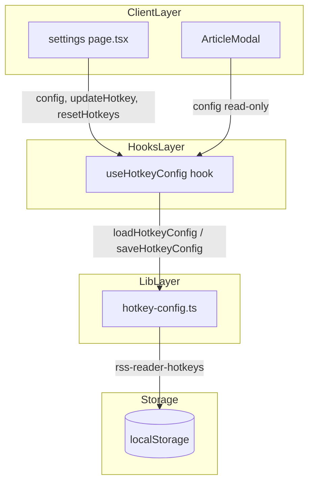
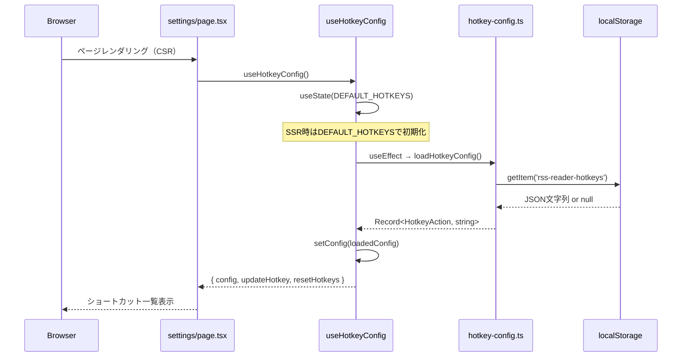
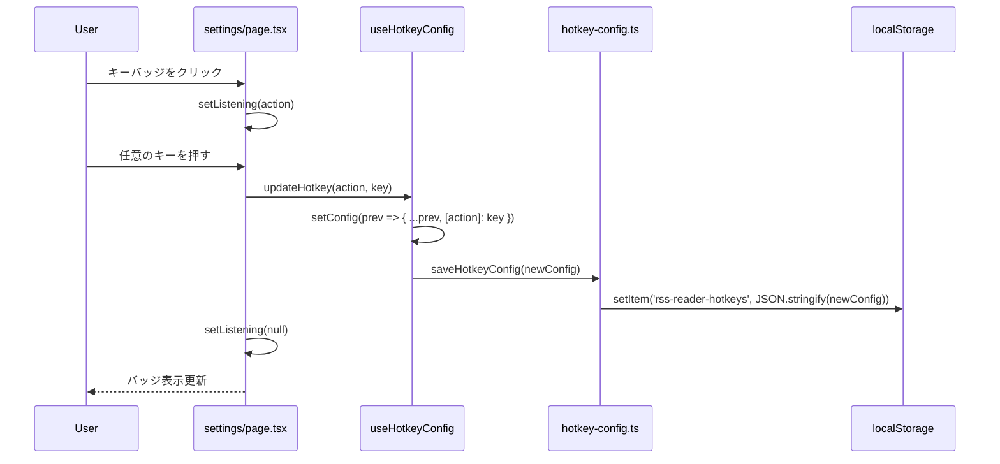

# Design Document: settings

## Overview

settings フィーチャーは、ユーザーが RSS リーダーの操作体験をカスタマイズするための /settings ページと、そのカスタマイズ設定を ArticleModal に適用するためのインフラストラクチャを提供する。

**Purpose**: ユーザーが ArticleModal で使用するキーボードショートカット 6 種類（モーダルクローズ・前後ナビゲーション・既読トグル・あとで読む・元記事を開く）をカスタマイズし、localStorage に永続化することで、セッションをまたいだ一貫した操作体験を実現する。  
**Users**: セルフホスト RSS リーダーの利用者が /settings ページでショートカットをカスタマイズし、記事閲覧時に ArticleModal でカスタムショートカットを利用する。  
**Impact**: `hotkey-config.ts`（ユーティリティ）および `useHotkeyConfig` フック（React フック）は既に実装済みであり、`ArticleModal` が `useHotkeyConfig` を通じてホットキー設定を読み取る構造も確立されている。本ドキュメントはその既存実装を正式に文書化する。

### Goals

- /settings ページで 6 種類のキーボードショートカットを個別にカスタマイズできる
- デフォルト値への一括リセットが可能
- ショートカット設定を localStorage に永続化し、セッションをまたいで保持する
- SSR 実行中は localStorage にアクセスしない（CSR のみ）
- ArticleModal がカスタマイズされたショートカット設定を自動的に適用する

### Non-Goals

- AppSettings.preferredScoreThreshold の管理（preference-recommendations が `/preferences` ページで担当）
- 認証設定・セッション管理
- AppSettings テーブルへの書き込み（このフィーチャーは localStorage のみを使用する）
- ショートカット設定のサーバーサイド同期

---

## Boundary Commitments

### This Spec Owns

- `/settings` ページ（`src/app/settings/page.tsx`）
- `hotkey-config.ts`（`HotkeyAction` 型・デフォルト値・localStorage 読み書きユーティリティ・表示フォーマット）
- `useHotkeyConfig` フック（ショートカット設定の React 状態管理）
- localStorage への `rss-reader-hotkeys` キーでの JSON 保存・読み込み
- ArticleModal における `useHotkeyConfig` フックの呼び出しと `config` の適用（呼び出しパターンのみ; ArticleModal コア実装は entry-viewing が担当）

### Out of Boundary

- `AppSettings` テーブル（`preferredScoreThreshold`）の管理（preference-recommendations が担当）
- `ArticleModal` のコア実装（entry-viewing が担当）
- 認証・セッション管理
- `/api/settings` エンドポイントの `preferredScoreThreshold` PATCH ロジック（preference-recommendations が担当）

### Allowed Dependencies

- entry-viewing: `ArticleModal` が `useHotkeyConfig` を呼び出す（読み取りのみ）
- React 19 / Next.js 16: `useState`, `useEffect`, `useCallback` フック
- Web Storage API: `localStorage`（ブラウザ CSR のみ）

### Revalidation Triggers

- `HotkeyAction` 型の追加・削除（ArticleModal の keyboard handler に影響）
- `DEFAULT_HOTKEYS` のデフォルト値変更
- localStorage キー名 `rss-reader-hotkeys` の変更（保存済みデータの後方互換性に影響）
- `useHotkeyConfig` の返却インターフェース変更（ArticleModal・SettingsPage に影響）

---

## Architecture

### Existing Architecture Analysis

本フィーチャーは Next.js App Router の既存パターンに完全適合している。

- `/settings` ページは `'use client'` のクライアントコンポーネントとして実装されており、App Router のレイアウト内に配置されている
- `hotkey-config.ts` は `/src/lib/` に配置されたユーティリティモジュールであり、型定義・デフォルト値・localStorage ユーティリティを一元管理する
- `useHotkeyConfig` は `/src/hooks/` に配置されたカスタムフックであり、初期化の `useEffect`（SSR セーフ）と `useCallback` によるメモ化を実装する
- `ArticleModal` は `next/dynamic({ ssr: false })` で遅延ロードされており、CSR のみで実行されるため SSR 問題が発生しない

### Architecture Pattern & Boundary Map



### Technology Stack

| Layer | Choice / Version | Role in Feature | Notes |
|-------|-----------------|-----------------|-------|
| Frontend | Next.js 16 + React 19 | Settings ページ + カスタムフック | App Router Client Component |
| State | React `useState` / `useEffect` / `useCallback` | ホットキー設定の React 状態管理 | SSR セーフ初期化 |
| Storage | Web Storage API (localStorage) | ショートカット設定の永続化 | CSR のみ; SSR ガード必須 |
| UI | Tailwind CSS 4 + lucide-react | 設定ページ UI（リスト・ボタン・バッジ） | shadcn/ui は使用していない |

---

## File Structure Plan

### Directory Structure

```
src/
├── app/
│   └── settings/
│       └── page.tsx              # Client Component: キーボードショートカット設定 UI
├── components/
│   └── article-modal.tsx         # 既存ファイル: useHotkeyConfig を呼び出して config を適用
├── hooks/
│   └── use-hotkey-config.ts      # useHotkeyConfig: ショートカット設定の React 状態管理フック
└── lib/
    └── hotkey-config.ts          # HotkeyAction 型・DEFAULT_HOTKEYS・localStorage ユーティリティ
```

### Modified Files

- `src/components/article-modal.tsx` — `useHotkeyConfig` をインポートして `config` でキーイベントハンドラーを構成（既実装。entry-viewing spec が担当するが、本フィーチャーの `useHotkeyConfig` に依存）

---

## System Flows

### ショートカット設定の初期化フロー



### キー割り当て更新フロー



---

## Requirements Traceability

| Requirement | Summary | Components | Interfaces |
|-------------|---------|------------|------------|
| 1.1 | 6種類のショートカット一覧表示 | Settings Page | HOTKEY_ACTIONS |
| 1.2 | ラベルと現在キーの表示 | Settings Page | HOTKEY_LABELS, config |
| 1.3 | キーバッジ表示 | Settings Page | formatKeyDisplay |
| 1.4 | デフォルト値の定義 | hotkey-config.ts | DEFAULT_HOTKEYS |
| 2.1 | キー入力待ち状態の表示 | Settings Page | listening state |
| 2.2 | キー割り当て更新 | Settings Page, useHotkeyConfig | updateHotkey |
| 2.3 | Escape でキャプチャキャンセル | Settings Page | keydown handler |
| 2.4 | 更新時 localStorage 保存 | useHotkeyConfig, hotkey-config.ts | saveHotkeyConfig |
| 3.1 | デフォルトに戻すボタン | Settings Page | resetHotkeys |
| 3.2 | デフォルト値への一括リセット | Settings Page, useHotkeyConfig | resetHotkeys |
| 3.3 | リセット後 localStorage 保存 | useHotkeyConfig, hotkey-config.ts | saveHotkeyConfig |
| 4.1 | localStorage への JSON 保存 | hotkey-config.ts | saveHotkeyConfig, STORAGE_KEY |
| 4.2 | localStorage からの読み込み | hotkey-config.ts, useHotkeyConfig | loadHotkeyConfig, useEffect |
| 4.3 | 設定なし時はデフォルト使用 | hotkey-config.ts | DEFAULT_HOTKEYS fallback |
| 4.4 | 読み込み失敗時のフォールバック | hotkey-config.ts | try-catch in loadHotkeyConfig |
| 4.5 | SSR時 localStorage 非アクセス | hotkey-config.ts | typeof window guard |
| 5.1 | ArticleModal でのショートカット読み込み | ArticleModal | useHotkeyConfig |
| 5.2 | ArticleModal でのショートカット実行 | ArticleModal | config keydown handler |
| 5.3 | ツールチップにキー表示 | ArticleModal | config.{action} in TooltipContent |
| 5.4 | フォーム入力中はショートカット無効 | ArticleModal | target instanceof HTMLInputElement guard |

---

## Components and Interfaces

### コンポーネント概要

| Component | Layer | Intent | Req Coverage | Key Dependencies | Contracts |
|-----------|-------|--------|-------------|-----------------|-----------|
| hotkey-config.ts | Lib | HotkeyAction 型・デフォルト値・localStorage ユーティリティ | 1.4, 2.4, 3.3, 4.1–4.5 | Web Storage API | Service |
| useHotkeyConfig | Hook | ショートカット設定の React 状態管理 | 2.2, 2.4, 3.2, 3.3, 4.2 | hotkey-config.ts | State |
| Settings Page | Client | キーボードショートカット設定 UI | 1.1–1.3, 2.1–2.3, 3.1–3.2 | useHotkeyConfig | State |
| ArticleModal | Client | ショートカット設定を読み取り適用（entry-viewing 担当） | 5.1–5.4 | useHotkeyConfig | State |

---

### Lib Layer

#### hotkey-config.ts

| Field | Detail |
|-------|--------|
| Intent | HotkeyAction 型・DEFAULT_HOTKEYS・localStorage の読み書き・キー表示フォーマットを一元管理する |
| Requirements | 1.4, 2.4, 3.3, 4.1, 4.2, 4.3, 4.4, 4.5 |

**Responsibilities & Constraints**
- `HotkeyAction` 型: 6 つのアクション識別子を union 型で定義する
- `DEFAULT_HOTKEYS`: 各アクションのデフォルトキー文字列を定義する
- `HOTKEY_LABELS`: 各アクションのユーザー向けラベル（日本語）を定義する
- `HOTKEY_ACTIONS`: アクション一覧の表示順序を固定する配列
- `loadHotkeyConfig()`: SSR ガード（`typeof window === 'undefined'`）後に localStorage から設定を読み込む。パース失敗時はデフォルトにフォールバック
- `saveHotkeyConfig(config)`: SSR ガード後に localStorage に設定を JSON 保存する
- `formatKeyDisplay(key)`: キー文字列をユーザー表示形式に変換する（例：`Escape` → `Esc`、`ArrowLeft` → `←`）

**Dependencies**
- Outbound: Web Storage API (localStorage) — CSR 時のみ (P0)

**Contracts**: Service [x] / API [ ] / Event [ ] / Batch [ ] / State [ ]

##### Service Interface

```typescript
export type HotkeyAction =
  | 'readLater'
  | 'toggleRead'
  | 'closeModal'
  | 'prevArticle'
  | 'nextArticle'
  | 'openOriginal'

export const DEFAULT_HOTKEYS: Record<HotkeyAction, string> = {
  readLater: 'f',
  toggleRead: 'm',
  closeModal: 'Escape',
  prevArticle: 'ArrowLeft',
  nextArticle: 'ArrowRight',
  openOriginal: 'o',
}

export const HOTKEY_LABELS: Record<HotkeyAction, string>
export const HOTKEY_ACTIONS: HotkeyAction[]

export function loadHotkeyConfig(): Record<HotkeyAction, string>
export function saveHotkeyConfig(config: Record<HotkeyAction, string>): void
export function formatKeyDisplay(key: string): string
```

- Preconditions: `saveHotkeyConfig` / `loadHotkeyConfig` はブラウザ環境（CSR）で呼び出されることを前提とするが、SSR ガードによりサーバーサイドでも安全に実行できる
- Postconditions: `loadHotkeyConfig` は常に全 HotkeyAction キーを持つ完全なオブジェクトを返す
- Invariants: `typeof window === 'undefined'` の場合は localStorage に一切アクセスしない

**Implementation Notes**
- localStorage キー名: `'rss-reader-hotkeys'`（定数 `STORAGE_KEY` として管理）
- `loadHotkeyConfig` は `{ ...DEFAULT_HOTKEYS, ...parsed }` でスプレッドするため、localStorage に部分的な設定しかない場合も全アクションのデフォルト値が保証される

---

### Hooks Layer

#### useHotkeyConfig

| Field | Detail |
|-------|--------|
| Intent | ショートカット設定の React 状態を管理し、Settings ページと ArticleModal に config・updateHotkey・resetHotkeys を提供する |
| Requirements | 2.2, 2.4, 3.2, 3.3, 4.2 |

**Responsibilities & Constraints**
- SSR セーフな初期化: `useState(DEFAULT_HOTKEYS)` で初期化し、`useEffect` で CSR 時に `loadHotkeyConfig()` を呼んで上書きする
- `updateHotkey(action, key)`: 指定アクションのキーを更新し、`saveHotkeyConfig` を呼ぶ
- `resetHotkeys()`: 全アクションをデフォルト値に戻し、`saveHotkeyConfig` を呼ぶ

**Dependencies**
- Inbound: Settings Page, ArticleModal (P0)
- Outbound: hotkey-config.ts (loadHotkeyConfig, saveHotkeyConfig, DEFAULT_HOTKEYS) (P0)

**Contracts**: Service [ ] / API [ ] / Event [ ] / Batch [ ] / State [x]

##### State Management

```typescript
// useHotkeyConfig の返却型
interface UseHotkeyConfigReturn {
  config: Record<HotkeyAction, string>
  updateHotkey: (action: HotkeyAction, key: string) => void
  resetHotkeys: () => void
}

export function useHotkeyConfig(): UseHotkeyConfigReturn
```

- 状態モデル: `config` は `Record<HotkeyAction, string>` として管理され、初期値は `DEFAULT_HOTKEYS`
- 永続化: `updateHotkey` / `resetHotkeys` 呼び出し時に `saveHotkeyConfig` が同期的に実行される
- 並行戦略: `useCallback` でメモ化することで不要な再レンダリングを防ぐ

**Implementation Notes**
- `'use client'` ディレクティブが必要
- SSR 時は `useState(DEFAULT_HOTKEYS)` の初期値が使用され、ハイドレーション後に `useEffect` で localStorage から上書きされる

---

### Client Layer

#### Settings Page (`src/app/settings/page.tsx`)

| Field | Detail |
|-------|--------|
| Intent | キーボードショートカット設定の表示・カスタマイズ・リセットを行う Client Component |
| Requirements | 1.1, 1.2, 1.3, 2.1, 2.2, 2.3, 3.1, 3.2 |

**Responsibilities & Constraints**
- `HOTKEY_ACTIONS` をイテレートして各アクションのラベルとキーバッジをリスト表示する
- `listening: HotkeyAction | null` ローカル状態でキー入力待ちアクションを追跡する
- `useEffect` で `window.addEventListener('keydown', handler)` を登録し、入力待ち中のキーイベントを捕捉する
- Escape キーは入力待ちキャンセルにのみ使用し、`closeModal` アクションへの割り当てには使わない

**Dependencies**
- Inbound: Next.js App Router (P0)
- Outbound: useHotkeyConfig (P0), hotkey-config.ts (HOTKEY_ACTIONS, HOTKEY_LABELS, formatKeyDisplay) (P0)

**Contracts**: Service [ ] / API [ ] / Event [ ] / Batch [ ] / State [x]

##### State Management

```typescript
// Settings Page のローカル状態
const { config, updateHotkey, resetHotkeys } = useHotkeyConfig()
const [listening, setListening] = useState<HotkeyAction | null>(null)
```

**Implementation Notes**
- キー入力待ち状態では `animate-pulse` クラスでバッジを点滅させ、ユーザーに入力待ち状態を明示する
- `formatKeyDisplay` で各キーを表示用文字列に変換する（例：`Escape` → `Esc`）
- `'use client'` ディレクティブが必要

---

## Data Models

### Domain Model

```
HotkeyConfig (value object)
  ├── readLater: string     (キー文字列, デフォルト: 'f')
  ├── toggleRead: string    (キー文字列, デフォルト: 'm')
  ├── closeModal: string    (キー文字列, デフォルト: 'Escape')
  ├── prevArticle: string   (キー文字列, デフォルト: 'ArrowLeft')
  ├── nextArticle: string   (キー文字列, デフォルト: 'ArrowRight')
  └── openOriginal: string  (キー文字列, デフォルト: 'o')
```

**Invariants**
- すべての HotkeyAction キーは必ず値を持つ（`loadHotkeyConfig` が DEFAULT_HOTKEYS スプレッドで保証）
- 保存形式は JSON 文字列 (`Record<HotkeyAction, string>`)

### Physical Data Model

```
localStorage:
  Key:   'rss-reader-hotkeys'
  Value: JSON.stringify(Record<HotkeyAction, string>)
  例:    '{"readLater":"f","toggleRead":"m","closeModal":"Escape","prevArticle":"ArrowLeft","nextArticle":"ArrowRight","openOriginal":"o"}'
```

---

## Error Handling

### Error Strategy

- localStorage アクセスは `try-catch` でラップし、失敗時は `DEFAULT_HOTKEYS` にフォールバックする
- SSR 環境では `typeof window === 'undefined'` ガードで localStorage アクセスを完全に回避する
- ユーザー入力（キー割り当て）のバリデーションは不要（KeyboardEvent.key は任意の文字列を受け入れる）

### Error Categories and Responses

- **localStorage 読み込み失敗**: JSON.parse エラー等 → `DEFAULT_HOTKEYS` にフォールバック（ユーザーへの通知なし、サイレントフォールバック）
- **localStorage 書き込み失敗**: プライベートモードの容量制限等 → 現状はエラーを無視（UI 状態は更新済みで機能は維持される）
- **SSR 環境**: `typeof window === 'undefined'` → `DEFAULT_HOTKEYS` を返して正常終了

---

## Testing Strategy

### Unit Tests

- `loadHotkeyConfig`: localStorage が空の場合に DEFAULT_HOTKEYS を返すこと
- `loadHotkeyConfig`: 有効な JSON が存在する場合にそれをデフォルト値にマージして返すこと
- `loadHotkeyConfig`: JSON パースエラー時に DEFAULT_HOTKEYS にフォールバックすること
- `loadHotkeyConfig`: SSR 環境（`typeof window === 'undefined'`）で DEFAULT_HOTKEYS を返すこと
- `saveHotkeyConfig`: localStorage に正しいキーで JSON 保存すること
- `saveHotkeyConfig`: SSR 環境で localStorage アクセスを行わないこと
- `formatKeyDisplay`: 特殊キー（Escape・ArrowLeft・ArrowRight 等）を正しい表示形式に変換すること

### Integration Tests

- `useHotkeyConfig`: 初期レンダリング時に DEFAULT_HOTKEYS で初期化されること
- `useHotkeyConfig`: マウント後に localStorage から設定を読み込むこと
- `useHotkeyConfig`: `updateHotkey` 呼び出し後に config が更新され localStorage に保存されること
- `useHotkeyConfig`: `resetHotkeys` 呼び出し後に DEFAULT_HOTKEYS に戻り localStorage に保存されること

### E2E / UI Tests

- /settings ページでキーバッジをクリックすると入力待ち状態になること（バッジが点滅）
- 入力待ち状態でキーを押すとバッジの表示が更新されること
- 入力待ち状態で Escape を押すとキャンセルされること（closeModal への割り当てにならないこと）
- デフォルトに戻すボタンを押すとすべてのバッジがデフォルト表示に戻ること
- ページをリロードしてもカスタマイズしたショートカットが保持されること
