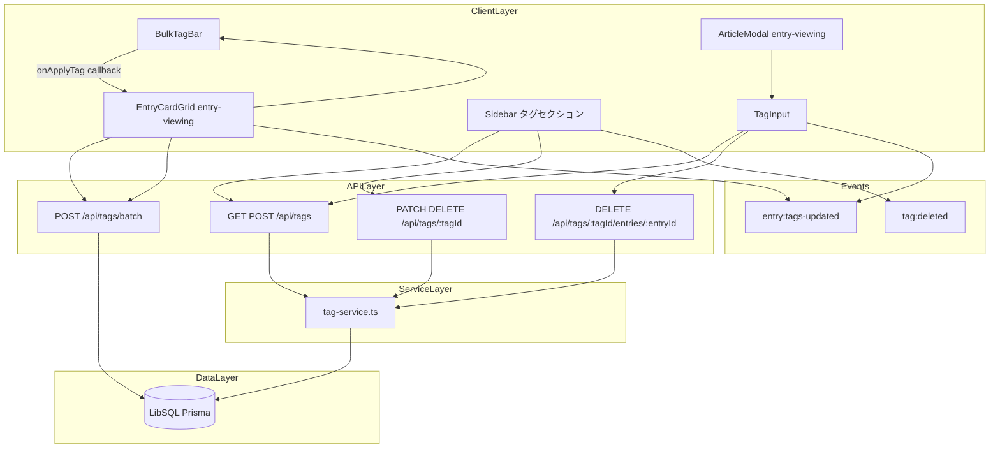
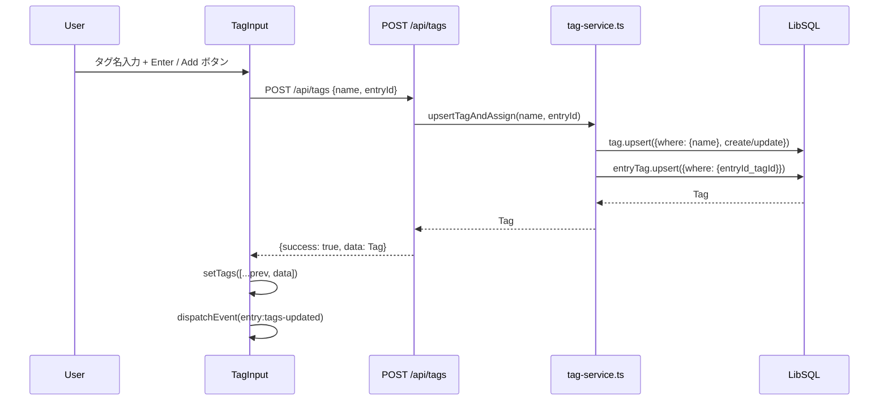
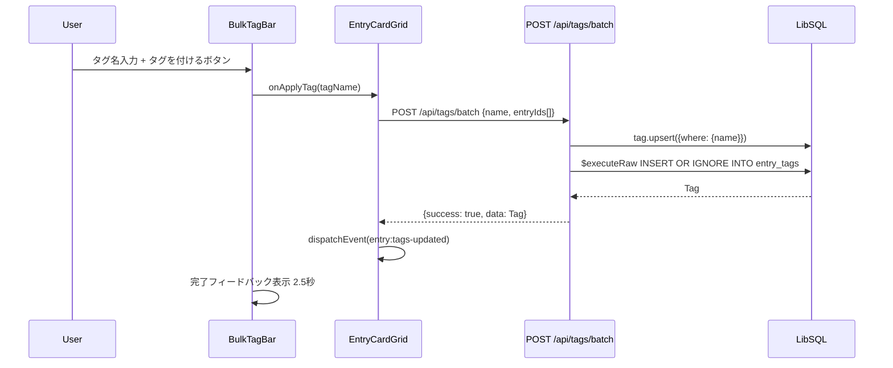
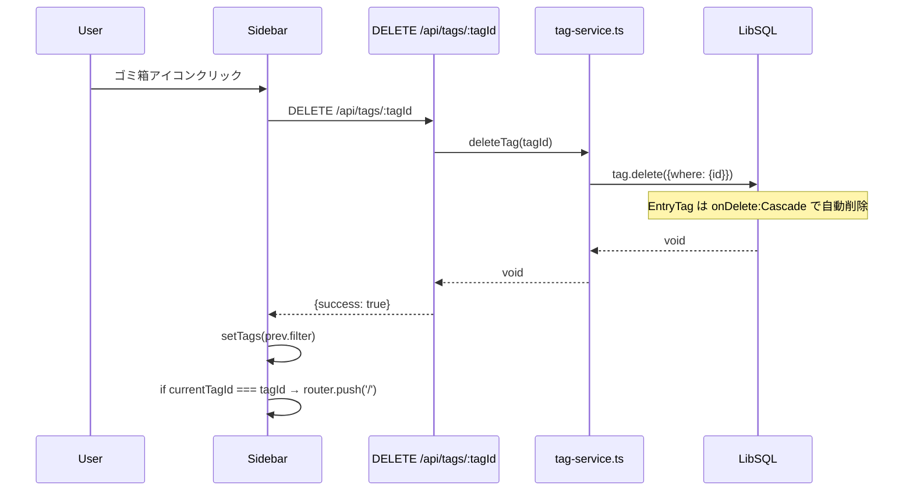

# Design Document: tag-management

## Overview

タグ管理機能は、RSSエントリーをユーザー定義のタグで分類・整理するためのバックエンドサービス・API・UIコンポーネント群を提供する。TagService が DB 操作を一手に担い、`/api/tags/*` のルート群が HTTP インターフェースを提供する。UI 側は ArticleModal 内の TagInput（個別タグ操作）と EntryCardGrid が制御する BulkTagBar（一括タグ付け）、そして Sidebar のタグセクション（リネーム・削除・フィルタリング）で構成される。

**Purpose**: エントリーをタグで分類し、サイドバーによるフィルタリング・一括タグ付けを通じて記事の整理効率を向上させる。  
**Users**: セルフホスト型 RSS リーダーの利用者が、記事モーダル・選択モード・サイドバーを通じてタグを管理する。  
**Impact**: entry-viewing の ArticleModal と EntryCardGrid を拡張してタグ付けインターフェースを提供し、Sidebar にタグ管理 UI を追加する。

### Goals

- upsert セマンティクスによるべき等なタグ作成（重複作成防止）
- タグ名の小文字・トリム正規化を全経路で一貫して適用
- 一括タグ付けにおける `INSERT OR IGNORE` による安全な並列挿入
- `entry:tags-updated` カスタムイベントによるプリフェッチキャッシュ無効化
- タグ削除時の `EntryTag` カスケード削除による参照整合性保証

### Non-Goals

- EntryCardGrid の選択モード UI 全体（entry-viewing が担当）
- ArticleModal の本体 UI（entry-viewing が担当）
- `GET /api/entries?tagId=...` フィルタリングロジック（entry-viewing が担当）
- 認証・認可制御（better-auth が担当）

---

## Boundary Commitments

### This Spec Owns

- `TagService`（`/src/lib/tag-service.ts`）: upsertTagAndAssign・removeTagFromEntry・getAllTags・renameTag・deleteTag
- API ルート: `GET/POST /api/tags`, `PATCH/DELETE /api/tags/:tagId`, `DELETE /api/tags/:tagId/entries/:entryId`, `POST /api/tags/batch`
- `TagInput` コンポーネント（`/src/components/tag-input.tsx`）: ArticleModal 内のタグ付与・除去・サジェスト UI
- `BulkTagBar` コンポーネント（`/src/components/bulk-tag-bar.tsx`）: 一括タグ付けツールバー UI
- Sidebar のタグセクション（`/src/components/sidebar.tsx` 内タグ管理ロジック）: リネーム・削除・フィルタリングリンク
- `Tag` / `EntryTag` データモデル（Prisma スキーマの `tags` / `entry_tags` テーブル）
- `entry:tags-updated` カスタムイベントの発火責任（TagInput・BulkTagBar・EntryCardGrid の `applyBatchTag`）

### Out of Boundary

- EntryCardGrid の選択モード（`isSelectionMode`・`selectedIds`・`enterSelectionMode`）の UI ロジック — entry-viewing 担当
- ArticleModal のフレーム・ナビゲーション・スワイプ — entry-viewing 担当
- `GET /api/entries?tagId=...` の実装 — entry-viewing 担当（tag-management は `tagId` パラメータを消費するだけ）
- `tag:deleted` イベントを受信した後の Sidebar タグリスト再取得トリガー — Sidebar 実装（このスペック）が所有するが、イベントの発火は EntryCardGrid（entry-viewing）も行う

### Allowed Dependencies

- Prisma 7 + LibSQL: `Tag`・`EntryTag` テーブルへの読み書き（TagService のみ）
- `entry-viewing` スペックの成果物: ArticleModal（TagInput を描画）、EntryCardGrid（BulkTagBar を描画、`applyBatchTag` を実装）
- Next.js App Router: API Route Handlers（`/app/api/tags/*`）
- shadcn/ui + Tailwind CSS 4: TagInput・BulkTagBar の UI プリミティブ
- `@/types/entry`: `Tag`・`TagOnEntry` 型定義（共有型）

### Revalidation Triggers

- `Tag` / `EntryTag` スキーマ変更（フィールド追加・削除）
- `TagService` の公開インターフェース変更（メソッドシグネチャ変更）
- `/api/tags` レスポンス形式変更（`data` フィールド構造変更）
- `entry:tags-updated` イベントの payload 構造変更
- `tag:deleted` イベントの発火条件・payload 変更

---

## Architecture

### Existing Architecture Analysis

本フィーチャーは Next.js App Router の既存パターンに完全適合している。

- **Service Layer パターン**: `tag-service.ts` がすべての DB クエリを担い、API ルートは薄いハンドラーとして委譲する
- **Client Component イベント駆動**: カスタムイベント（`entry:tags-updated`・`tag:deleted`）で コンポーネント間の状態同期を実現し、グローバル状態管理ライブラリを使用しない
- **upsert セマンティクス**: `prisma.tag.upsert` により、タグ名の重複作成を防ぎつつべき等な操作を保証する
- **バッチ挿入**: `INSERT OR IGNORE` によるRaw SQL で既存レコードをスキップし、重複エラーを防ぐ

### Architecture Pattern & Boundary Map



### Technology Stack

| Layer | Choice / Version | Role in Feature | Notes |
|-------|------------------|-----------------|-------|
| Frontend | Next.js 16 + React 19 | Client Components（TagInput・BulkTagBar・Sidebar） | `'use client'` 宣言 |
| UI | Tailwind CSS 4 + shadcn/ui | タグチップ・入力フィールド・ドロップダウン | `Input`・`Button` コンポーネント使用 |
| Backend | Next.js API Route Handlers | `/api/tags/*` エンドポイント群 | 薄いハンドラー、ServiceLayer に委譲 |
| ORM | Prisma 7 + LibSQL | `tag-service.ts` の DB 操作 | `upsert`・`delete`（カスケード）・`$executeRaw` |
| Events | CustomEvent API (browser) | コンポーネント間状態同期 | `entry:tags-updated`・`tag:deleted` |

---

## File Structure Plan

### Directory Structure

```
src/
├── app/
│   └── api/
│       └── tags/
│           ├── route.ts                      # GET /api/tags, POST /api/tags
│           ├── [tagId]/
│           │   ├── route.ts                  # PATCH /api/tags/:tagId, DELETE /api/tags/:tagId
│           │   └── entries/
│           │       └── [entryId]/
│           │           └── route.ts          # DELETE /api/tags/:tagId/entries/:entryId
│           └── batch/
│               └── route.ts                  # POST /api/tags/batch
├── components/
│   ├── tag-input.tsx                         # TagInput: 個別エントリーへのタグ付与/除去UI
│   ├── bulk-tag-bar.tsx                      # BulkTagBar: 一括タグ付けツールバーUI
│   └── sidebar.tsx                           # (既存ファイル) タグセクション追加
└── lib/
    └── tag-service.ts                        # TagService: upsert/remove/list/rename/delete
```

### Modified Files

- `src/components/sidebar.tsx` — タグリスト表示・リネーム・削除・フィルタリングリンクを追加（既存実装済み）
- `src/components/article-modal.tsx` — TagInput を描画するタグセクションを追加（既存実装済み）
- `src/components/entry-card-grid.tsx` — BulkTagBar の描画・applyBatchTag・選択モードのロジックを追加（既存実装済み）
- `src/types/entry.ts` — `CreateTagRequest`・`CreateTagResponse`・`GetTagsResponse` 型を追加（既存実装済み）

---

## System Flows

### 単一エントリーへのタグ付与フロー



### 一括タグ付けフロー



### タグ削除フロー（カスケード）



---

## Requirements Traceability

| Requirement | Summary | Components | Interfaces |
|-------------|---------|------------|------------|
| 1.1, 1.2 | タグ名正規化 | TagService, BatchAPI | normalizedName = name.toLowerCase().trim() |
| 2.1–2.4 | タグ upsert | TagService, POST /api/tags, TagInput | upsertTagAndAssign, POST /api/tags |
| 3.1–3.3 | タグ一覧取得 | TagService, GET /api/tags, Sidebar | getAllTags, GET /api/tags |
| 4.1–4.3 | タグリネーム | TagService, PATCH /api/tags/:tagId, Sidebar | renameTag, PATCH /api/tags/:tagId |
| 5.1–5.4 | タグ削除 | TagService, DELETE /api/tags/:tagId, Sidebar | deleteTag, tag:deleted event |
| 6.1–6.6 | 単一エントリーへのタグ付与・除去 | TagInput, POST /api/tags, DELETE /api/tags/:tagId/entries/:entryId | upsertTagAndAssign, removeTagFromEntry |
| 7.1–7.7 | 一括タグ付け | BulkTagBar, EntryCardGrid, POST /api/tags/batch | applyBatchTag, entry:tags-updated event |
| 8.1–8.4 | タグフィルタリング | Sidebar, EntryFilterBar (entry-viewing), GET /api/entries?tagId | tagId URL parameter |
| 9.1–9.4 | エラーハンドリング・非機能要件 | すべてのAPI Routes, TagInput, BulkTagBar | HTTP 400/404/500 レスポンス |

---

## Components and Interfaces

### コンポーネント概要

| Component | Layer | Intent | Req Coverage | Key Dependencies | Contracts |
|-----------|-------|--------|-------------|-----------------|-----------|
| TagService | Service | Tag DB 操作（upsert・remove・list・rename・delete） | 1, 2, 3, 4, 5, 6 | Prisma / LibSQL | Service |
| GET /api/tags | API | タグ一覧取得 | 3.1 | TagService | API |
| POST /api/tags | API | タグ upsert + エントリー割り当て | 2.1–2.4 | TagService | API |
| PATCH /api/tags/:tagId | API | タグリネーム | 4.1–4.3 | TagService | API |
| DELETE /api/tags/:tagId | API | タグ削除（カスケード） | 5.1–5.4 | TagService | API |
| DELETE /api/tags/:tagId/entries/:entryId | API | エントリーからタグ除去 | 6.5 | TagService | API |
| POST /api/tags/batch | API | 複数エントリーへの一括タグ付け | 7.3–7.6 | Prisma（直接） | API |
| TagInput | Client UI | 個別エントリーのタグ付与・除去・サジェスト | 6.1–6.6 | POST /api/tags, DELETE /api/tags/:tagId/entries/:entryId | State |
| BulkTagBar | Client UI | 一括タグ付けツールバー | 7.1–7.7 | EntryCardGrid (onApplyTag callback) | State |
| Sidebar タグセクション | Client UI | タグ一覧・フィルタリングリンク・リネーム・削除 | 3.2–3.3, 4.1–4.2, 5.2–5.4, 8.1–8.3 | GET /api/tags, PATCH /api/tags/:tagId, DELETE /api/tags/:tagId | State |

---

### Service Layer

#### TagService

| Field | Detail |
|-------|--------|
| Intent | Tag の作成・一覧・リネーム・削除、EntryTag の付与・除去をカプセル化する唯一のデータアクセス層 |
| Requirements | 1.1, 1.2, 2.1, 3.1, 4.1, 5.1, 6.1, 6.5 |

**Responsibilities & Constraints**
- `upsertTagAndAssign` はタグ名の正規化 + `tag.upsert` + `entryTag.upsert` を 1 関数で行う
- `getAllTags` は `react.cache` でラップされ、同一リクエストスコープ内で重複 DB クエリを防ぐ
- `deleteTag` は Prisma の `onDelete: Cascade` に依存して `EntryTag` を自動削除する（明示的な EntryTag 削除は不要）
- タグ名正規化（`name.toLowerCase().trim()`）は `upsertTagAndAssign` と `renameTag` 内で適用する

**Dependencies**
- Inbound: `/api/tags` Route Handlers (P0)
- Outbound: Prisma / LibSQL — `tags`・`entry_tags` テーブル (P0)
- External: `react.cache` — `getAllTags` のリクエストスコープキャッシュ (P2)

**Contracts**: Service [x] / API [ ] / Event [ ] / Batch [ ] / State [ ]

##### Service Interface

```typescript
// src/lib/tag-service.ts

export async function upsertTagAndAssign(name: string, entryId: string): Promise<Tag>
// Preconditions: name は非空文字列、entryId は存在する Entry の ID
// Postconditions: Tag が作成または取得され、EntryTag が作成または既存のまま
// Invariants: 返却される Tag.name は toLowerCase().trim() 済み

export async function removeTagFromEntry(tagId: string, entryId: string): Promise<void>
// Preconditions: tagId・entryId 双方が存在し、EntryTag レコードが存在する
// Postconditions: 対応する EntryTag レコードが削除される

export const getAllTags: () => Promise<Tag[]>
// react.cache でラップ済み
// Postconditions: 全 Tag を name 昇順で返す

export async function renameTag(tagId: string, newName: string): Promise<Tag>
// Preconditions: tagId が存在する Tag の ID、newName は非空文字列
// Postconditions: Tag.name が normalizedName に更新される

export async function deleteTag(tagId: string): Promise<void>
// Preconditions: tagId が存在する Tag の ID
// Postconditions: Tag が削除され、EntryTag はカスケード削除される
```

**Implementation Notes**
- Integration: `prisma` クライアントは `@/lib/db` から import する。TagService は他のサービスをインポートしない
- Validation: タグ名の空文字チェックは API ルート層で行い、TagService は正規化済みの名前を受け取る
- Risks: `upsertTagAndAssign` の 2 つの upsert はトランザクションではない。競合状態（race condition）は `upsert` のべき等性により実用上問題なし

---

### API Layer

#### POST /api/tags

| Field | Detail |
|-------|--------|
| Intent | タグを upsert して指定エントリーに割り当てる |
| Requirements | 2.1–2.4 |

**Contracts**: Service [ ] / API [x] / Event [ ] / Batch [ ] / State [ ]

##### API Contract

| Method | Endpoint | Request Body | Response | Errors |
|--------|----------|-------------|----------|--------|
| POST | /api/tags | `{ name: string, entryId: string }` | `{ success: true, data: Tag }` (201) | 400 VALIDATION_ERROR, 404 ENTRY_NOT_FOUND, 500 |

**Implementation Notes**
- Validation: `name` または `entryId` が falsy の場合に 400 を返す
- `getEntryById` で entryId の存在確認を行い、なければ 404 を返す

#### GET /api/tags

| Field | Detail |
|-------|--------|
| Intent | 全タグを名前昇順で返す |
| Requirements | 3.1 |

**Contracts**: Service [ ] / API [x] / Event [ ] / Batch [ ] / State [ ]

##### API Contract

| Method | Endpoint | Request | Response | Errors |
|--------|----------|---------|----------|--------|
| GET | /api/tags | — | `{ success: true, data: Tag[] }` | 500 |

#### PATCH /api/tags/:tagId

| Field | Detail |
|-------|--------|
| Intent | タグ名を変更する |
| Requirements | 4.1–4.3 |

**Contracts**: Service [ ] / API [x] / Event [ ] / Batch [ ] / State [ ]

##### API Contract

| Method | Endpoint | Request Body | Response | Errors |
|--------|----------|-------------|----------|--------|
| PATCH | /api/tags/:tagId | `{ name: string }` | `{ success: true, data: Tag }` | 400 VALIDATION_ERROR, 500 |

**Implementation Notes**
- `name` が空文字またはホワイトスペースのみの場合に 400 を返す

#### DELETE /api/tags/:tagId

| Field | Detail |
|-------|--------|
| Intent | タグを削除する（EntryTag はカスケード削除） |
| Requirements | 5.1 |

**Contracts**: Service [ ] / API [x] / Event [ ] / Batch [ ] / State [ ]

##### API Contract

| Method | Endpoint | Request | Response | Errors |
|--------|----------|---------|----------|--------|
| DELETE | /api/tags/:tagId | — | `{ success: true }` | 500 |

#### DELETE /api/tags/:tagId/entries/:entryId

| Field | Detail |
|-------|--------|
| Intent | 特定エントリーからタグを除去する |
| Requirements | 6.5 |

**Contracts**: Service [ ] / API [x] / Event [ ] / Batch [ ] / State [ ]

##### API Contract

| Method | Endpoint | Request | Response | Errors |
|--------|----------|---------|----------|--------|
| DELETE | /api/tags/:tagId/entries/:entryId | — | `{ success: true }` | 404 TAG_NOT_FOUND, 500 |

#### POST /api/tags/batch

| Field | Detail |
|-------|--------|
| Intent | 複数エントリーに同一タグを一括付与する |
| Requirements | 7.3–7.6 |

**Contracts**: Service [ ] / API [x] / Batch [x] / Event [ ] / State [ ]

##### API Contract

| Method | Endpoint | Request Body | Response | Errors |
|--------|----------|-------------|----------|--------|
| POST | /api/tags/batch | `{ name: string, entryIds: string[] }` | `{ success: true, data: Tag }` (201) | 400 VALIDATION_ERROR, 500 |

##### Batch / Job Contract

- Trigger: クライアントからの明示的 POST リクエスト
- Input / validation: `name` が非空文字列、`entryIds` が非空配列であることを検証
- Output / destination: `tag` upsert + `entry_tags` への一括 INSERT
- Idempotency & recovery: `INSERT OR IGNORE INTO entry_tags` により既存レコードをスキップ（べき等）

**Implementation Notes**
- Integration: `TagService` を使わず `prisma` を直接使用（パフォーマンス最適化のため Raw SQL）
- `Prisma.sql` + `Prisma.join` でパラメータ化クエリを構築し、SQL インジェクションを防ぐ
- タグ名正規化はルート内で `name.toLowerCase().trim()` を直接適用する

---

### Client Layer

#### TagInput

| Field | Detail |
|-------|--------|
| Intent | 記事モーダル内でエントリーへのタグ付与・除去・サジェスト表示を行う Client Component |
| Requirements | 6.1–6.6, 9.1, 9.2 |

**Contracts**: Service [ ] / API [ ] / Event [x] / Batch [ ] / State [x]

##### State Management

```typescript
// src/components/tag-input.tsx
interface TagInputProps {
  entryId: string
  initialTags: Tag[]
  allTags: Tag[]
}

// ローカルステート
const [tags, setTags] = useState<Tag[]>(initialTags)   // 付与済みタグリスト
const [inputValue, setInputValue] = useState('')         // 入力中のタグ名
const [isLoading, setIsLoading] = useState(false)        // API 呼び出し中フラグ
```

##### Event Contract

- Published events:
  - `entry:tags-updated` — タグ付与・除去時に発火。payload: `{ entryId: string, tags: Tag[] }`
- Subscribed events: なし

**Implementation Notes**
- Integration: `addTag` で `POST /api/tags` を、`removeTag` で `DELETE /api/tags/:tagId/entries/:entryId` を呼び出す
- Validation: `inputValue.trim()` が空の場合は `addTag` を中断する
- サジェストは `allTags` から未割り当てタグを `inputValue.toLowerCase().trim()` で部分一致フィルタリング
- Risks: API エラー時は `setTags` を呼ばず、入力フィールドを再活性化するのみ

#### BulkTagBar

| Field | Detail |
|-------|--------|
| Intent | 複数エントリー選択時に一括タグ付けを行うツールバー Client Component |
| Requirements | 7.1–7.7, 9.1, 9.2 |

**Contracts**: Service [ ] / API [ ] / Event [ ] / Batch [ ] / State [x]

##### State Management

```typescript
// src/components/bulk-tag-bar.tsx
interface BulkTagBarProps {
  selectedCount: number
  totalCount: number
  allTags: Array<{ id: string; name: string }>
  onApplyTag: (tagName: string) => Promise<void>  // EntryCardGrid の applyBatchTag を渡す
  onSelectAll: () => void
  onClearSelection: () => void
  onExitSelectionMode: () => void
}

// ローカルステート
const [inputValue, setInputValue] = useState('')
const [isLoading, setIsLoading] = useState(false)
const [showSuggestions, setShowSuggestions] = useState(false)
const [appliedCount, setAppliedCount] = useState<number | null>(null)
```

**Implementation Notes**
- Integration: タグ付けは `onApplyTag(tagName)` コールバック経由で EntryCardGrid に委譲する。BulkTagBar 自身は `/api/tags/batch` を直接呼ばない
- サジェストは `inputValue` が空のとき最大 8 件の全タグを、非空のとき部分一致タグを表示
- `appliedCount` は適用成功後に 2.5 秒間表示されてから `null` にリセット

#### Sidebar タグセクション

| Field | Detail |
|-------|--------|
| Intent | サイドバー内でタグの一覧・フィルタリングリンク・リネーム・削除を提供する |
| Requirements | 3.2–3.3, 4.1–4.2, 5.2–5.4, 8.1–8.3 |

**Contracts**: Service [ ] / API [ ] / Event [x] / Batch [ ] / State [x]

##### State Management

```typescript
// src/components/sidebar.tsx（タグ管理部分のみ）
const [tags, setTags] = useState<TagItem[]>([])
const [tagsOpen, setTagsOpen] = useState(true)
const [editingTagId, setEditingTagId] = useState<string | null>(null)
const [editingTagName, setEditingTagName] = useState('')
```

##### Event Contract

- Subscribed events:
  - `tag:deleted` — タグ削除時に `GET /api/tags` を再取得してタグリストを更新

**Implementation Notes**
- Integration: `handleRenameTag` で `PATCH /api/tags/:tagId`、`handleDeleteTag` で `DELETE /api/tags/:tagId` を呼び出す
- `handleDeleteTag` 成功後、`currentTagId === tagId` の場合は `router.push('/')` でホームに遷移
- タグは `/?tagId={id}` へのリンクとして描画し、URL パラメータを通じてフィルタリングを entry-viewing に委譲

---

## Data Models

### Domain Model

```
Tag (aggregate root)
  ├── id: string (UUID)
  ├── name: string @unique (正規化済み小文字)
  └── createdAt: DateTime

EntryTag (結合テーブル)
  ├── entryId: string → Entry (onDelete: Cascade)
  └── tagId: string → Tag (onDelete: Cascade)
```

**Invariants**
- `Tag.name` は保存前に `toLowerCase().trim()` が適用されている
- `Tag.name` はユニーク制約により重複しない
- `EntryTag` の複合主キー `(entryId, tagId)` により同一ペアの重複はない
- Tag 削除時、`onDelete: Cascade` により関連する `EntryTag` レコードがすべて自動削除される

### Physical Data Model

```sql
-- tags テーブル
CREATE TABLE tags (
  id        TEXT PRIMARY KEY,
  name      TEXT UNIQUE NOT NULL,
  createdAt DATETIME DEFAULT CURRENT_TIMESTAMP
);

-- entry_tags テーブル（結合テーブル）
CREATE TABLE entry_tags (
  entry_id TEXT NOT NULL REFERENCES entries(id) ON DELETE CASCADE,
  tag_id   TEXT NOT NULL REFERENCES tags(id) ON DELETE CASCADE,
  PRIMARY KEY (entry_id, tag_id)
);
CREATE INDEX entry_tags_tag_id_idx ON entry_tags(tag_id);
```

### Data Contracts & Integration

#### タグ作成レスポンス

```typescript
// POST /api/tags, POST /api/tags/batch レスポンス
interface CreateTagResponse {
  success: true
  data: Tag  // { id, name, createdAt }
}
```

#### タグ一覧レスポンス

```typescript
// GET /api/tags レスポンス
interface GetTagsResponse {
  success: true
  data: Tag[]
}
```

#### イベント Payload

```typescript
// entry:tags-updated
interface TagsUpdatedEvent {
  entryId: string | null  // null の場合は一括タグ付け
  tags: Tag[]             // 更新後のタグリスト（個別の場合）
  batchTagId?: string     // 一括タグ付けの場合のタグID
}

// tag:deleted（payload なし、再取得で対応）
```

---

## Error Handling

### Error Strategy

- API バリデーションエラー: 400 + `VALIDATION_ERROR` コード
- リソース不存在: 404 + `ENTRY_NOT_FOUND` または `TAG_NOT_FOUND` コード
- サーバー内部エラー: 500 + `INTERNAL_SERVER_ERROR` コード（`console.error` でログ出力）
- フロントエンド: API エラー時は `isLoading` を解除してのみ操作前の状態を維持

### Error Categories and Responses

- **User Errors (4xx)**:
  - `name` または `entryId` 未指定 → 400 VALIDATION_ERROR
  - 存在しない `entryId` → 404 ENTRY_NOT_FOUND
  - 存在しない `tagId/entryId` ペア → 404 TAG_NOT_FOUND
- **System Errors (5xx)**: DB 接続障害 → 500 INTERNAL_SERVER_ERROR（グレースフルデグラデーション）
- **UI フォールバック**: TagInput・BulkTagBar とも `finally` ブロックで `setIsLoading(false)` を確実に実行

---

## Testing Strategy

### Unit Tests

- `upsertTagAndAssign`: 新規タグ作成・既存タグ再利用・EntryTag 重複スキップの各ケース
- `renameTag`: 正常更新・タグ名正規化（大文字→小文字）の確認
- `deleteTag`: Tag 削除後 EntryTag が存在しないこと（カスケード削除確認）
- `removeTagFromEntry`: 正常削除・存在しないペアのエラーハンドリング
- `getAllTags`: 名前昇順返却・空リストのケース

### Integration Tests

- `POST /api/tags`: 正常 201・name 未指定 400・entryId 不存在 404
- `GET /api/tags`: 正常 200・空リスト
- `PATCH /api/tags/:tagId`: 正常 200・空名 400
- `DELETE /api/tags/:tagId`: 正常 200・EntryTag カスケード削除確認
- `DELETE /api/tags/:tagId/entries/:entryId`: 正常 200・存在しないペア 404
- `POST /api/tags/batch`: 正常 201・空 entryIds 400・重複付与の冪等確認

### E2E / UI Tests

- TagInput: タグ入力 Enter → タグチップ追加 → `entry:tags-updated` イベント発火
- TagInput: ×ボタンクリック → タグチップ除去 → `entry:tags-updated` イベント発火
- TagInput: 既存タグ名部分入力 → サジェスト表示 → クリックで付与
- BulkTagBar: エントリー選択 → タグ入力 → 適用 → 完了フィードバック表示
- Sidebar: タグリネーム（鉛筆クリック→入力→Enter）→ タグ名更新確認
- Sidebar: タグ削除 → タグリストから除去 → フィルタリング中なら `/` にリダイレクト
