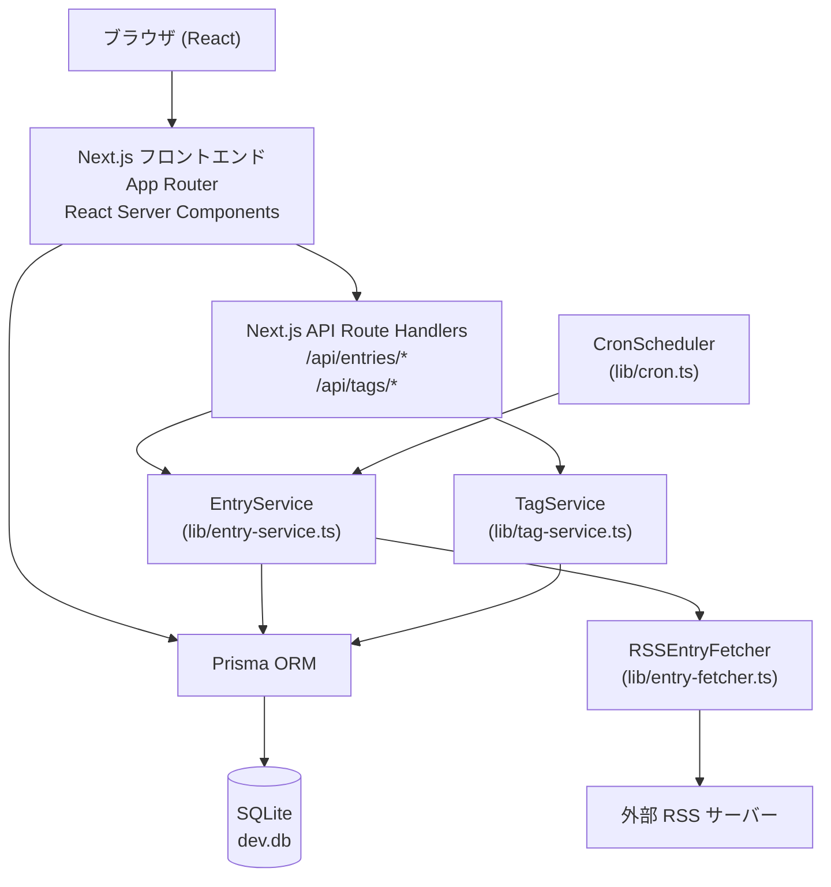

# RSSエントリー閲覧 アーキテクチャ設計

**作成日**: 2026-03-14
**関連要件定義**: [requirements.md](../../spec/rss-entry-view/requirements.md)
**ヒアリング記録**: [design-interview.md](design-interview.md)

**【信頼性レベル凡例】**:
- 🔵 **青信号**: EARS要件定義書・設計文書・ユーザヒアリングを参考にした確実な設計
- 🟡 **黄信号**: EARS要件定義書・設計文書・ユーザヒアリングから妥当な推測による設計
- 🔴 **赤信号**: EARS要件定義書・設計文書・ユーザヒアリングにない推測による設計

---

## システム概要 🔵

**信頼性**: 🔵 *要件定義書 概要より*

RSSリーダーWebアプリケーションのエントリー閲覧機能。全登録フィードのエントリー（記事）を時系列でまとめて表示し、モーダルで詳細閲覧・メタ情報（既読・後で読む・タグ）管理を行う。
バックグラウンドで1時間ごとに全フィードを自動取得・DB更新する。

## アーキテクチャパターン 🔵

**信頼性**: 🔵 *既存 rss-feed-registration 設計・ヒアリングQ: node-cronより*

- **パターン**: フルスタックモノリス（Next.js App Router）＋ バックグラウンドスケジューラー
- **選択理由**: 既存フィード管理機能と同一アーキテクチャを維持。node-cronをNext.js Instrumentationフック（`src/instrumentation.ts`）で起動し、devcontainerでも動作する

## コンポーネント構成

### フロントエンド 🔵

**信頼性**: 🔵 *既存 rss-feed-registration 設計・ヒアリングQ: URLクエリパラメータより*

- **フレームワーク**: Next.js 14+ App Router（React Server Components + Client Components）
- **スタイリング**: Tailwind CSS（既存）
- **UIコンポーネント**: shadcn/ui（既存）
- **状態管理**:
  - エントリー一覧・フィルター: URL クエリパラメータ（`?feedId=&tagId=&page=`）→ Server Component で取得
  - モーダル: URL クエリパラメータ（`?entryId=xxx`）→ ブラウザ履歴に残る
  - タグ入力: `useState` + Combobox（shadcn/ui）
- **ルーティング**: Next.js App Router（`app/` ディレクトリ）

### バックエンド 🔵

**信頼性**: 🔵 *既存 rss-feed-registration 設計・ヒアリングQ: node-cronより*

- **API実装**: Next.js Route Handlers（`app/api/` 配下）
- **エントリーパース**: `rss-parser` の `items` 配列を活用（既存ライブラリ拡張）
- **HTML除去**: `stripHtml`（`string-strip-html` ライブラリ）または自前の正規表現
- **SSRF対策**: 既存 `lib/ssrf-guard.ts` を再利用
- **定期実行**: `node-cron` + Next.js Instrumentation（`src/instrumentation.ts`）

### データベース 🔵

**信頼性**: 🔵 *既存 rss-feed-registration 設計・要件定義 データモデルより*

- **DBMS**: SQLite（既存）
- **ORM**: Prisma（既存、`src/generated/prisma` に出力）
- **追加テーブル**: `Entry`、`EntryMeta`、`Tag`、`EntryTag`（中間テーブル）
- **ファイル**: `prisma/dev.db`（既存）

## システム構成図



**信頼性**: 🔵 *要件定義・既存設計・ヒアリングより*

## ディレクトリ構造（追加分） 🔵

**信頼性**: 🔵 *既存プロジェクト構造・Next.js App Router慣習より*

```
./
├── src/
│   ├── app/
│   │   ├── page.tsx                    # エントリー一覧ページ（更新: フィード一覧 → エントリー一覧）
│   │   └── api/
│   │       ├── entries/
│   │       │   ├── route.ts            # GET /api/entries（一覧・フィルター・ページネーション）
│   │       │   └── [id]/
│   │       │       ├── route.ts        # GET /api/entries/:id（詳細取得）
│   │       │       └── meta/
│   │       │           └── route.ts    # PUT /api/entries/:id/meta（既読・後で読む更新）
│   │       └── tags/
│   │           ├── route.ts            # GET /api/tags, POST /api/tags
│   │           └── [id]/
│   │               └── route.ts        # DELETE /api/tags/:id/entries/:entryId（タグ解除）
│   ├── components/
│   │   ├── entry-list.tsx              # エントリー一覧コンポーネント（Client Component）
│   │   ├── entry-modal.tsx             # エントリーモーダル（Client Component）
│   │   ├── entry-filter.tsx            # フィード・タグフィルター（Client Component）
│   │   └── tag-input.tsx               # タグ入力Combobox（Client Component）
│   ├── lib/
│   │   ├── entry-service.ts            # エントリービジネスロジック（一覧・保存・上限削除）
│   │   ├── entry-fetcher.ts            # RSS エントリー取得・パース（rss-parser items）
│   │   ├── tag-service.ts              # タグ作成・付与・削除
│   │   └── cron.ts                     # node-cron スケジューラー定義
│   ├── types/
│   │   └── entry.ts                    # エントリー型定義
│   └── instrumentation.ts              # Next.js Instrumentation Hook（cron起動）
├── prisma/
│   └── schema.prisma                   # Prisma スキーマ（Entry, EntryMeta, Tag, EntryTag追加）
└── package.json
```

## レイヤー責務

### ページ層（app/page.tsx）🔵

**信頼性**: 🔵 *Next.js App Router設計・ヒアリングQ: URLクエリパラメータより*

- React Server Componentでクエリパラメータ（feedId, tagId, page）を受け取りDBからエントリー一覧を取得
- `?entryId=xxx` パラメータがある場合はモーダルを初期オープン状態でレンダリング
- `<EntryList>` (Client Component) に一覧データを渡す
- `<EntryModal>` (Client Component) にエントリー詳細データを渡す

### API Route Handler層（app/api/）🔵

**信頼性**: 🔵 *既存 rss-feed-registration 設計より*

- HTTP リクエストのバリデーション
- Service層の呼び出し
- HTTP レスポンス整形・エラーハンドリング

### EntryService層（lib/entry-service.ts）🔵

**信頼性**: 🔵 *既存 FeedService パターンより*

- エントリーの保存・重複排除（guid単位）
- 500件上限チェックと古いエントリーの削除
- フィード別・タグ別フィルタリング + AND条件
- ページネーション（20件/ページ）

### EntryFetcher層（lib/entry-fetcher.ts）🔵

**信頼性**: 🔵 *既存 rss-fetcher.ts の拡張・ヒアリングより*

- 既存 `rss-fetcher.ts` の `fetchFeed()` を参考に `fetchEntries()` を実装
- `rss-parser` の `items` 配列からエントリーを取得
- `item.guid`、`item.title`、`item.link`、`item.summary`（description）、`item.content:encoded`（全文）、`item.pubDate` を抽出
- プレーンテキスト変換: HTML タグを除去して `content` に保存

### TagService層（lib/tag-service.ts）🟡

**信頼性**: 🟡 *EntryService パターンから妥当な推測*

- タグの小文字正規化（case-insensitive）
- タグの作成・検索・付与・解除

### CronScheduler（lib/cron.ts + instrumentation.ts）🔵

**信頼性**: 🔵 *ヒアリングQ: node-cronより*

- `node-cron` で `0 * * * *`（毎時0分）にスケジュール
- `src/instrumentation.ts` の `register()` 関数内でcronを起動（Next.js 14+ の公式サポートパターン）
- 全フィードをループし `EntryFetcher` → `EntryService.saveEntries()` を実行
- 各フィードの失敗はスキップして次のフィードを処理

## 非機能要件の実現方法

### パフォーマンス 🟡

**信頼性**: 🟡 *NFR-001から妥当な推測*

- **一覧表示**: Server Componentで直接Prismaクエリ、SQLite ローカルI/Oで2秒以内は容易
- **ページネーション**: `take: 20, skip: (page-1)*20` でDBレベルでの制限
- **フィルター**: Prismaの `where` 句で AND 条件クエリ

### セキュリティ 🔵

**信頼性**: 🔵 *NFR-101, NFR-102・ヒアリングQ: プレーンテキストより*

- **HTML表示**: プレーンテキスト変換（HTMLタグ除去）→ XSSリスクなし（NFR-101は実質不要）
- **SSRF対策**: 既存 `lib/ssrf-guard.ts` を `entry-fetcher.ts` からも呼び出す（NFR-102）

### ユーザビリティ 🔵

**信頼性**: 🔵 *NFR-201・ヒアリングQ: URLクエリパラメータより*

- **モーダル状態**: URLクエリパラメータで管理→ ブラウザバックでモーダルが閉じる直感的な動作
- **即時反映**: メタ情報変更はClient Componentで楽観的更新 + API呼び出し

## 技術的制約

### パフォーマンス制約 🔵

**信頼性**: 🔵 *要件定義 NFR-001, NFR-002, NFR-003より*

- エントリー一覧表示応答時間: 2秒以内
- 定期取得処理1回あたり: 5分以内
- 各フィードの取得タイムアウト: 30秒（既存設定と同一）

### セキュリティ制約 🔵

**信頼性**: 🔵 *既存 NFR-101, NFR-102 継承より*

- HTML全文: プレーンテキスト変換で表示（XSS防止）
- SSRF対策: 定期取得でも既存 `ssrf-guard.ts` を使用

### データ制約 🔵

**信頼性**: 🔵 *要件定義 REQ-401より*

- 1フィードあたりエントリー保存上限: 500件
- 超過分は `publishedAt` または `createdAt` 昇順（最古）で削除
- タグ名: 小文字正規化して保存（case-insensitive）

### 互換性制約 🔵

**信頼性**: 🔵 *既存 devcontainer.json・Prismaスキーマより*

- Node.js: Node 24系（既存）
- TypeScript: strict mode（既存）
- Next.js: 14以上（既存、Instrumentation Hook対応）
- SQLite: 既存の `prisma/dev.db` を拡張（マイグレーション追加）

## 新規追加パッケージ

| パッケージ | 用途 | 信頼性 |
|-----------|------|--------|
| `node-cron` | 定期実行スケジューラー | 🔵 *ヒアリングQ: node-cronより* |
| `@types/node-cron` | TypeScript型定義 | 🔵 *node-cron使用時に必要* |

## 関連文書

- **データフロー**: [dataflow.md](dataflow.md)
- **型定義**: [interfaces.ts](interfaces.ts)
- **DBスキーマ**: [database-schema.sql](database-schema.sql)
- **API仕様**: [api-endpoints.md](api-endpoints.md)
- **要件定義**: [requirements.md](../../spec/rss-entry-view/requirements.md)
- **既存アーキテクチャ**: [../rss-feed-registration/architecture.md](../rss-feed-registration/architecture.md)

## 信頼性レベルサマリー

- 🔵 青信号: 18件 (82%)
- 🟡 黄信号: 4件 (18%)
- 🔴 赤信号: 0件 (0%)

**品質評価**: 高品質
