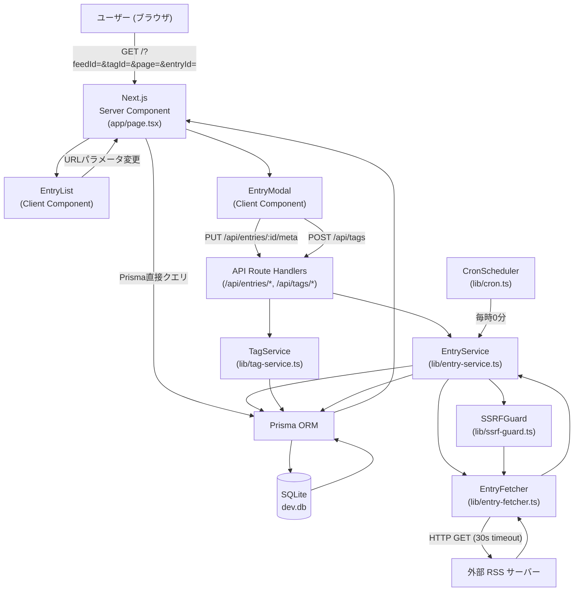
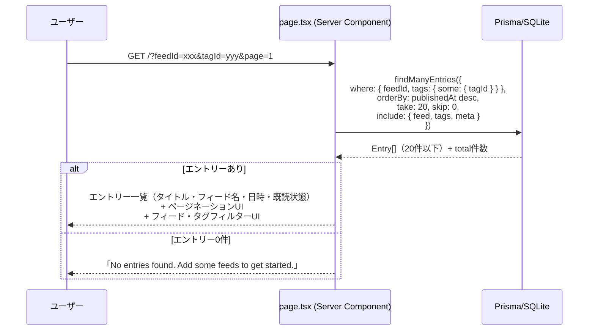
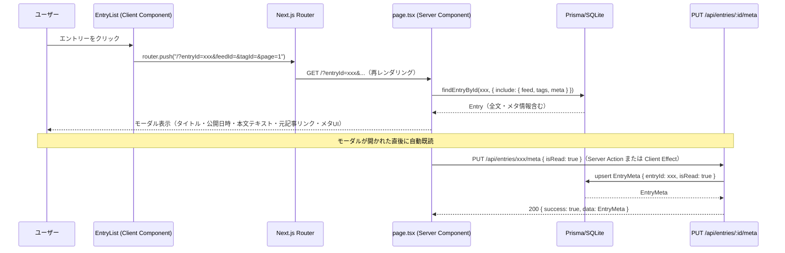
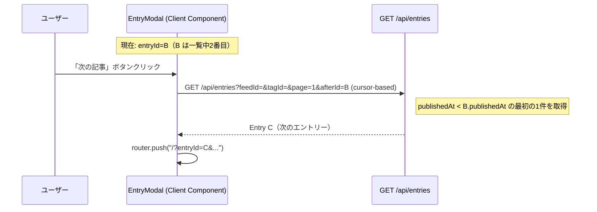
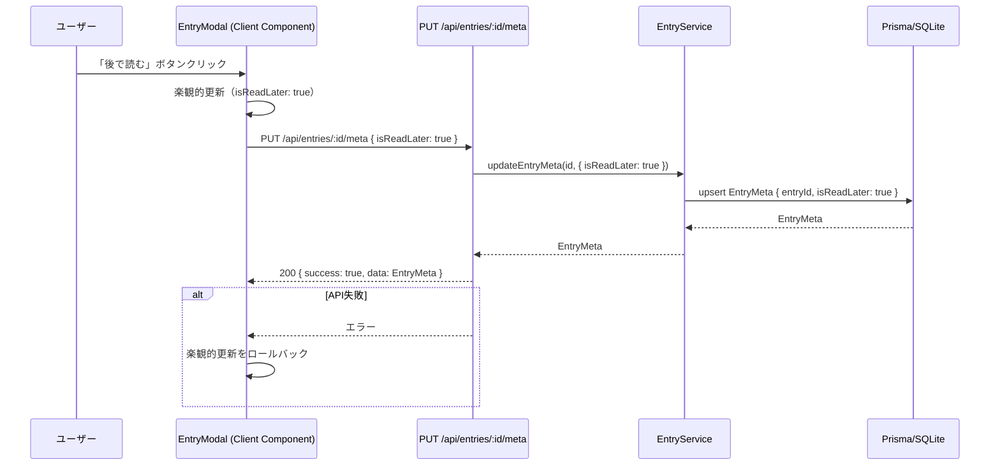
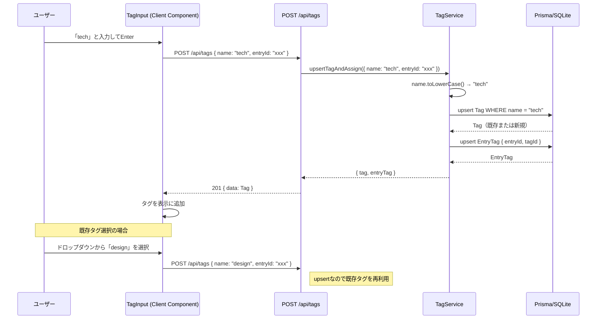
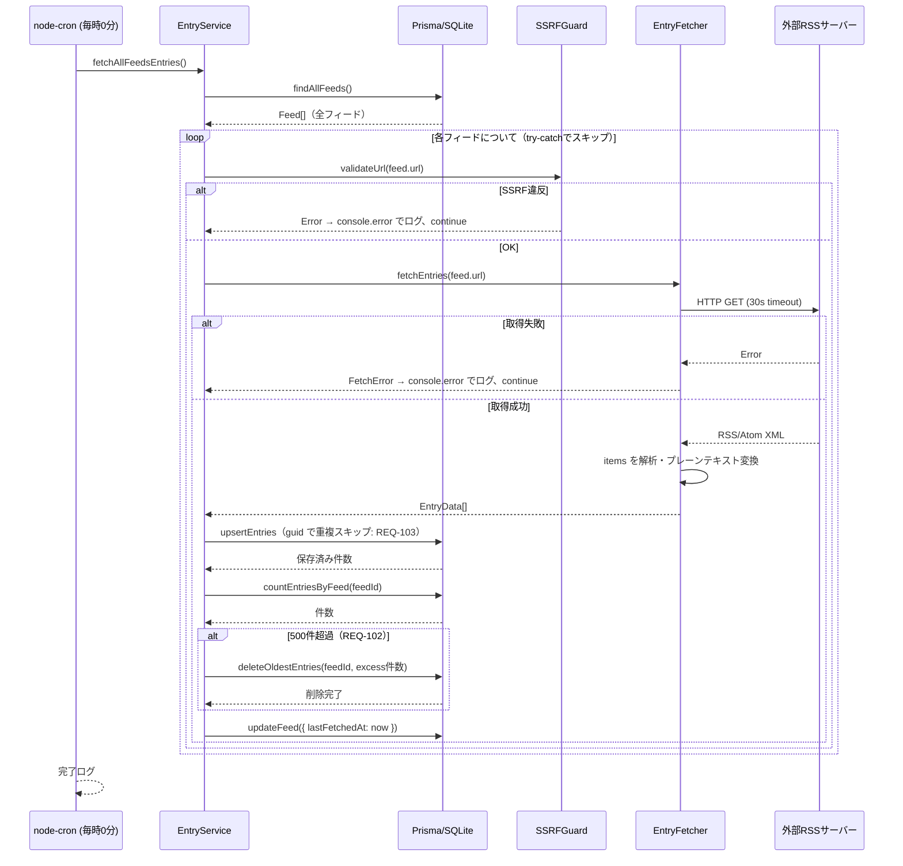
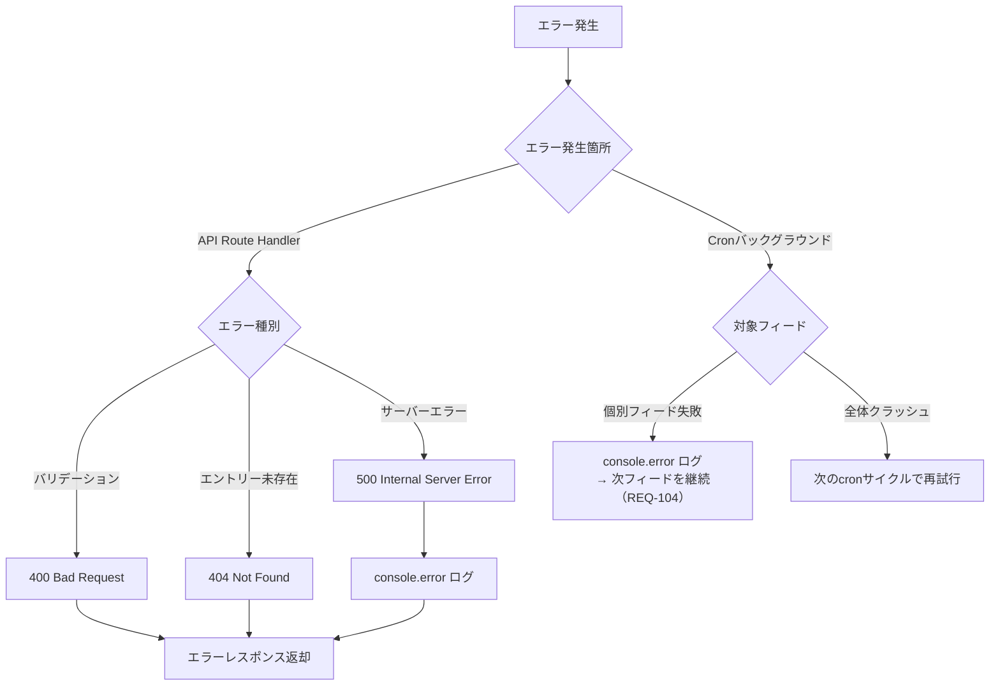
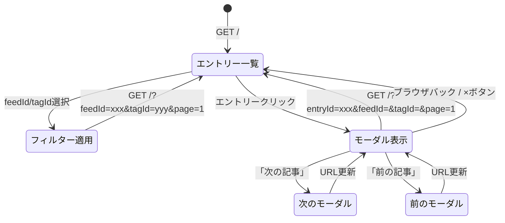

# RSSエントリー閲覧 データフロー図

**作成日**: 2026-03-14
**関連アーキテクチャ**: [architecture.md](architecture.md)
**関連要件定義**: [requirements.md](../../spec/rss-entry-view/requirements.md)

**【信頼性レベル凡例】**:
- 🔵 **青信号**: EARS要件定義書・設計文書・ユーザヒアリングを参考にした確実なフロー
- 🟡 **黄信号**: EARS要件定義書・設計文書・ユーザヒアリングから妥当な推測によるフロー
- 🔴 **赤信号**: EARS要件定義書・設計文書・ユーザヒアリングにない推測によるフロー

---

## システム全体のデータフロー 🔵

**信頼性**: 🔵 *要件定義・アーキテクチャ設計より*

---

## 主要機能のデータフロー

### 機能1: エントリー一覧表示（フィルター・ページネーション） 🔵

**信頼性**: 🔵 *REQ-001, REQ-003, REQ-004, REQ-005・ヒアリングQ: URLクエリパラメータより*

**関連要件**: REQ-001, REQ-002, REQ-003, REQ-004, REQ-005

**詳細**:
1. `feedId` と `tagId` の両方が指定された場合は AND 条件でフィルタリング
2. Server Component が直接 Prisma クライアントを呼び出し（APIを経由しない）
3. `include: { feed: true, tags: { include: { tag: true } }, meta: true }` でリレーションを含めて取得

---

### 機能2: エントリーモーダル表示（既読自動更新） 🔵

**信頼性**: 🔵 *REQ-006, REQ-007, REQ-101・ヒアリングQ: URLクエリパラメータより*

**関連要件**: REQ-006, REQ-007, REQ-101

**詳細**:
- モーダルを閉じる: ブラウザバックまたは `?entryId` パラメータを除いた URL に遷移
- 前後ナビ: 現在のフィルター・ソート条件と同じクエリで前後のエントリーIDを取得して URL を更新

---

### 機能3: 前後ナビゲーション 🔵

**信頼性**: 🔵 *REQ-007・ヒアリングQ: URLクエリパラメータより*

**関連要件**: REQ-007

**詳細**:
- カーソルベースの前後取得: `beforeId`/`afterId` パラメータで隣接エントリーを取得
- 最初/最後のエントリーではボタンを disabled にする

---

### 機能4: 既読・後で読む更新 🔵

**信頼性**: 🔵 *REQ-008, REQ-009・NFR-201より*

**関連要件**: REQ-008, REQ-009

---

### 機能5: タグ付け 🔵

**信頼性**: 🔵 *REQ-010, REQ-011, REQ-012・ヒアリングQ: タグcase-insensitiveより*

**関連要件**: REQ-010, REQ-011, REQ-012

---

### 機能6: 定期自動取得（1時間ごと） 🔵

**信頼性**: 🔵 *REQ-211・ヒアリングQ: node-cronより*

**関連要件**: REQ-211, REQ-102, REQ-103, REQ-104, EDGE-004

**詳細**:
- `instrumentation.ts` の `register()` で `node-cron.schedule('0 * * * *', ...)` を起動
- `process.env.NEXT_RUNTIME === 'nodejs'` 条件で Node.js ランタイムのみ実行（Edge Runtime では実行しない）

---

## エラーハンドリングフロー 🔵

**信頼性**: 🔵 *既存 rss-feed-registration エラーパターン継承・REQ-104より*

---

## URL状態管理フロー（モーダル・フィルター） 🔵

**信頼性**: 🔵 *ヒアリングQ: URLクエリパラメータより*

---

## データ整合性の保証 🔵

**信頼性**: 🔵 *Prisma + SQLite制約・REQ-103より*

- **重複排除**: `Entry` テーブルに `@@unique([feedId, guid])` 複合ユニーク制約
- **カスケード削除**: `Feed` 削除時に `Entry` も削除（`onDelete: Cascade`）
- **EntryMeta**: `entryId` に `@unique` 制約（1エントリー1メタ）
- **EntryTag**: `(entryId, tagId)` 複合主キーで重複防止
- **タグ正規化**: アプリ層で `name.toLowerCase()` + DB側 `@unique` 制約

---

## 関連文書

- **アーキテクチャ**: [architecture.md](architecture.md)
- **型定義**: [interfaces.ts](interfaces.ts)
- **DBスキーマ**: [database-schema.sql](database-schema.sql)
- **API仕様**: [api-endpoints.md](api-endpoints.md)

## 信頼性レベルサマリー

- 🔵 青信号: 18件 (86%)
- 🟡 黄信号: 3件 (14%)
- 🔴 赤信号: 0件 (0%)

**品質評価**: 高品質
