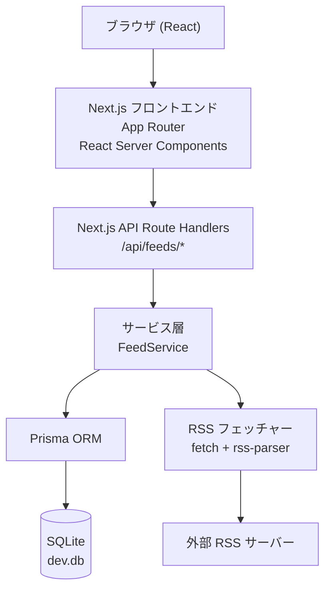

# RSSシードの登録 アーキテクチャ設計

**作成日**: 2026-03-13
**関連要件定義**: [requirements.md](../../spec/rss-feed-registration/requirements.md)
**ヒアリング記録**: [design-interview.md](design-interview.md)

**【信頼性レベル凡例】**:
- 🔵 **青信号**: EARS要件定義書・設計文書・ユーザヒアリングを参考にした確実な設計
- 🟡 **黄信号**: EARS要件定義書・設計文書・ユーザヒアリングから妥当な推測による設計
- 🔴 **赤信号**: EARS要件定義書・設計文書・ユーザヒアリングにない推測による設計

---

## システム概要 🔵

**信頼性**: 🔵 *要件定義書 概要より*

RSSリーダーWebアプリケーションのフィード管理機能。ユーザーがRSSフィードURLを入力・検証・登録し、一覧表示・編集・削除できるフルスタックWebアプリ。Next.jsのフルスタック構成でフロントエンドとバックエンドAPIを一体化し、SQLiteで永続化する。

## アーキテクチャパターン 🔵

**信頼性**: 🔵 *ヒアリングQ4: Next.js、Q2: Route Handlers、note.md技術スタックより*

- **パターン**: フルスタックモノリス（Next.js App Router）
- **選択理由**: 小規模アプリ・認証なし・単一DBのためオーバーエンジニアリングを避けNext.jsモノリスが最適

## コンポーネント構成

### フロントエンド 🔵

**信頼性**: 🔵 *ヒアリングQ4(Next.js)・Q5(shadcn/ui + Tailwind CSS)より*

- **フレームワーク**: Next.js 14+ App Router（React Server Components + Client Components）
- **スタイリング**: Tailwind CSS
- **UIコンポーネント**: shadcn/ui
- **状態管理**: React Hook Form（フォーム）+ useState/useTransition（ローカル状態）
- **ルーティング**: Next.js App Router（`app/` ディレクトリ）

### バックエンド 🔵

**信頼性**: 🔵 *ヒアリングQ2(Route Handlers)・note.mdより*

- **API実装**: Next.js Route Handlers (`app/api/` 配下)
- **RSSパース**: `rss-parser` ライブラリ 🔵 *ヒアリングQ3より*
- **HTTP取得**: Node.js 標準 `fetch` API + `AbortController`（タイムアウト制御）
- **SSRF対策**: IPアドレス検証ミドルウェア 🔵 *ヒアリングQ6より*

### データベース 🔵

**信頼性**: 🔵 *ヒアリングQ1(SQLite)・Q3(Prisma)より*

- **DBMS**: SQLite（ファイルベース）
- **ORM**: Prisma（型安全なクエリ、マイグレーション管理）
- **ファイル**: `prisma/dev.db`（開発）

## システム構成図



**信頼性**: 🔵 *要件定義・ヒアリングより*

## ディレクトリ構造 🔵

**信頼性**: 🔵 *Next.js App Router慣習 + ヒアリングより*

```
./
├── app/
│   ├── page.tsx              # フィード一覧ページ（React Server Component）
│   ├── feeds/
│   │   ├── new/
│   │   │   └── page.tsx      # フィード登録フォームページ
│   │   └── [id]/
│   │       ├── page.tsx      # フィード詳細・編集ページ
│   │       └── edit/
│   │           └── page.tsx  # 編集フォームページ
│   └── api/
│       ├── feeds/
│       │   ├── route.ts      # GET /api/feeds, POST /api/feeds
│       │   └── [id]/
│       │       └── route.ts  # GET/PUT/DELETE /api/feeds/:id
│       └── feeds/validate/
│           └── route.ts      # POST /api/feeds/validate
├── components/
│   ├── ui/                   # shadcn/ui コンポーネント
│   ├── feed-list.tsx         # フィード一覧コンポーネント
│   ├── feed-form.tsx         # フィード登録・編集フォーム
│   └── delete-confirm-dialog.tsx  # 削除確認ダイアログ
├── lib/
│   ├── db.ts                 # Prisma クライアントシングルトン
│   ├── feed-service.ts       # フィードビジネスロジック
│   ├── rss-fetcher.ts        # RSS取得・パース
│   └── ssrf-guard.ts         # SSRF対策ユーティリティ
├── prisma/
│   ├── schema.prisma         # DBスキーマ定義
│   ├── migrations/           # マイグレーションファイル
│   └── dev.db                # SQLiteデータベースファイル
├── types/
│   └── feed.ts               # 型定義（interfaces.ts 参照）
└── package.json
```

## レイヤー責務

### ページ層（app/*.tsx）🔵

**信頼性**: 🔵 *Next.js App Router設計より*

- React Server ComponentsでDBから直接データ取得（一覧ページ）
- Client ComponentsでインタラクティブなUI（フォーム、ダイアログ）
- `"use client"` ディレクティブで明示的にClient Componentを指定

### API Route Handler層（app/api/）🔵

**信頼性**: 🔵 *ヒアリングQ2: Route Handlersより*

- HTTP リクエストのバリデーション
- Service 層の呼び出し
- HTTP レスポンス整形
- エラーハンドリング（HTTP ステータスコード変換）

### サービス層（lib/feed-service.ts）🟡

**信頼性**: 🟡 *フルスタック設計のベストプラクティスから推測*

- ビジネスロジック（重複チェック、SSRF検証）
- RSS フェッチャーの呼び出し
- Prisma 経由のDB操作
- バリデーションロジック

### データアクセス層（Prisma ORM）🔵

**信頼性**: 🔵 *ヒアリングQ1(Prisma)より*

- Prismaが担当（型安全なクエリ生成）
- マイグレーション管理（`prisma migrate dev`）

## 非機能要件の実現方法

### パフォーマンス 🟡

**信頼性**: 🟡 *NFR要件から妥当な推測*

- **URLタイムアウト**: `AbortController` で30秒タイムアウト（NFR-001）
- **一覧表示**: SQLiteはローカルファイルIOなので1秒以内は容易（NFR-002）
- **最適化**: React Server Componentsによるサーバーサイドレンダリング

### セキュリティ 🔵

**信頼性**: 🔵 *ヒアリングQ6(SSRF対策実施)・NFR-101, NFR-102より*

- **SSRF対策**: `lib/ssrf-guard.ts` でプライベートIPアドレスをブロック
  - ブロック対象: `127.0.0.0/8`、`10.0.0.0/8`、`172.16.0.0/12`、`192.168.0.0/16`、`::1` 等
- **SQLインジェクション対策**: Prismaの型安全なクエリにより自動防止（NFR-102）
- **URLサニタイズ**: URL形式チェック（http/https のみ許可、REQ-402）

### エラーメッセージ 🔵

**信頼性**: 🔵 *ヒアリングQ7: 英語より*

- すべてのエラーメッセージは英語で表示

## 技術的制約

### パフォーマンス制約 🔵

**信頼性**: 🔵 *要件定義 NFR-001, NFR-002より*

- RSS URL検証タイムアウト: 30秒
- 一覧表示応答時間: 1秒以内

### セキュリティ制約 🔵

**信頼性**: 🔵 *ヒアリングQ6, NFR-101, NFR-102より*

- SSRF対策必須（プライベートIPブロック）
- URL scheme制限: http/https のみ

### 文字数制約 🔵

**信頼性**: 🔵 *ヒアリングQ8より*

- URL最大長: 2048文字
- description最大長: 1000文字
- memo最大長: 1000文字

### 互換性制約 🔵

**信頼性**: 🔵 *devcontainer.json・note.mdより*

- Node.js: devcontainerのNode.js & TypeScript（Node 24系）
- TypeScript: strict mode
- Next.js: 14以上（App Router使用）

## 関連文書

- **データフロー**: [dataflow.md](dataflow.md)
- **型定義**: [interfaces.ts](interfaces.ts)
- **DBスキーマ**: [database-schema.sql](database-schema.sql)
- **API仕様**: [api-endpoints.md](api-endpoints.md)
- **要件定義**: [requirements.md](../../spec/rss-feed-registration/requirements.md)

## 信頼性レベルサマリー

- 🔵 青信号: 18件 (75%)
- 🟡 黄信号: 5件 (21%)
- 🔴 赤信号: 1件 (4%)

**品質評価**: 高品質
