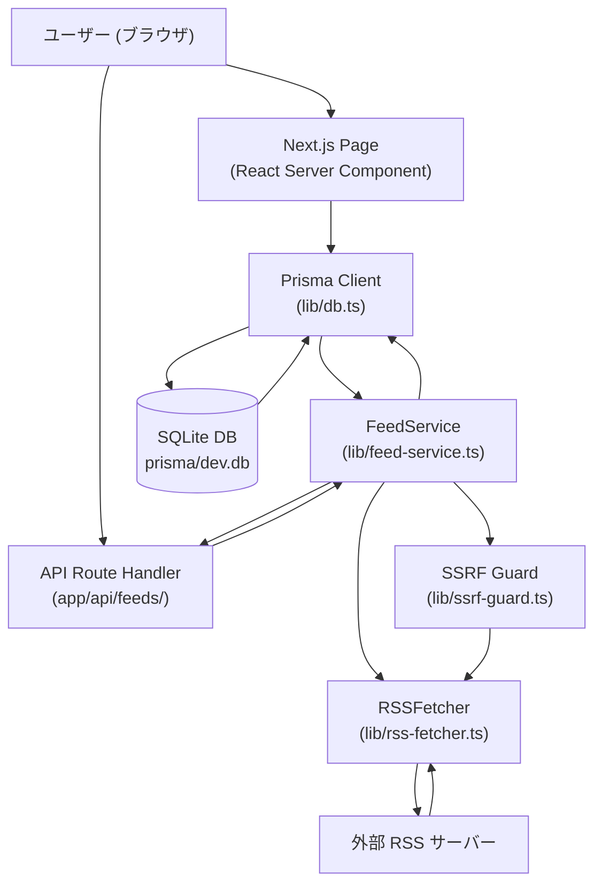
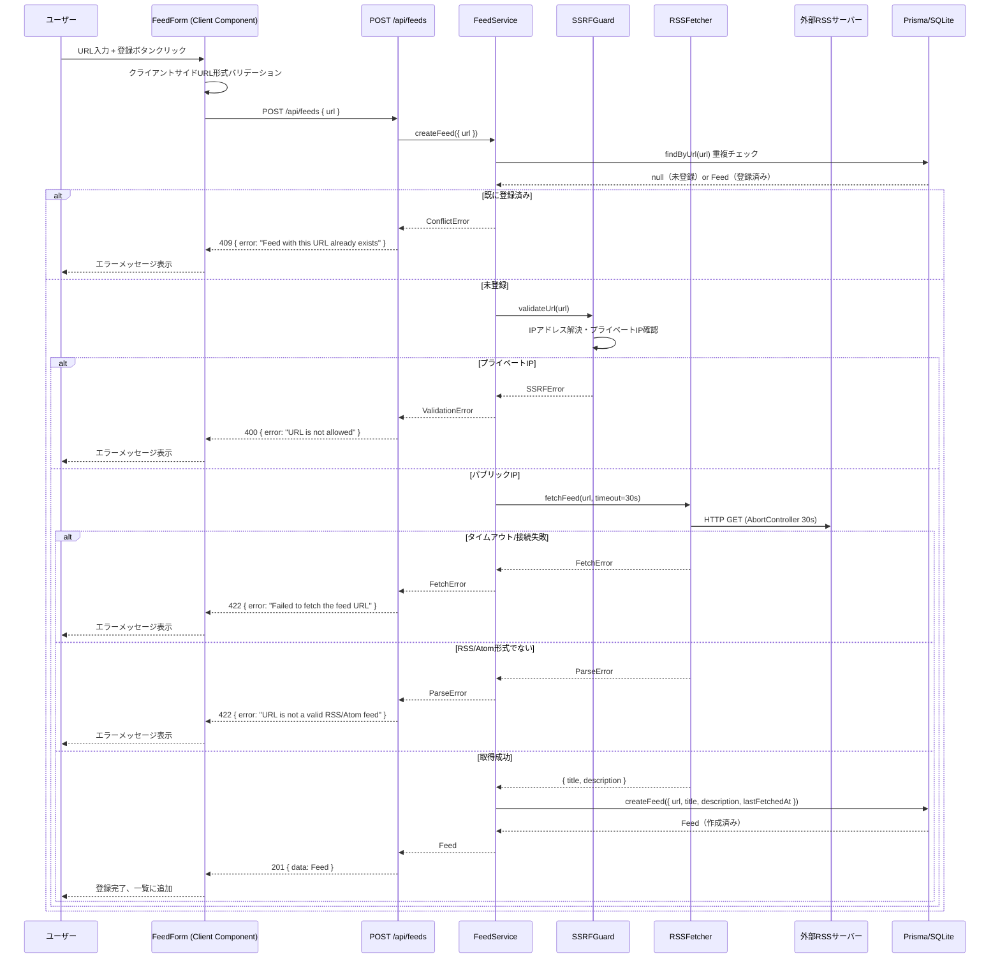
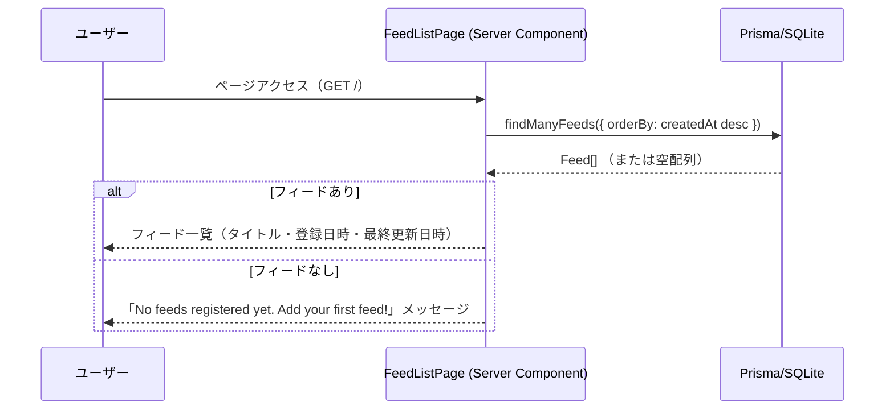
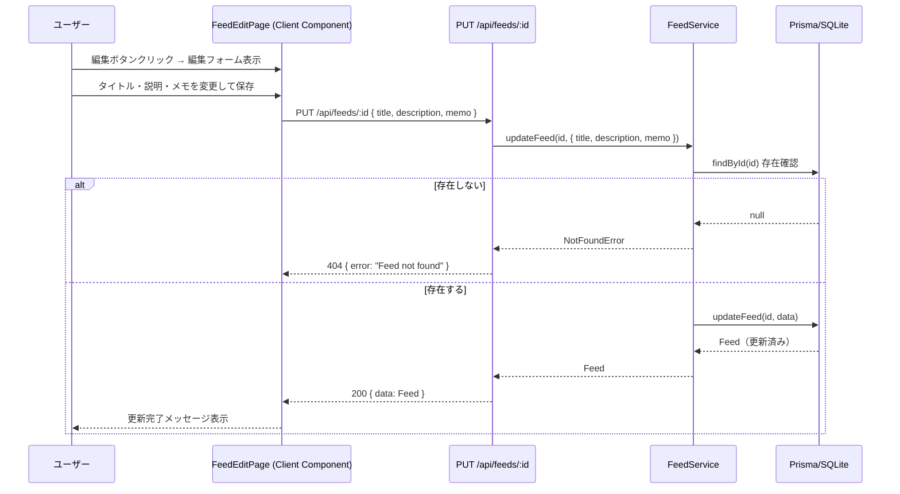
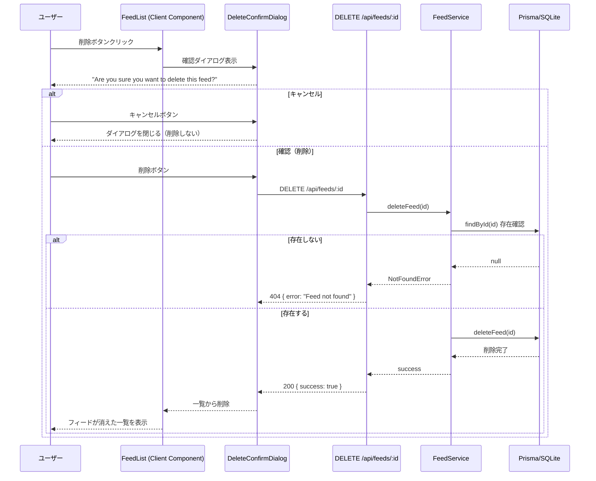
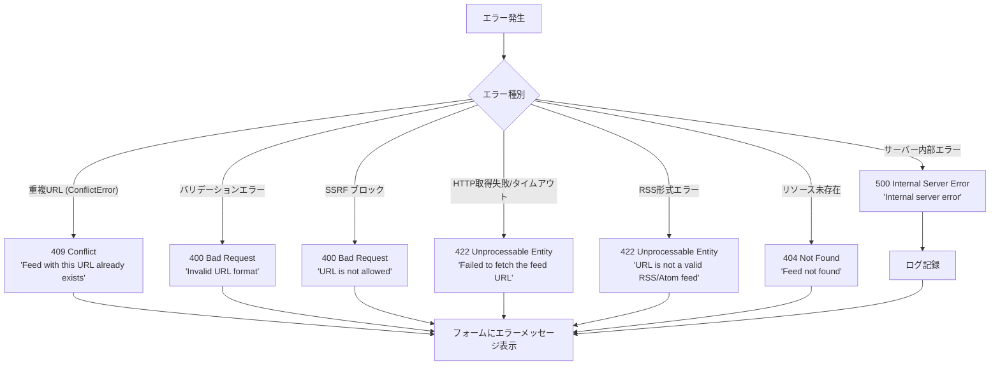
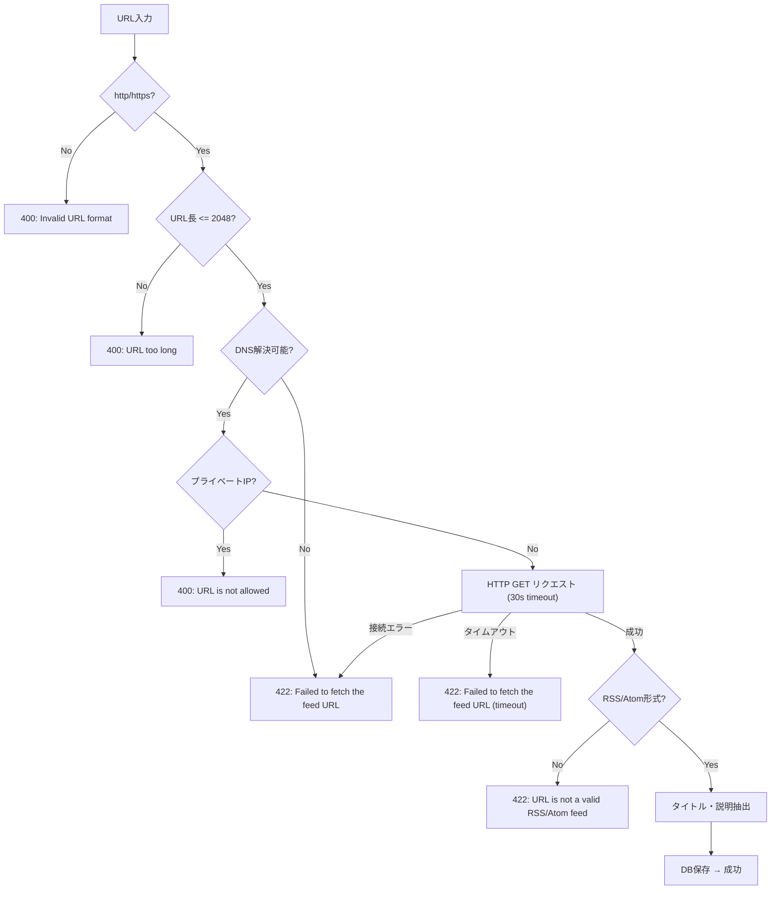
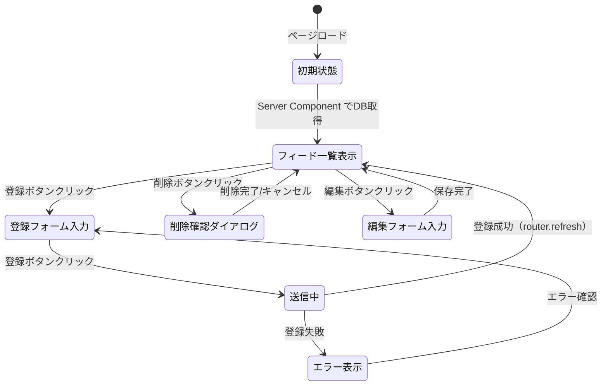

# RSSシードの登録 データフロー図

**作成日**: 2026-03-13
**関連アーキテクチャ**: [architecture.md](architecture.md)
**関連要件定義**: [requirements.md](../../spec/rss-feed-registration/requirements.md)

**【信頼性レベル凡例】**:
- 🔵 **青信号**: EARS要件定義書・設計文書・ユーザヒアリングを参考にした確実なフロー
- 🟡 **黄信号**: EARS要件定義書・設計文書・ユーザヒアリングから妥当な推測によるフロー
- 🔴 **赤信号**: EARS要件定義書・設計文書・ユーザヒアリングにない推測によるフロー

---

## システム全体のデータフロー 🔵

**信頼性**: 🔵 *要件定義・ユーザーストーリーより*

---

## 主要機能のデータフロー

### 機能1: RSSフィード登録 🔵

**信頼性**: 🔵 *ユーザーストーリー1.1・要件REQ-001, REQ-101, REQ-102, REQ-103より*

**関連要件**: REQ-001, REQ-101, REQ-102, REQ-103, REQ-106, REQ-107

**詳細ステップ**:
1. フォームでクライアントサイドURL形式チェック（http/https プレフィックス）
2. `POST /api/feeds` に URL を送信
3. DB で重複チェック（UNIQUE 制約）
4. SSRF ガードで対象 IP を検証
5. `rss-parser` で RSS/Atom フェッチ（30秒 AbortController）
6. タイトル・説明を抽出し DB に保存
7. 成功レスポンスを返しフォームをリセット

---

### 機能2: フィード一覧表示 🔵

**信頼性**: 🔵 *ユーザーストーリー2.1・要件REQ-002, REQ-003より*

**関連要件**: REQ-002, REQ-003, REQ-202

---

### 機能3: フィード編集 🔵

**信頼性**: 🔵 *ユーザーストーリー3.1・要件REQ-104より*

**関連要件**: REQ-104

---

### 機能4: フィード削除 🔵

**信頼性**: 🔵 *ユーザーストーリー4.1・要件REQ-105より*

**関連要件**: REQ-105

---

## エラーハンドリングフロー 🔵

**信頼性**: 🔵 *要件定義 REQ-106, REQ-107, EDGE-001, EDGE-002・ヒアリングより*

---

## URL検証フロー（SSRF対策含む）🔵

**信頼性**: 🔵 *ヒアリングQ6(SSRF対策)・REQ-101, REQ-402より*

---

## データ処理パターン

### 同期処理 🔵

**信頼性**: 🔵 *アーキテクチャ設計より*

- フィード一覧取得（SQLite はローカルI/O、十分高速）
- フィード編集・削除
- Prisma ORM クエリ（SQLite 同期API使用）

### 非同期処理 🔵

**信頼性**: 🔵 *RSSフェッチ要件より*

- RSS URL検証・フェッチ（外部HTTPリクエスト、30秒タイムアウト）
- Route Handler は全体が async 関数として処理

### バッチ処理 🟡

**信頼性**: 🟡 *将来的な拡張として推測（現スコープ外）*

- 現在のスコープには含まれない（フィード記事の定期更新は今回対象外）

---

## 状態管理フロー

### フロントエンド状態管理 🔵

**信頼性**: 🔵 *Next.js App Router設計・ヒアリングより*

---

## データ整合性の保証 🔵

**信頼性**: 🔵 *Prisma + SQLite制約より*

- **UNIQUE制約**: `url` カラムにDB側でUNIQUE制約（REQ-401, REQ-103）
- **NULL制約**: `title`, `url` は NOT NULL
- **トランザクション**: 単一フィード操作のため明示的トランザクション不要
- **Prismaによる型安全保証**: コンパイル時にSQLインジェクションを防止

---

## 関連文書

- **アーキテクチャ**: [architecture.md](architecture.md)
- **型定義**: [interfaces.ts](interfaces.ts)
- **DBスキーマ**: [database-schema.sql](database-schema.sql)
- **API仕様**: [api-endpoints.md](api-endpoints.md)

## 信頼性レベルサマリー

- 🔵 青信号: 18件 (82%)
- 🟡 黄信号: 3件 (14%)
- 🔴 赤信号: 1件 (4%)

**品質評価**: 高品質
