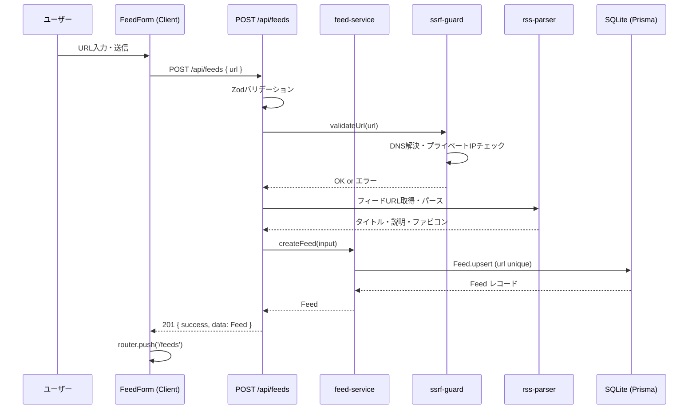
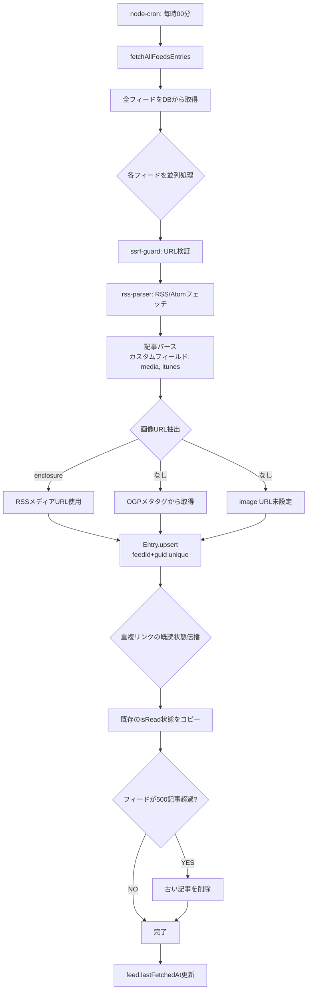
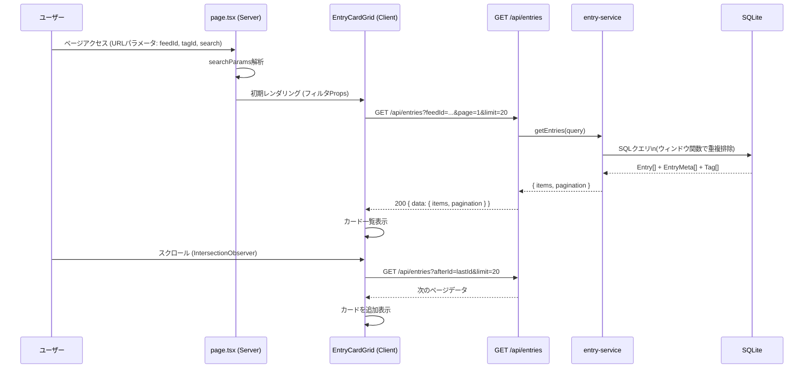
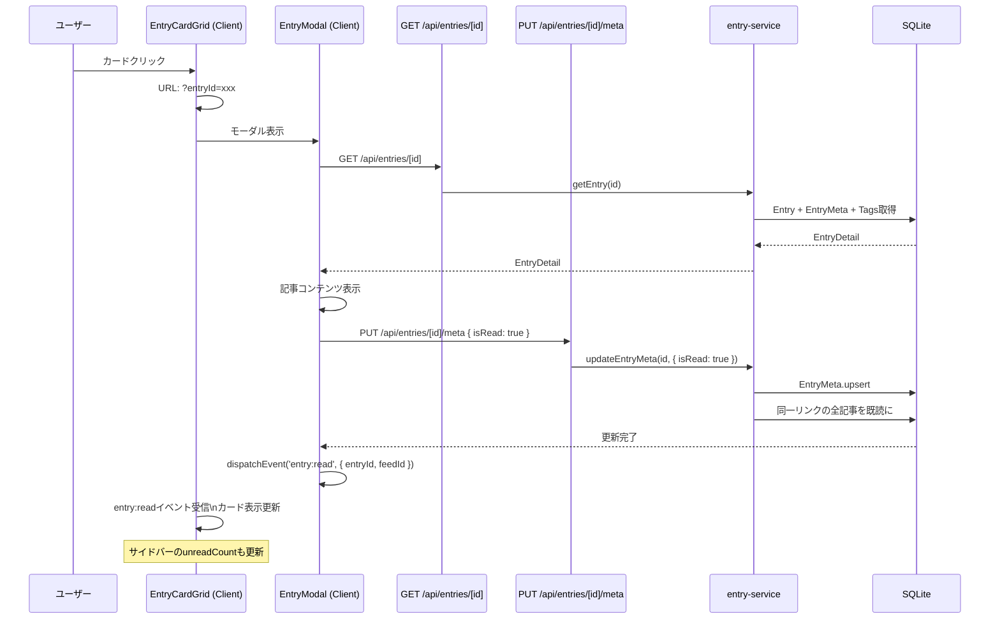
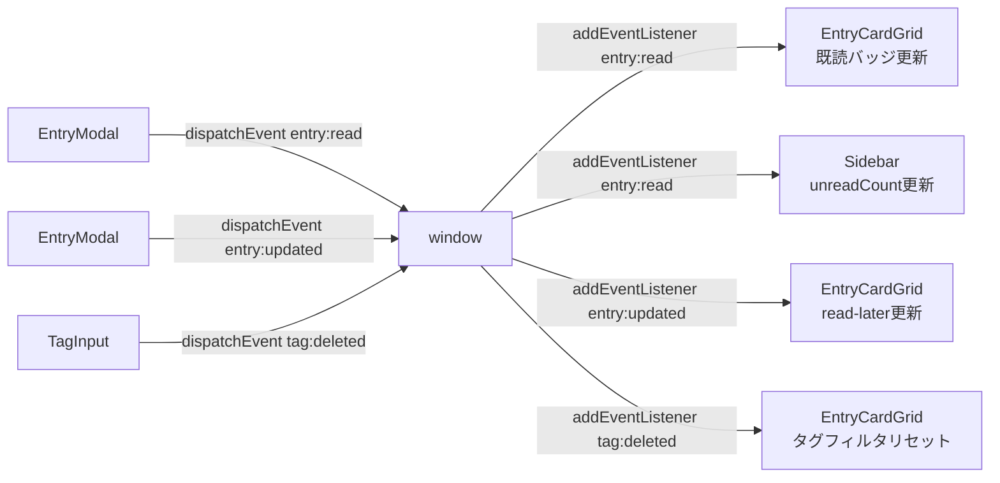
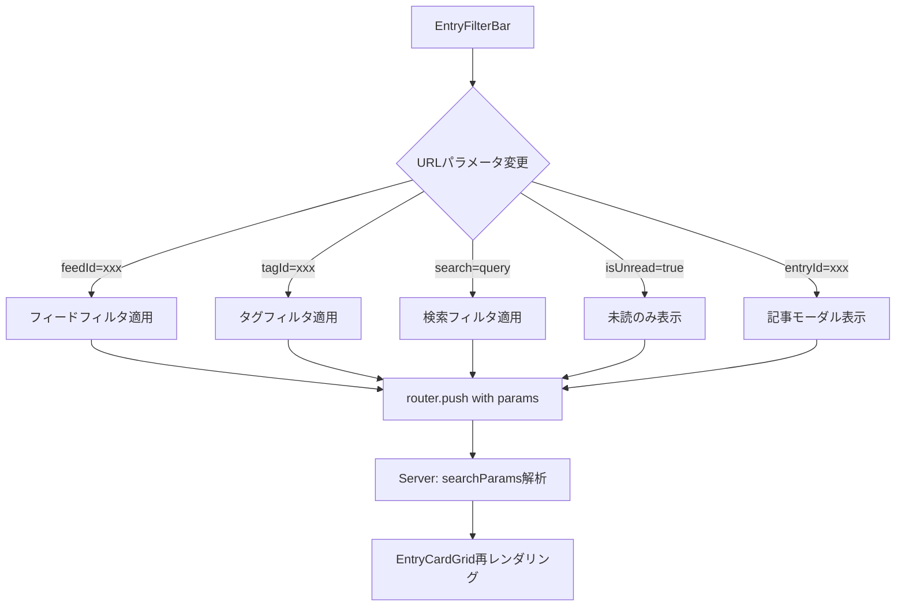
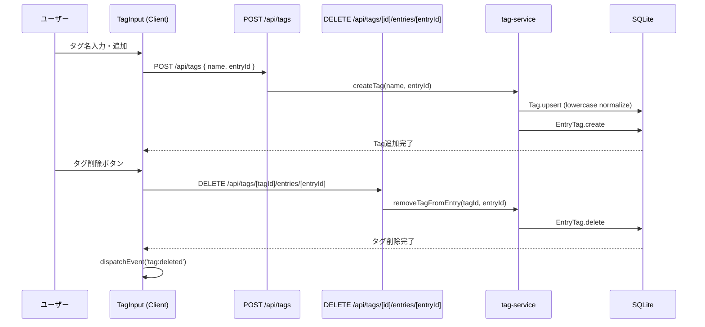
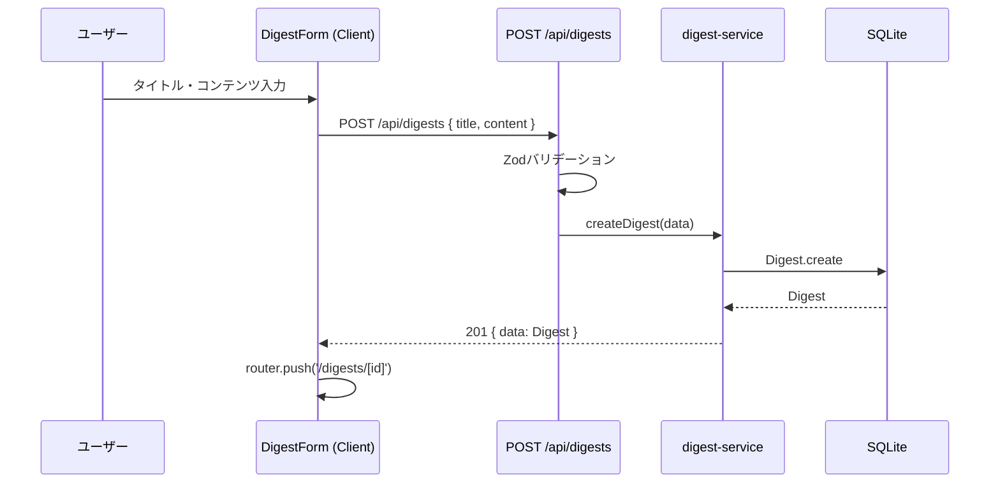
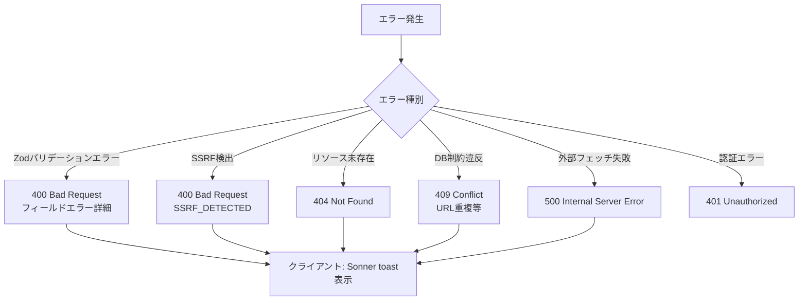

# データフロー図（逆生成）

## 分析日時
2026-03-16

---

## フィード追加フロー

---

## 記事自動取得フロー（Cronジョブ）

---

## 記事一覧取得・表示フロー

---

## 記事詳細表示・既読フロー

---

## 状態管理フロー（カスタムイベント）

---

## URLパラメータによるフィルター状態管理

---

## タグ管理フロー

---

## ダイジェスト作成フロー

---

## エラーハンドリングフロー

