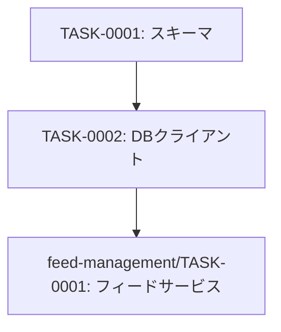

# database-setup タスク一覧

## 概要

**分析日時**: 2026-03-14
**対象コードベース**: /workspaces/rss-reader
**発見タスク数**: 2
**推定総工数**: 3時間

## タスク一覧

#### TASK-0001: Prismaスキーマとマイグレーション

- [x] **タスク完了** (実装済み)
- **タスクタイプ**: DIRECT
- **実装ファイル**:
  - `prisma/schema.prisma`
  - `prisma/migrations/`
  - `prisma.config.ts`
  - `.env.example`
- **実装詳細**:
  - SQLite + LibSQL adapter 構成
  - `Feed` モデル定義（id/url/title/description/memo/createdAt/updatedAt/lastFetchedAt）
  - url フィールドにユニーク制約
  - UUIDを主キーに使用
  - DATABASE_URL 環境変数によるDB接続設定
- **推定工数**: 2時間

#### TASK-0002: データベースクライアントシングルトン

- [x] **タスク完了** (実装済み)
- **タスクタイプ**: DIRECT
- **実装ファイル**:
  - `src/lib/db.ts`
- **実装詳細**:
  - Prismaクライアントのシングルトンパターン実装
  - 開発環境でのホットリロード対策（globalオブジェクトへのキャッシュ）
  - `@prisma/adapter-libsql` + `@libsql/client` 使用
- **推定工数**: 1時間

## 依存関係マップ

