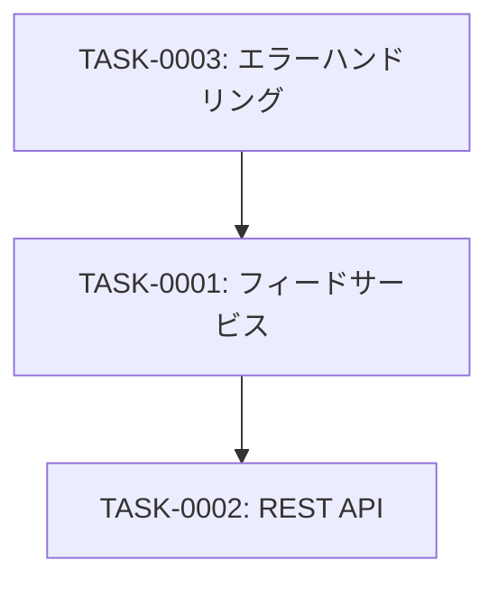

# feed-management タスク一覧

## 概要

**分析日時**: 2026-03-14
**対象コードベース**: /workspaces/rss-reader
**発見タスク数**: 3
**推定総工数**: 10時間

## タスク一覧

#### TASK-0001: フィードサービス実装（ビジネスロジック）

- [x] **タスク完了** (実装済み)
- **タスクタイプ**: TDD
- **実装ファイル**:
  - `src/lib/feed-service.ts`
  - `src/lib/errors.ts`
  - `src/types/feed.ts`
- **実装詳細**:
  - `createFeed(url)`: URL重複チェック、SSRF検証、RSSメタデータ取得、DB保存
  - `getAllFeeds()`: 全フィードをcreatedAt降順で取得（リスト表示用フィールドのみ）
  - `getFeedById(id)`: IDでフィード取得、未存在時NotFoundError
  - `updateFeed(id, data)`: title/description/memoの更新
  - `deleteFeed(id)`: フィード削除（存在チェック付き）
- **テスト実装状況**:
  - [x] 単体テスト: `src/lib/feed-service.test.ts`
  - [ ] E2Eテスト: 未実装
- **推定工数**: 4時間

#### TASK-0002: REST APIエンドポイント実装

- [x] **タスク完了** (実装済み)
- **タスクタイプ**: TDD
- **実装ファイル**:
  - `src/app/api/feeds/route.ts`
  - `src/app/api/feeds/[id]/route.ts`
- **実装詳細**:
  - `GET /api/feeds`: 全フィード一覧取得
  - `POST /api/feeds`: 新規フィード作成（URLバリデーション付き）
  - `GET /api/feeds/[id]`: IDでフィード取得
  - `PUT /api/feeds/[id]`: フィード情報更新（title空文字バリデーション）
  - `DELETE /api/feeds/[id]`: フィード削除
  - 全エンドポイントで統一エラーハンドリング（AppError→JSON変換）
- **テスト実装状況**:
  - [ ] 単体テスト: 未実装
  - [ ] E2Eテスト: 未実装
- **推定工数**: 3時間

#### TASK-0003: エラーハンドリングシステム

- [x] **タスク完了** (実装済み)
- **タスクタイプ**: TDD
- **実装ファイル**:
  - `src/lib/errors.ts`
  - `src/types/feed.ts`
- **実装詳細**:
  - `AppError`: 基底エラークラス（code, statusCode）
  - `ConflictError`: 409 / FEED_ALREADY_EXISTS
  - `NotFoundError`: 404 / FEED_NOT_FOUND
  - `FeedFetchError`: 422 / FEED_FETCH_FAILED
  - `InvalidFeedFormatError`: 422 / INVALID_FEED_FORMAT
  - `SSRFError`: 400 / URL_NOT_ALLOWED
  - `ErrorResponse`型定義
- **テスト実装状況**:
  - [x] 単体テスト: `src/lib/errors.test.ts`
  - [ ] E2Eテスト: 未実装
- **推定工数**: 3時間

## 依存関係マップ

