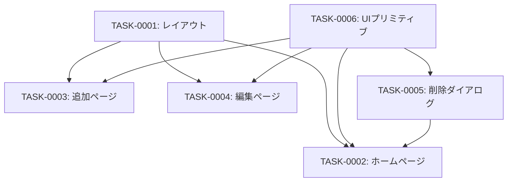

# feed-ui タスク一覧

## 概要

**分析日時**: 2026-03-14
**対象コードベース**: /workspaces/rss-reader
**発見タスク数**: 6
**推定総工数**: 14時間

## タスク一覧

#### TASK-0001: ルートレイアウトとグローバルスタイル

- [x] **タスク完了** (実装済み)
- **タスクタイプ**: DIRECT
- **実装ファイル**:
  - `src/app/layout.tsx`
  - `src/app/globals.css`
- **実装詳細**:
  - Geistフォント適用
  - スティッキーヘッダー（RSSアイコン＋タイトル）
  - lang="ja" 設定
  - Tailwind CSS v4 カスタムカラー設計（OKLch色空間）
  - ライト/ダークテーマ対応
  - CSSカスタムプロパティによるデザイントークン定義
- **推定工数**: 2時間

#### TASK-0002: ホームページ（フィード一覧）

- [x] **タスク完了** (実装済み)
- **タスクタイプ**: DIRECT
- **実装ファイル**:
  - `src/app/page.tsx`
  - `src/components/feed-list.tsx`
- **実装詳細**:
  - サーバーコンポーネントで全フィードを取得して表示
  - フィード数カウント表示
  - 「フィードを追加」ボタン（/feeds/newへリンク）
  - FeedListコンポーネント: アイコン・タイトル・URL・作成日表示
  - 編集ボタン（/feeds/[id]/editへリンク）
  - 削除ボタン（DeleteConfirmDialogを開く）
  - 空状態（フィードなし）のCTA表示
- **テスト実装状況**:
  - [x] コンポーネントテスト: `src/components/feed-list.test.tsx`
  - [ ] E2Eテスト: 未実装
- **推定工数**: 3時間

#### TASK-0003: フィード追加ページとフォーム

- [x] **タスク完了** (実装済み)
- **タスクタイプ**: TDD
- **実装ファイル**:
  - `src/app/feeds/new/page.tsx`
  - `src/components/feed-form.tsx`
- **実装詳細**:
  - サーバーコンポーネント（ページ）
  - 戻るリンク（ホームへ）
  - FeedFormコンポーネント:
    - URL入力フィールド（http/https必須のクライアントバリデーション）
    - 送信中のローディング状態
    - エラーメッセージ表示
    - 成功時にホームへリダイレクト
    - フォームリセット
- **テスト実装状況**:
  - [x] コンポーネントテスト: `src/components/feed-form.test.tsx`
  - [x] ページテスト: `src/app/feeds/new/page.test.tsx`
  - [ ] E2Eテスト: 未実装
- **推定工数**: 3時間

#### TASK-0004: フィード編集ページとフォーム

- [x] **タスク完了** (実装済み)
- **タスクタイプ**: TDD
- **実装ファイル**:
  - `src/app/feeds/[id]/edit/page.tsx`
  - `src/components/edit-feed-form.tsx`
- **実装詳細**:
  - サーバーコンポーネント（動的ルート）
  - IDでフィード取得（未存在時404）
  - EditFeedFormコンポーネント:
    - URL表示（読み取り専用）
    - title/description/memoの編集フィールド
    - 文字数カウンター（description/memo: 最大1000文字）
    - 保存中のローディング状態
    - キャンセルボタン（ホームへ）
- **テスト実装状況**:
  - [x] コンポーネントテスト: `src/components/edit-feed-form.test.tsx`
  - [ ] E2Eテスト: 未実装
- **推定工数**: 3時間

#### TASK-0005: 削除確認ダイアログ

- [x] **タスク完了** (実装済み)
- **タスクタイプ**: TDD
- **実装ファイル**:
  - `src/components/delete-confirm-dialog.tsx`
- **実装詳細**:
  - 破壊的アクション用赤色削除ボタン
  - AlertDialogによる確認モーダル（フィードタイトル表示）
  - DELETE /api/feeds/[id] API呼び出し
  - 成功時にページリフレッシュ
- **テスト実装状況**:
  - [x] コンポーネントテスト: `src/components/delete-confirm-dialog.test.tsx`
  - [ ] E2Eテスト: 未実装
- **推定工数**: 2時間

#### TASK-0006: UIプリミティブコンポーネント

- [x] **タスク完了** (実装済み)
- **タスクタイプ**: DIRECT
- **実装ファイル**:
  - `src/components/ui/button.tsx`
  - `src/components/ui/input.tsx`
  - `src/components/ui/textarea.tsx`
  - `src/components/ui/label.tsx`
  - `src/components/ui/dialog.tsx`
  - `src/components/ui/alert-dialog.tsx`
  - `src/components/ui/sonner.tsx`
- **実装詳細**:
  - Button: CVAベース、バリアント（default/outline/secondary/ghost/destructive/link）とサイズ（xs/sm/default/lg/icon）
  - Input: ダークモード対応テキスト入力
  - Textarea: field-sizing付き複数行入力
  - Label: peer disabled対応フォームラベル
  - AlertDialog: Base-UI使用の確認ダイアログ
  - Dialog: Base-UI使用のモーダル
  - Sonner: テーマ対応トースト通知プロバイダー
- **推定工数**: 1時間

## 依存関係マップ

