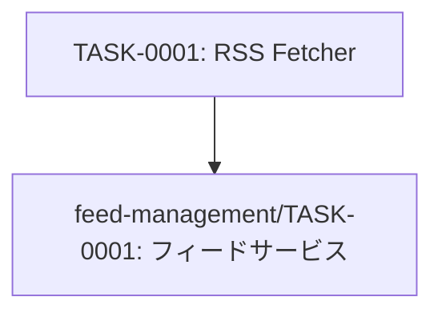

# rss-parsing タスク一覧

## 概要

**分析日時**: 2026-03-14
**対象コードベース**: /workspaces/rss-reader
**発見タスク数**: 1
**推定総工数**: 3時間

## タスク一覧

#### TASK-0001: RSS/Atomフィードフェッチャー実装

- [x] **タスク完了** (実装済み)
- **タスクタイプ**: TDD
- **実装ファイル**:
  - `src/lib/rss-fetcher.ts`
- **実装詳細**:
  - RSS 2.0 / Atom 1.0 両対応
  - 30秒タイムアウト設定
  - rss-parserライブラリ使用
  - title未設定時はURLにフォールバック
  - lastFetchedAtタイムスタンプの記録
  - ネットワークエラー・フォーマットエラーの適切な例外変換
- **テスト実装状況**:
  - [x] 単体テスト: `src/lib/rss-fetcher.test.ts`
  - [ ] E2Eテスト: 未実装
- **推定工数**: 3時間

## 依存関係マップ

