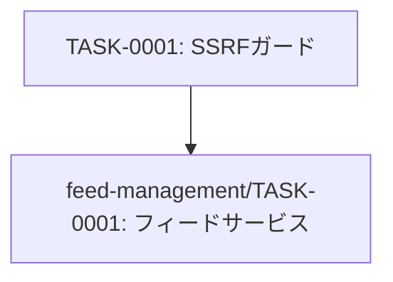

# security-ssrf-protection タスク一覧

## 概要

**分析日時**: 2026-03-14
**対象コードベース**: /workspaces/rss-reader
**発見タスク数**: 1
**推定総工数**: 4時間

## タスク一覧

#### TASK-0001: SSRFガード実装

- [x] **タスク完了** (実装済み)
- **タスクタイプ**: TDD
- **実装ファイル**:
  - `src/lib/ssrf-guard.ts`
- **実装詳細**:
  - プライベートIPレンジブロック（IPv4/IPv6）
  - http/httpsプロトコルのみ許可
  - URL長2048文字制限
  - URLフォーマット検証
  - DNSルックアップによる解決済みIPの検証
  - ブロック対象: 127.x, 10.x, 172.16-31.x, 192.168.x, 169.254.x, 100.64-127.x (IPv4)
  - ブロック対象: ::1, fe80::/10, fc00::/7, fd00::/8 (IPv6)
- **テスト実装状況**:
  - [x] 単体テスト: `src/lib/ssrf-guard.test.ts`
  - [ ] E2Eテスト: 未実装
- **推定工数**: 4時間

## 依存関係マップ

