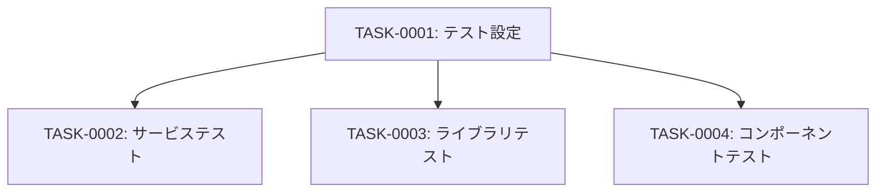

# testing タスク一覧

## 概要

**分析日時**: 2026-03-14
**対象コードベース**: /workspaces/rss-reader
**発見タスク数**: 4
**推定総工数**: 8時間

## タスク一覧

#### TASK-0001: テストフレームワーク設定

- [x] **タスク完了** (実装済み)
- **タスクタイプ**: DIRECT
- **実装ファイル**:
  - `vitest.config.ts`
  - `package.json` (test scripts)
- **実装詳細**:
  - Vitest v4 + jsdom環境設定
  - グローバルテスト関数有効化
  - `@/*` パスエイリアスの設定（tsconfig準拠）
  - `@vitejs/plugin-react` プラグイン適用
  - テストスクリプト: `pnpm test`, `pnpm test:watch`, `pnpm test:coverage`
- **推定工数**: 1時間

#### TASK-0002: サービス層テスト

- [x] **タスク完了** (実装済み)
- **タスクタイプ**: TDD
- **実装ファイル**:
  - `src/lib/feed-service.test.ts`
- **実装詳細**:
  - Prismaクライアントのモック
  - RSS Fetcherのモック
  - SSRF Guardのモック
  - テストケース: フィード作成/重複防止/SSRF検証/全件取得/ID取得/更新/削除
- **推定工数**: 2時間

#### TASK-0003: ライブラリ単体テスト

- [x] **タスク完了** (実装済み)
- **タスクタイプ**: TDD
- **実装ファイル**:
  - `src/lib/rss-fetcher.test.ts`
  - `src/lib/ssrf-guard.test.ts`
  - `src/lib/errors.test.ts`
- **実装詳細**:
  - RSS Fetcher: fetch/rss-parserのモック、RSS2.0/Atom/エラーケース
  - SSRF Guard: 全プライベートIPレンジ、DNS解決モック
  - Errors: 全エラークラスのcode/statusCode検証
- **推定工数**: 3時間

#### TASK-0004: UIコンポーネントテスト

- [x] **タスク完了** (実装済み)
- **タスクタイプ**: TDD
- **実装ファイル**:
  - `src/components/feed-list.test.tsx`
  - `src/components/feed-form.test.tsx`
  - `src/components/edit-feed-form.test.tsx`
  - `src/components/delete-confirm-dialog.test.tsx`
  - `src/app/feeds/new/page.test.tsx`
- **実装詳細**:
  - React Testing Library使用
  - next/navigationのモック（useRouter, router.push/refresh）
  - fetch APIのモック
  - ユーザーインタラクション（クリック、入力）のシミュレーション
- **推定工数**: 2時間

## 依存関係マップ

